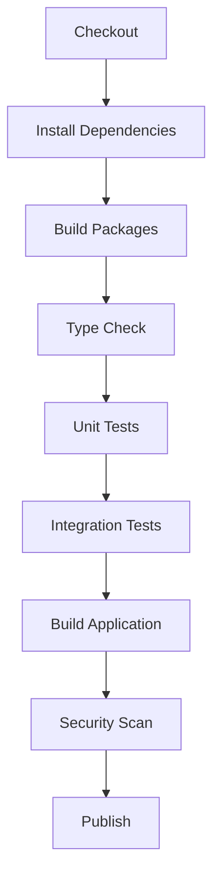

# ZanaFleet Build Fix Plan

## Executive Summary

This document outlines a comprehensive plan to fix the 57 TypeScript build errors identified in the current build. The issues are categorized by root cause with specific fix strategies.

## Build Error Analysis

### Category 1: Package Resolution Issues (3 errors)

**Files affected:**

- `apps/api/src/modules/actor/services/test-account-seeder.service.ts` - Cannot find module `@zanafleet/utils`
- `apps/api/src/modules/auth/handlers/login.handler.ts` - Cannot find module `@zanafleet/utils`
- `apps/api/src/modules/signup/handlers/update-signup-step.handler.ts` - Cannot find module `@zanafleet/utils`

**Root Cause:**
The `tsconfig.base.json` paths map to source files (`packages/contracts/src`), but the packages need to be built first. The `postinstall` script should handle this, but there may be a race condition or the packages aren't being built correctly.

**Fix Strategy:**

1. Ensure `@zanafleet/utils` and `@zanafleet/contracts` are built BEFORE the main app
2. Update build order in package.json to explicitly build packages first
3. Consider using `npm workspaces` more explicitly

```json
// Current postinstall - may have timing issues
"postinstall": "npm --workspace @zanafleet/contracts run build && npm --workspace @zanafleet/utils run build"

// Improved approach - build as part of main build
"prebuild": "npm run build:packages",
"build:packages": "npm run build:contracts && npm run build:utils",
```

---

### Category 2: PaymentMethod Export/Import Issues (18 errors)

**Files affected:** Multiple files in `apps/api/src/modules/payment/`

**Root Cause:**
The `payment.enums.ts` file imports `PaymentMethod` from `@zanafleet/contracts` and attempts to re-export it:

```typescript
import { PaymentMethod } from '@zanafleet/contracts';
export { PaymentMethod };
```

However, this doesn't work correctly with TypeScript enums when imported from another module. The enum needs to be explicitly re-exported.

**Fix Strategy:**
Change the re-export pattern in `apps/api/src/modules/payment/dto/payment.enums.ts`:

```typescript
// BEFORE (broken)
import { PaymentMethod } from '@zanafleet/contracts';
export { PaymentMethod };

// AFTER (fixed) - use export * or re-declare
import { PaymentMethod as PM } from '@zanafleet/contracts';
export { PM as PaymentMethod };
// OR
export { PaymentMethod } from '@zanafleet/contracts';
```

---

### Category 3: Messaging Service Type Mismatch (3 errors)

**Files:** `apps/api/src/core/messaging/services/messaging.service.ts`

**Root Cause:**
The `MessageChannel` type is defined as:

```typescript
export type MessageChannel = Exclude<NotificationChannel, NotificationChannel.IN_APP>;
```

The switch statement uses `NotificationChannel.EMAIL` but TypeScript is having issues with the type narrowing in the switch.

**Fix Strategy:**
The current code uses `NotificationChannel.EMAIL` correctly. The issue might be resolved by ensuring proper type imports. However, looking at the current file, the code appears correct. This error might be from an older version. **Verify and fix if needed with explicit type casting in the switch:**

```typescript
switch (message.channel as NotificationChannel) {
  case NotificationChannel.EMAIL:
  // ...
}
```

---

### Category 4: Calendar/Policy Enum Mapping Issues (3 errors)

**Files:**

- `apps/api/src/modules/calendar/services/calendar-policy-bridge.service.ts` (lines 433, 491)
- `apps/api/src/modules/policy/services/policy-evaluation-engine.service.ts` (line 360)

**Root Cause:**
Hardcoded enum mappings are missing the `ASSET` and `OPERATOR` values that exist in the contracts:

```typescript
// Current (incomplete)
const mapping: Record<PolicyScope, PolicyScope> = {
  GLOBAL: PolicyScope.GLOBAL,
  NATIONAL: PolicyScope.NATIONAL,
  SACCO: PolicyScope.SACCO,
  BUSINESS: PolicyScope.BUSINESS,
  RIDER: PolicyScope.RIDER,
  // MISSING: ASSET, OPERATOR
};
```

**Fix Strategy:**
Add missing enum values to the mappings:

```typescript
const mapping: Record<PolicyScope, PolicyScope> = {
  GLOBAL: PolicyScope.GLOBAL,
  NATIONAL: PolicyScope.NATIONAL,
  SACCO: PolicyScope.SACCO,
  BUSINESS: PolicyScope.BUSINESS,
  RIDER: PolicyScope.RIDER,
  ASSET: PolicyScope.ASSET, // ADD
  OPERATOR: PolicyScope.OPERATOR, // ADD
};
```

---

### Category 5: TypeORM Import Issues (1 error)

**File:** `apps/api/src/modules/dashboard/services/business-owner-dashboard.service.ts`

**Root Cause:**
`FindOptionsWhere` is not imported from TypeORM.

**Fix Strategy:**
Add the import:

```typescript
import { FindOptionsWhere } from 'typeorm';
```

---

### Category 6: Unused Imports (Multiple files)

**Files:**

- `apps/api/src/modules/communication/communication.module.ts` - `createNoOpProviders`
- `apps/api/src/modules/customer/customer.controller.ts` - `UseGuards`, `Request`
- `apps/api/src/modules/order/coordinators/customer-order.orchestrator.ts` - `RequestDeliveryInput`, `PaymentInitiationInput`
- `apps/api/src/modules/order/services/activity-seeder.service.ts` - `ActorType`, `TEST_WORKSPACE_ID`, `TEST_CUSTOMER_ID`
- `apps/api/src/modules/payment/dto/payment.enums.ts` - `PaymentMethod` (unused import)
- `apps/api/src/modules/policy/tests/unit/policy-enforcement.adapter.spec.ts` - `EvaluationContext`
- `apps/api/src/modules/search/entities/search-document.entity.ts` - `Index`
- `apps/api/src/modules/search/providers/postgres-search.provider.ts` - `SelectQueryBuilder`, `logger`

**Fix Strategy:**
Remove unused imports or prefix with underscore if intentionally kept for future use.

---

### Category 7: Implicit Any Type (1 error)

**File:** `apps/api/src/modules/delivery/controllers/delivery-tracking.controller.ts` (line 186)

**Root Cause:**
Parameter `r` implicitly has type `any`.

**Fix Strategy:**
Add explicit type:

```typescript
const stops: DeliveryTrackingStopDto[] = rows.map((r: any) => ({ ... }));
// OR better
const stops: DeliveryTrackingStopDto[] = rows.map((r: RowType) => ({ ... }));
```

---

### Category 8: Delivery Handler Type Issues (1 error)

**File:** `apps/api/src/modules/delivery/handlers/cancel-delivery.handler.ts` (line 43)

**Root Cause:**
Type `string | undefined` is not assignable to type `string`.

**Fix Strategy:**
Add null check or default value:

```typescript
reason,  // might be undefined
// Change to:
reason ?? 'No reason provided',
```

---

### Category 9: Test Import Issues (2 errors)

**Files:**

- `apps/api/src/modules/delivery/tests/unit/candidate-selection.service.spec.ts` - `haversineDistanceMeters` not exported
- `apps/api/src/modules/search/providers/postgres-search-provider.integration.spec.ts` - Cannot find module

**Fix Strategy:**
For `haversineDistanceMeters`, either export it from the service or mock it in tests:

```typescript
// In candidate-selection.service.ts, export the function
export function haversineDistanceMeters(...) { ... }
```

---

## Build Configuration Improvements

### Current Issues

1. `nest-cli.json` has `typeCheck: false` but errors are still being generated
2. Build order is not explicit - packages may not build before the main app
3. No clear separation between build stages in CI

### Recommended Build Configuration

```json
// package.json scripts
{
  "scripts": {
    "prebuild": "rimraf dist",
    "build": "npm run build:packages && nest build",
    "build:packages": "npm run build:contracts && npm run build:utils",
    "build:contracts": "npm run build --workspace=@zanafleet/contracts",
    "build:utils": "npm run build --workspace=@zanafleet/utils",
    "build:api": "nest build",
    "typecheck": "tsc --noEmit -p apps/api/tsconfig.json",
    "typecheck:watch": "tsc --noEmit -p apps/api/tsconfig.json --watch"
    // ...
  }
}
```

### CI Pipeline Stages



---

## Implementation Priority

| Priority | Task                      | Estimated Files     |
| -------- | ------------------------- | ------------------- |
| P0       | Fix PaymentMethod exports | 1 file + 17 imports |
| P0       | Fix package resolution    | Build config        |
| P1       | Fix enum mappings         | 2 files             |
| P1       | Fix TypeORM imports       | 1 file              |
| P2       | Fix unused imports        | 8 files             |
| P2       | Fix implicit any          | 1 file              |
| P2       | Fix delivery handler      | 1 file              |
| P3       | Fix test imports          | 2 files             |

---

## Verification Strategy

1. **Local Verification:**

   ```bash
   npm run build        # Full build
   npm run typecheck    # Type checking only
   npm run test:unit    # Unit tests
   ```

2. **CI Simulation:**
   ```bash
   npm run ci:all       # Full CI pipeline
   ```

---

## Summary

The build issues stem from three main areas:

1. **Package build order** - Packages need to be built before the main app
2. **TypeScript export/import patterns** - Enum re-exports need fixing
3. **Incomplete enum mappings** - Missing values in hardcoded mappings

Once these are addressed, the build should pass cleanly with `npm run build`.
