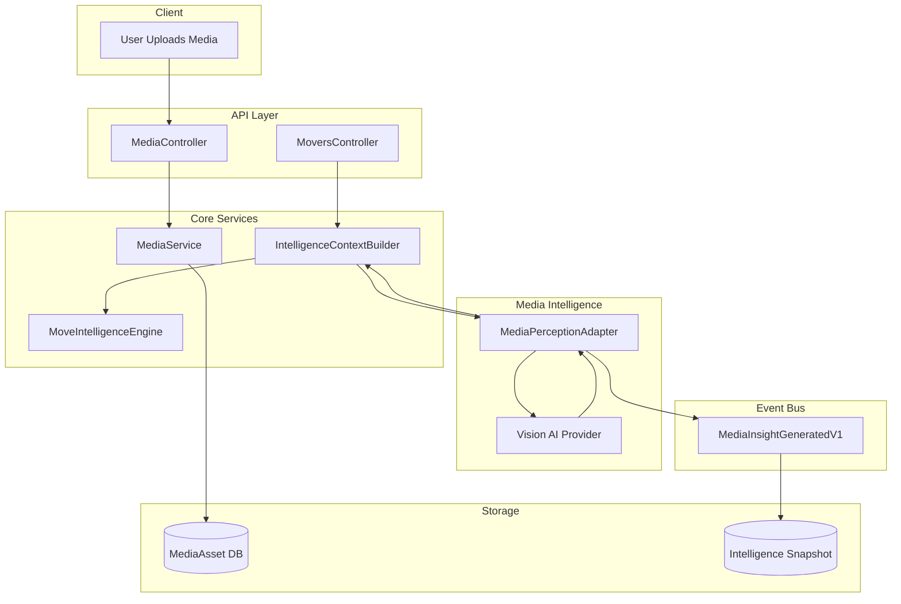

# Media Insight Integration Architecture

This document defines the architecture for integrating Media Intelligence into the ZanaFleet Move Intelligence system. The design enables AI-powered analysis of uploaded media (photos/videos) to enhance move profile estimation and vehicle recommendations.

## Table of Contents

1. [Overview](#1-overview)
2. [MediaInsight Interface Definition](#2-mediainsight-interface-definition)
3. [MediaPerceptionAdapter Interface](#3-mediaperceptionadapter-interface)
4. [Integration Points](#4-integration-points)
5. [Event Contracts](#5-event-contracts)
6. [Configuration Schema](#6-configuration-schema)
7. [Sequence Diagrams](#7-sequence-diagrams)
8. [Error Handling Strategy](#8-error-handling-strategy)
9. [Storage Strategy](#9-storage-strategy)
10. [Implementation Checklist](#10-implementation-checklist)

---

## 1. Overview

### Purpose

The Media Insight Integration enables the Move Intelligence system to analyze customer-uploaded photos and videos of items to be moved. This analysis produces structured data that enhances the accuracy of move profiles, leading to better vehicle recommendations and more accurate pricing.

### Design Principles

1. **Non-Blocking**: Media analysis never blocks the booking flow
2. **Optional Enhancement**: System works fully without media insights
3. **Graceful Degradation**: AI failures result in fallback to legacy estimation
4. **Versioned Schema**: All data structures support schema evolution
5. **Event-Driven**: Follows Command → Event → Handler → Projection pattern
6. **Toggleable**: Feature can be disabled via configuration

### High-Level Architecture

