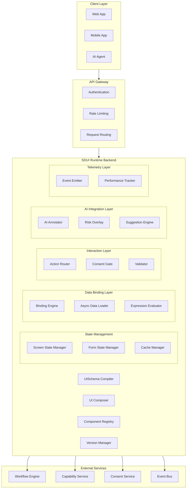
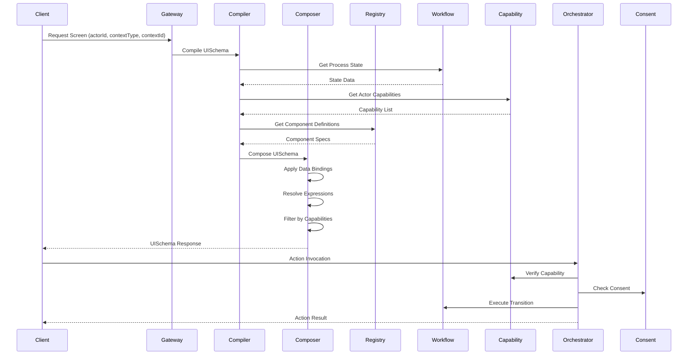
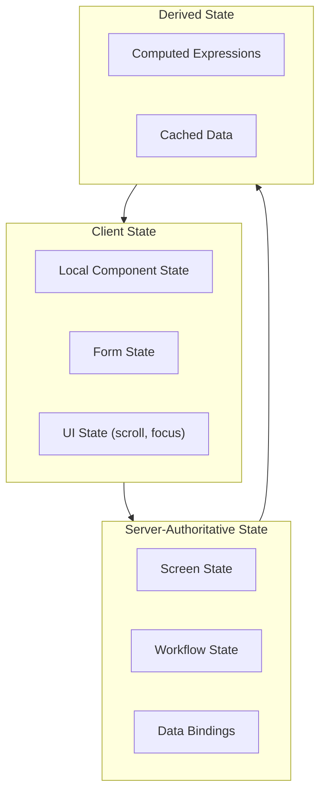
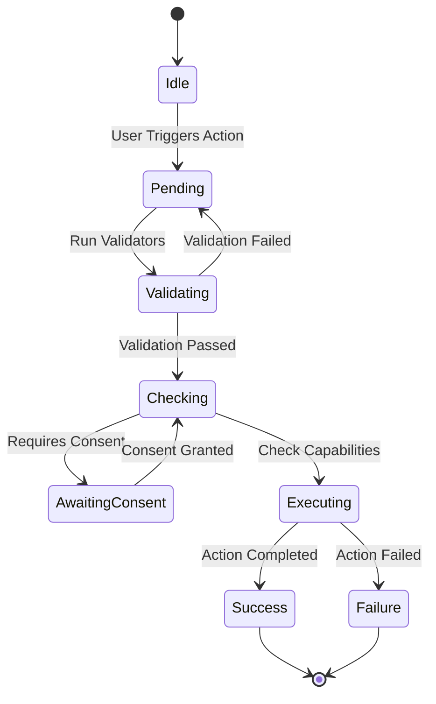

# ZanaFleet SDUI Runtime Architecture

**Version:** 1.0.0  
**Status:** Architectural Design  
**Date:** 2026-02-14

---

## Executive Summary

This document defines the architecture for ZanaFleet's production-grade, extensible Server-Driven UI (SDUI) Runtime. The system is designed to support sophisticated pages, nested layouts, complex stateful components, dynamic data binding, async operations, forms with validation, real-time updates, AI-augmented UI, risk-aware decorations, capability gating, and multi-platform rendering.

The SDUI Runtime represents a significant evolution from the current UIComposer, adding comprehensive schema support, advanced layout systems, sophisticated state management, and AI integration capabilities while maintaining backward compatibility.

---

## Core Principles

1. **Backend owns UI definition** - All UI schema originates from the backend
2. **Frontend interprets declarative UI schema** - Runtime engine parses and renders
3. **UI schema must be expressive enough for complex apps** - Rich component model
4. **Business logic must never live in frontend** - All logic via actions/commands
5. **Capabilities gate interactions** - Permission-based action control
6. **AI can annotate but not mutate authority** - AI suggestions are advisory only
7. **Every action routes through Orchestrator** - Single mutation entry point
8. **Consent is explicit** - User consent required for sensitive operations
9. **Fully versioned** - Schema versioning enables controlled evolution
10. **Fully observable** - Comprehensive telemetry at every layer
11. **Deterministic** - Same input always produces same output
12. **Extensible without breaking clients** - Backward compatibility first

---

## 1. High-Level Architecture Diagram



### Data Flow Architecture



---

## 2. UISchema v1 Definition

### 2.1 Schema Structure

The UISchema is a comprehensive JSON schema that defines the complete UI structure:

```typescript
// Core UISchema Types
interface UISchema {
  version: string;                    // "1.0.0"
  schemaVersion: number;              // 1
  screen: Screen;
  metadata: SchemaMetadata;
  capabilities: CapabilityRequirement[];
  telemetry: TelemetryConfig;
}

interface SchemaMetadata {
  screenId: string;
  screenTitle: string;
  contextType: string;
  contextId?: string;
  locale: string;
  theme?: string;
  createdAt: string;
  expiresAt?: string;
  cacheable: boolean;
  ttl?: number;
}

interface Screen {
  id: string;
  type: 'screen';
  layout: LayoutNode;
  state: ScreenState;
  dataSources: DataSource[];
  bindings: Binding[];
  actions: ActionDefinition[];
  validators: ValidatorDefinition[];
  aiAnnotations?: AIAnnotation[];
  telemetry: TelemetryConfig;
}

interface LayoutNode {
  id: string;
  type: 'grid' | 'flex' | 'stack' | 'tabs' | 'modal' | 'drawer' | 'carousel';
  slots?: SlotDefinition[];
  children?: LayoutNode[];
  props?: Record<string, unknown>;
  visibility?: Condition;
  permissions?: string[];
}

interface SlotDefinition {
  id: string;
  name: string;
  allowedComponents: string[];
  defaultComponent?: string;
  required: boolean;
}
```

### 2.2 Component Tree Structure

```typescript
interface ComponentNode {
  id: string;
  type: string;
  variant?: string;
  slots?: Record<string, ComponentNode[]>;
  props: ComponentProps;
  state?: ComponentState;
  bindings?: Binding[];
  events?: EventBinding[];
  actions?: ActionReference[];
  validation?: ValidationRule[];
  capabilities?: string[];
  aiAnnotations?: AIAnnotation[];
  riskDecoration?: RiskDecoration;
  accessibility?: AccessibilityConfig;
}

interface ComponentProps {
  // Static props
  [key: string]: PropValue;
}

type PropValue = 
  | string 
  | number 
  | boolean 
  | null 
  | undefined
  | PropValue[]
  | { [key: string]: PropValue }
  | BindingReference
  | Expression;

interface BindingReference {
  $binding: {
    source: string;           // dataSource id
    path: string;              // JSON path
    default?: PropValue;
    transform?: Transform[];
  };
}

interface Expression {
  $expr: {
    operator: 'eq' | 'ne' | 'gt' | 'lt' | 'and' | 'or' | 'not' | 'map' | 'filter' | 'reduce';
    operands: (Expression | BindingReference | PropValue)[];
  };
}
```

### 2.3 Data Binding Schema

```typescript
interface DataSource {
  id: string;
  type: 'static' | 'async' | 'computed' | 'websocket' | 'polling';
  endpoint?: string;
  method?: 'GET' | 'POST';
  headers?: Record<string, string>;
  body?: unknown;
  query?: Record<string, string>;
  
  // Async configuration
  loadingState?: LoadingStateConfig;
  errorState?: ErrorStateConfig;
  retry?: RetryConfig;
  
  // Polling/websocket configuration
  polling?: {
    interval: number;
    enabled: boolean;
  };
  websocket?: {
    channel: string;
    event: string;
  };
}

interface LoadingStateConfig {
  component?: string;  // Component to show while loading
  skeleton?: boolean;
  placeholder?: string;
}

interface RetryConfig {
  maxAttempts: number;
  backoff: 'linear' | 'exponential';
  initialDelay: number;
}

interface Binding {
  id: string;
  sourceId: string;
  targetId: string;        // Component or slot id
  targetPath: string;      // Prop path
  transform?: Transform[];
  conditional?: Condition;
}

interface Transform {
  type: 'map' | 'filter' | 'format' | 'cast';
  config: Record<string, unknown>;
}
```

### 2.4 Conditional Rendering

```typescript
interface Condition {
  $when: {
    operator: 'eq' | 'ne' | 'gt' | 'lt' | 'gte' | 'lte' | 'in' | 'notIn' | 'contains' | 'startsWith' | 'endsWith';
    left: BindingReference | string;
    right: BindingReference | PropValue | PropValue[];
  };
  $and?: Condition[];
  $or?: Condition[];
}

// Usage examples
const visibilityCondition: Condition = {
  $when: {
    operator: 'eq',
    left: { $binding: { source: 'user', path: 'role' } },
    right: 'admin'
  }
};

const complexCondition: Condition = {
  $and: [
    { $when: { operator: 'eq', left: { $binding: { source: 'order', path: 'status' } }, right: 'pending' }},
    { $when: { operator: 'gte', left: { $binding: { source: 'order', path: 'amount' } }, right: 100 }}
  ]
};
```

### 2.5 Validation Rules

```typescript
interface ValidationRule {
  id: string;
  field: string;
  rules: ValidationRuleSet[];
  message?: Record<string, string>;  // locale -> message
}

interface ValidationRuleSet {
  type: 'required' | 'min' | 'max' | 'minLength' | 'maxLength' | 'pattern' | 'custom' | 'email' | 'url' | 'phone';
  value?: unknown;
  message?: string;
  severity?: 'error' | 'warning';
}

interface ValidatorDefinition {
  id: string;
  name: string;
  type: 'sync' | 'async';
  validate: (value: unknown, context: Record<string, unknown>) => ValidationResult;
}

interface ValidationResult {
  valid: boolean;
  errors: ValidationError[];
  warnings: ValidationWarning[];
}

interface ValidationError {
  field: string;
  message: string;
  code: string;
  severity: 'error' | 'warning';
}
```

---

## 3. Layout System

### 3.1 Layout Container Types

```typescript
type LayoutType = 
  | 'grid' 
  | 'flex' 
  | 'stack' 
  | 'tabs' 
  | 'accordion' 
  | 'modal' 
  | 'drawer' 
  | 'carousel'
  | 'split-view'
  | 'master-detail';

// Grid Layout
interface GridLayout extends BaseLayout {
  type: 'grid';
  columns: ColumnDefinition[];
  rows?: RowDefinition[];
  gap?: Dimension;
  alignment?: GridAlignment;
}

interface ColumnDefinition {
  span: number | { base: number; sm?: number; md?: number; lg?: number; xl?: number };
  offset?: number;
  justify?: 'start' | 'center' | 'end' | 'stretch';
}

// Flex Layout
interface FlexLayout extends BaseLayout {
  type: 'flex';
  direction: 'row' | 'column' | 'row-reverse' | 'column-reverse';
  justify?: FlexJustify;
  align?: FlexAlign;
  gap?: Dimension;
  wrap?: 'nowrap' | 'wrap' | 'wrap-reverse';
}

// Tabs Layout
interface TabsLayout extends BaseLayout {
  type: 'tabs';
  tabs: TabItem[];
  activeTab?: string;
  tabPosition: 'top' | 'bottom' | 'left' | 'right';
  variant: 'line' | 'pills' | 'enclosed';
}

interface TabItem {
  id: string;
  label: string;
  icon?: string;
  badge?: number | BindingReference;
  disabled?: boolean | Condition;
  content: LayoutNode;
}

// Modal/Drawer Layout
interface ModalLayout extends BaseLayout {
  type: 'modal' | 'drawer';
  overlay: boolean;
  closable: boolean;
  closeOnOverlayClick: boolean;
  size?: 'sm' | 'md' | 'lg' | 'xl' | 'full';
  position?: 'center' | 'top' | 'bottom';
  animation?: AnimationConfig;
  slots: {
    header?: SlotDefinition;
    body: SlotDefinition;
    footer?: SlotDefinition;
  };
}

// Drawer specific
interface DrawerLayout extends ModalLayout {
  type: 'drawer';
  placement: 'start' | 'end' | 'top' | 'bottom';
  width?: Dimension;
  height?: Dimension;
}
```

### 3.2 Responsive Breakpoints

```typescript
interface BreakpointConfig {
  breakpoints: {
    base: 0;      // Default (mobile-first)
    sm: 640;      // Small tablets
    md: 768;      // Tablets
    lg: 1024;     // Laptops
    xl: 1280;     // Desktops
    '2xl': 1536;  // Large desktops
  };
  unit: 'px' | 'rem' | 'em';
}

// Responsive value definition
type ResponsiveValue<T> = T | {
  base?: T;
  sm?: T;
  md?: T;
  lg?: T;
  xl?: T;
  '2xl'?: T;
};

// Usage in props
interface ResponsiveProps {
  width: ResponsiveValue<string | number>;
  height: ResponsiveValue<string | number>;
  padding: ResponsiveValue<Dimension>;
  margin: ResponsiveValue<Dimension>;
  display?: ResponsiveValue<'block' | 'flex' | 'grid' | 'none'>;
  visibility?: ResponsiveValue<'visible' | 'hidden'>;
}
```

### 3.3 Slot-Based Layout Injection

```typescript
interface SlotSystem {
  // Slot declaration in parent
  slots: Record<string, SlotDefinition>;
  
  // Slot injection from backend
  inject?: {
    slotName: string;
    components: ComponentNode[];
  }[];
  
  // Dynamic slot resolution
  resolveSlot: (slotName: string, context: Record<string, unknown>) => ComponentNode[];
}

// Slot usage in component
interface SlotUsage {
  slot: string;
  fallback?: ComponentNode;
  conditions?: Condition[];
}
```

### 3.4 Dynamic Region Updates

```typescript
interface RegionRefreshConfig {
  regionId: string;
  trigger: {
    type: 'on-load' | 'on-event' | 'on-timer' | 'on-action';
    event?: string;
    timer?: number;  // milliseconds
    actionId?: string;
  };
  dataSource: string;
  animation?: AnimationConfig;
}

interface PartialRefresh {
  regions: RegionRefreshConfig[];
  strategy: 'replace' | 'append' | 'prepend' | 'merge';
  diffing: boolean;
}
```

---

## 4. Component Model

### 4.1 Component Categories

| Category | Description | Example Components |
|----------|-------------|-------------------|
| Display | Visual presentation | Text, Image, Icon, Badge, Avatar, Card, Divider |
| Interactive | User interaction | Button, Link, Toggle, Slider, DatePicker, TimePicker |
| Form | Data collection | Input, Select, Checkbox, Radio, TextArea, FileUpload |
| Data | Data presentation | Table, List, Tree, Calendar, Chart |
| Visualization | Data visualization | BarChart, LineChart, PieChart, Map |
| Composite | Combined components | Card, Modal, Accordion, Tabs |
| Container | Layout containers | Grid, Flex, Stack, Section |

### 4.2 Component Interface

```typescript
interface ComponentDefinition {
  // Identity
  type: string;
  version: string;
  displayName: string;
  description: string;
  category: ComponentCategory;
  tags?: string[];
  
  // Schema
  propsSchema: PropSchema;
  slots?: ComponentSlot[];
  events?: ComponentEvent[];
  states?: ComponentStateDefinition[];
  
  // Capabilities
  requiredCapabilities?: string[];
  requiredConsents?: string[];
  
  // Platform support
  platforms?: ('web' | 'ios' | 'android')[];
  
  // Rendering
  renderer: string;  // Component renderer key
  defaultProps?: Record<string, PropValue>;
  
  // Lifecycle
  lifecycle?: {
    mounted?: string;    // Action to call on mount
    unmounted?: string;  // Action to call on unmount
  };
  
  // AI
  aiConfig?: AIComponentConfig;
}

interface PropSchema {
  [propName: string]: PropSchemaEntry;
}

interface PropSchemaEntry {
  type: 'string' | 'number' | 'boolean' | 'object' | 'array' | 'enum' | 'union';
  required?: boolean;
  default?: PropValue;
  validation?: ValidationRuleSet[];
  description?: string;
  enum?: PropValue[];
  items?: PropSchemaEntry;
  properties?: Record<string, PropSchemaEntry>;
}

interface ComponentSlot {
  name: string;
  description?: string;
  allowedComponents?: string[];
  multiple?: boolean;
  default?: ComponentNode;
}

interface ComponentEvent {
  name: string;
  description?: string;
  payload?: Record<string, PropSchemaEntry>;
  bubbles?: boolean;
}

interface ComponentStateDefinition {
  name: string;
  initial: PropValue;
  persistence?: 'session' | 'local' | 'server';
}

interface AIComponentConfig {
  annotatable: boolean;
  suggestions?: string[];
  riskAssessment?: boolean;
  explainable?: boolean;
}
```

### 4.3 Component Variants

```typescript
interface ComponentVariant {
  id: string;
  name: string;
  baseComponent: string;
  props?: Partial<ComponentProps>;
  overrides?: Record<string, Partial<PropSchemaEntry>>;
  conditions?: Condition[];
}

// Example: Button variants
const buttonVariants: ComponentVariant[] = [
  {
    id: 'primary',
    name: 'Primary Button',
    baseComponent: 'Button',
    props: { variant: 'primary', size: 'md' }
  },
  {
    id: 'secondary',
    name: 'Secondary Button', 
    baseComponent: 'Button',
    props: { variant: 'secondary', size: 'md' }
  },
  {
    id: 'danger',
    name: 'Danger Button',
    baseComponent: 'Button',
    props: { variant: 'danger', size: 'md' }
  }
];
```

### 4.4 Async Loading States

```typescript
interface AsyncComponentConfig {
  loading: {
    component?: string;
    skeleton?: boolean;
    skeletonProps?: Record<string, PropValue>;
    timeout?: number;
    minDisplayTime?: number;
  };
  error: {
    component?: string;
    retryable?: boolean;
    retryAction?: string;
  };
  empty: {
    component?: string;
    message?: string;
  };
  success: {
    transition?: AnimationConfig;
  };
}
```

---

## 5. State Management Strategy

### 5.1 State Layers



### 5.2 State Types

```typescript
// Screen-level state (server-authoritative)
interface ScreenState {
  id: string;
  version: string;
  data: Record<string, unknown>;
  lastModified: string;
  etag: string;
  ttl?: number;
}

// Component-local state
interface ComponentState {
  componentId: string;
  local: Record<string, unknown>;
  persistence?: 'none' | 'session' | 'local' | 'server';
}

// Form state
interface FormState {
  formId: string;
  values: Record<string, unknown>;
  errors: Record<string, ValidationError[]>;
  warnings: Record<string, ValidationWarning[]>;
  touched: Record<string, boolean>;
  dirty: Record<string, boolean>;
  submitCount: number;
  isValid: boolean;
  isSubmitting: boolean;
}

// Derived state
interface DerivedState {
  id: string;
  sources: string[];  // Data source IDs
  expression: Expression;
  caching?: {
    enabled: boolean;
    ttl: number;
  };
}
```

### 5.3 State Reconciliation

```typescript
interface State Reconciliation {
  // Deterministic reconciliation algorithm
  reconcile: (
    previousState: ScreenState,
    newState: ScreenState,
    options: ReconciliationOptions
  ) => ReconciliationResult;
  
  // Idempotent refresh
  refresh: (
    stateId: string,
    etag?: string
  ) => RefreshResult;
  
  // Optimistic updates
  optimisticUpdate: (
    actionId: string,
    optimisticState: ScreenState,
    rollbackState: ScreenState
  ) => OptimisticResult;
}

interface ReconciliationOptions {
  strategy: 'full' | 'partial' | 'diff';
  diffAlgorithm: 'shallow' | 'deep' | 'structural';
  preserveLocalState: boolean;
  animationHints?: boolean;
}
```

### 5.4 Optimistic UI

```typescript
interface OptimisticConfig {
  enabled: boolean;
  strategies: {
    [actionId: string]: OptimisticStrategy;
  };
}

interface OptimisticStrategy {
  type: 'immediate' | 'delayed' | 'confirmation';
  rollbackOn: string[];  // Error types that trigger rollback
  confirmState?: string;  // State that confirms the optimistic update
}
```

---

## 6. Data Binding

### 6.1 Binding DSL

```typescript
// Binding types
type BindingType = 
  | 'static'      // Static value
  | 'data'        // From data source
  | 'computed'    // Computed expression
  | 'context'     // From context (actor, locale, etc.)
  | 'event';      // From user event

interface BindingDSL {
  // Static binding
  $value: PropValue;
  
  // Data binding
  $data: {
    source: string;
    path: string;
    default?: PropValue;
  };
  
  // Computed binding
  $computed: Expression;
  
  // Context binding
  $context: {
    key: string;
    default?: PropValue;
  };
  
  // Event binding
  $event: {
    type: string;
    path: string;
  };
}

// Usage in component props
const exampleBindings = {
  // Static
  label: { $value: 'Submit' },
  
  // From data source
  items: { $data: { source: 'itemsList', path: 'items' } },
  
  // Computed
  isDisabled: { 
    $computed: {
      $expr: {
        operator: 'or',
        operands: [
          { $expr: { operator: 'eq', operands: [{ $data: { source: 'form', path: 'submitting' } }, true]}},
          { $expr: { operator: 'eq', operands: [{ $data: { source: 'form', path: 'invalid' } }, true]}}
        ]
      }
    }
  },
  
  // From context
  userName: { $context: { key: 'actor.name' } }
};
```

### 6.2 Async Data Loaders

```typescript
interface AsyncDataLoader {
  // Load data from endpoint
  load: (config: DataSourceConfig) => Promise<DataResult>;
  
  // Streaming support
  stream: (config: DataSourceConfig) => Observable<DataResult>;
  
  // Pagination
  paginate: (config: PaginationConfig) => Promise<PaginatedResult>;
  
  // Incremental updates
  subscribe: (channel: string, handler: DataHandler) => Subscription;
}

interface PaginationConfig {
  source: string;
  page: number;
  pageSize: number;
  sort?: SortConfig[];
  filter?: FilterConfig[];
}

interface PaginatedResult {
  items: unknown[];
  page: number;
  pageSize: number;
  total: number;
  hasMore: boolean;
  cursor?: string;
}
```

### 6.3 WebSocket & Polling Hints

```typescript
interface RealtimeConfig {
  // WebSocket configuration
  websocket?: {
    enabled: boolean;
    endpoint?: string;
    channels: ChannelConfig[];
    reconnect?: ReconnectConfig;
  };
  
  // Polling configuration
  polling?: {
    enabled: boolean;
    interval: number;  // milliseconds
    adaptive?: boolean; // Adjust based on activity
  };
  
  // Optimistic updates
  optimistic?: {
    enabled: boolean;
    conflictResolution: 'server-wins' | 'client-wins' | 'merge';
  };
}

interface ChannelConfig {
  name: string;
  filter?: Condition;
  transform?: Transform[];
}
```

---

## 7. Interaction Model

### 7.1 Action Definitions

```typescript
interface ActionDefinition {
  id: string;
  type: ActionType;
  label: string;
  description?: string;
  icon?: string;
  
  // Execution
  handler: ActionHandler;
  payload?: Record<string, PropValue>;
  
  // Capability & Consent
  requiresCapability?: string;
  requiresConsent?: string;
  
  // Validation
  validates?: string[];  // Validator IDs
  
  // Navigation
  navigation?: NavigationConfig;
  
  // UI feedback
  loadingState?: LoadingStateConfig;
  successState?: SuccessStateConfig;
  errorState?: ErrorStateConfig;
  
  // Lifecycle
  before?: string[];    // Actions to execute before
  after?: string[];     // Actions to execute after
  
  // Scope
  scope: 'screen' | 'region' | 'component';
  targetId?: string;    // For region/component scope
}

type ActionType = 
  | 'submit' 
  | 'navigate' 
  | 'refresh' 
  | 'open-modal' 
  | 'close-modal'
  | 'open-drawer'
  | 'close-drawer'
  | 'reset'
  | 'custom';

interface ActionHandler {
  type: 'command' | 'workflow' | 'external' | 'internal';
  target: string;  // Command name, workflow ID, or URL
}
```

### 7.2 Event Bindings

```typescript
interface EventBinding {
  event: string;              // Event name
  action: string | ActionDefinition;  // Action to execute
  conditions?: Condition[];   // When to bind
  debounce?: number;          // Debounce in ms
  throttle?: number;          // Throttle in ms
  capture?: boolean;          // Event capture phase
}

// Supported events
type SupportedEvent = 
  | 'click' | 'dblclick' | 'longpress'
  | 'change' | 'input' | 'blur' | 'focus'
  | 'submit' | 'reset'
  | 'swipe' | 'scroll' | 'resize'
  | 'custom';
```

### 7.3 Action Lifecycle



### 7.4 Error Surface Model

```typescript
interface ErrorSurface {
  // Error display configuration
  display: {
    strategy: 'inline' | 'toast' | 'modal' | 'banner';
    position?: 'top' | 'bottom' | 'center';
    duration?: number;
  };
  
  // Error mapping
  mappings: {
    [errorCode: string]: {
      message: string;
      severity: 'error' | 'warning' | 'info';
      action?: string;
    };
  };
  
  // Recovery
  recovery?: {
    retryable: boolean;
    retryAction?: string;
    fallbackAction?: string;
  };
}
```

---

## 8. AI Integration Layer

### 8.1 AI Capabilities & Restrictions

```typescript
// What AI CAN do
interface AICapabilities {
  // Annotate actions with explanations
  annotate: (context: AIContext) => Promise<AIAnnotation[]>;
  
  // Suggest ordering/prioritization
  suggestOrder: (items: unknown[], context: AIContext) => Promise<Suggestion[]>;
  
  // Attach confidence scores
  attachConfidence: (prediction: unknown, context: AIContext) => Promise<ConfidenceScore>;
  
  // Provide risk overlays
  assessRisk: (action: ActionDefinition, context: AIContext) => Promise<RiskAssessment>;
  
  // Inject advisory components
  suggestComponent: (slot: string, context: AIContext) => Promise<ComponentSuggestion[]>;
}

// What AI CANNOT do
const AIRestrictions = {
  CANNOT: [
    'Create unauthorized capabilities',
    'Bypass workflow validation',
    'Auto-execute commands without user confirmation',
    'Modify UISchema without backend validation',
    'Override capability checks',
    'Skip consent requirements'
  ]
};
```

### 8.2 AI Annotation Schema

```typescript
interface AIAnnotation {
  id: string;
  targetId: string;        // Component or action ID
  targetType: 'component' | 'action' | 'screen';
  type: 'explanation' | 'suggestion' | 'risk' | 'confidence' | 'ordering';
  
  content: {
    title?: string;
    body: string;
    confidence?: number;   // 0-1
    priority?: number;     // 1-5
  };
  
  metadata: {
    model: string;
    generatedAt: string;
    expiresAt?: string;
    version: string;
  };
  
  actions?: {
    accept?: string;
    dismiss?: string;
   了解更多?: string;
  };
}

interface RiskAssessment {
  level: 'low' | 'medium' | 'high' | 'critical';
  factors: RiskFactor[];
  recommendations: string[];
  overrideable: boolean;
}

interface RiskFactor {
  category: string;
  description: string;
  weight: number;
}
```

### 8.3 AI Suggestion Components

```typescript
// AI can inject advisory components
interface AISuggestionComponent {
  type: 'tooltip' | 'banner' | 'inline' | 'sidebar';
  position: 'before' | 'after' | 'overlay';
  dismissible: boolean;
  autoHide?: number;
  
  content: {
    icon?: string;
    title?: string;
    message: string;
    actions?: AIAction[];
  };
}

interface AIAction {
  id: string;
  label: string;
  style: 'primary' | 'secondary' | 'link';
  action: ActionDefinition;
}
```

---

## 9. Performance Design

### 9.1 Screen Diffing Algorithm

```typescript
interface DiffEngine {
  // Compute minimal diff between two UISchema trees
  diff: (
    oldSchema: UISchema,
    newSchema: UISchema,
    options: DiffOptions
  ) => DiffResult;
  
  // Apply diff to client
  patch: (currentSchema: UISchema, diff: DiffResult) => UISchema;
}

interface DiffOptions {
  algorithm: 'simple' | 'structural' | 'semantic';
  ignoreKeys?: string[];  // Keys to ignore in diff
  hashFunction?: string;
}

interface DiffResult {
  operations: DiffOperation[];
  hash: string;
  compression?: CompressionResult;
}

type DiffOperation = 
  | { op: 'replace'; path: string; value: unknown }
  | { op: 'remove'; path: string }
  | { op: 'insert'; path: string; value: unknown }
  | { op: 'move'; from: string; to: string };
```

### 9.2 Partial Tree Updates

```typescript
interface PartialUpdateConfig {
  // Region-based rendering
  regions: {
    [regionId: string]: {
      boundaries: string[];  // Component IDs that define region
      refresh: 'on-load' | 'on-demand' | 'on-event';
    };
  };
  
  // Incremental updates
  incremental: {
    enabled: boolean;
    granularity: 'component' | 'prop' | 'binding';
  };
  
  // Virtualization
  virtualization?: {
    enabled: boolean;
    overscan: number;
    estimatedItemSize: number;
  };
}
```

### 9.3 Lazy Component Loading

```typescript
interface LazyLoadingConfig {
  // Component-level lazy loading
  components: {
    [componentType: string]: {
      lazy: boolean;
      preload?: string[];    // Preload when these are loaded
      priority?: number;    // Loading priority
    };
  };
  
  // Screen-level code splitting
  codeSplitting: {
    enabled: boolean;
    strategy: 'size' | 'depth' | 'manual';
    maxBundleSize?: number;
  };
  
  // Prefetching
  prefetch: {
    enabled: boolean;
    strategy: 'viewport' | 'likely' | 'manual';
  };
}
```

### 9.4 Compression Strategy

```typescript
interface CompressionConfig {
  // Schema compression
  schema: {
    enabled: boolean;
    algorithm: 'gzip' | 'brotli' | 'lz4';
    minSize: number;  // Min bytes to compress
  };
  
  // Delta compression
  delta: {
    enabled: boolean;
    algorithm: 'vcdiff' | 'json-patch' | 'custom';
  };
  
  // Response caching
  cache: {
    enabled: boolean;
    strategy: 'etag' | 'last-modified' | 'cache-control';
    maxAge?: number;
  };
}
```

---

## 10. Versioning & Compatibility

### 10.1 Schema Version Negotiation

```typescript
interface VersionNegotiation {
  // Client sends supported versions
  clientCapabilities: {
    schemaVersions: number[];
    featureFlags?: string[];
    platform: string;
    platformVersion: string;
  };
  
  // Server determines best compatible version
  negotiate: (client: ClientCapabilities) => NegotiatedVersion;
}

interface NegotiatedVersion {
  schemaVersion: number;
  features: string[];
  deprecated: string[];
  removed: string[];
  migrationAvailable?: string;
}
```

### 10.2 Capability-Based Degradation

```typescript
interface FeatureDegradation {
  // Map features to capability requirements
  featureMap: {
    [feature: string]: {
      requiredCapabilities: string[];
      fallback?: string;  // Fallback feature
      gracefulDegradation?: DegradationPath;
    };
  };
  
  // Check feature availability
  isAvailable: (feature: string, capabilities: string[]) => boolean;
  
  // Get fallback UI
  getFallback: (feature: string, context: Record<string, unknown>) => ComponentNode[];
}
```

### 10.3 Safe Fallback Rendering

```typescript
interface FallbackConfig {
  // Unknown component handling
  unknownComponent: {
    render: 'empty' | 'placeholder' | 'error' | 'legacy';
    log: boolean;
  };
  
  // Unknown property handling
  unknownProperty: {
    ignore: boolean;
    warn: boolean;
  };
  
  // Version compatibility
  versionCompatibility: {
    allowUnknownProps: boolean;
    allowUnknownComponents: boolean;
    strictMode: boolean;
  };
}
```

---

## 11. Telemetry

### 11.1 Event Types

```typescript
// Core telemetry events
type TelemetryEvent = 
  | ScreenRendered
  | ComponentRendered
  | ActionInvoked
  | ActionSucceeded
  | ActionFailed
  | SuggestionDisplayed
  | SuggestionAccepted
  | RegionRefreshed
  | DataLoaded
  | ErrorOccurred
  | PerformanceMetric;

interface ScreenRendered {
  event: 'ScreenRendered';
  timestamp: string;
  actorId: string;
  contextId: string;
  contextType: string;
  screenId: string;
  schemaVersion: number;
  renderTime: number;
  componentCount: number;
  correlationId: string;
}

interface ComponentRendered {
  event: 'ComponentRendered';
  timestamp: string;
  actorId: string;
  componentId: string;
  componentType: string;
  variant?: string;
  renderTime: number;
  parentId?: string;
  correlationId: string;
}

interface ActionInvoked {
  event: 'ActionInvoked';
  timestamp: string;
  actorId: string;
  actionId: string;
  actionType: string;
  contextId: string;
  workflowState?: string;
  capability?: string;
  correlationId: string;
  payloadSize?: number;
}

interface ActionSucceeded {
  event: 'ActionSucceeded';
  timestamp: string;
  actorId: string;
  actionId: string;
  duration: number;
  correlationId: string;
}

interface ActionFailed {
  event: 'ActionFailed';
  timestamp: string;
  actorId: string;
  actionId: string;
  errorCode: string;
  errorMessage: string;
  recoverable: boolean;
  correlationId: string;
}

interface SuggestionDisplayed {
  event: 'SuggestionDisplayed';
  timestamp: string;
  actorId: string;
  suggestionId: string;
  suggestionType: string;
  targetId: string;
  confidence: number;
  correlationId: string;
}

interface SuggestionAccepted {
  event: 'SuggestionAccepted';
  timestamp: string;
  actorId: string;
  suggestionId: string;
  actionTaken: string;
  correlationId: string;
}

interface RegionRefreshed {
  event: 'RegionRefreshed';
  timestamp: string;
  actorId: string;
  regionId: string;
  refreshType: 'manual' | 'automatic' | 'polling' | 'websocket';
  dataSourceId: string;
  duration: number;
  correlationId: string;
}
```

### 11.2 Common Fields

```typescript
interface TelemetryBase {
  // Actor context
  actorId: string;
  actorType: string;
  organizationId?: string;
  
  // Workflow context
  contextId: string;
  contextType: string;
  workflowState?: string;
  
  // Action context
  capability?: string;
  correlationId: string;
  
  // Environment
  deviceId?: string;
  platform: string;
  platformVersion: string;
  appVersion: string;
  
  // Timing
  timestamp: string;
  sessionId: string;
}
```

---

## 12. Folder Structure

```
ui-runtime/
├── schema/                          # UISchema definitions
│   ├── v1/                         # Version 1 schema
│   │   ├── types/                  # TypeScript types
│   │   │   ├── core.ts            # Core types (UISchema, Screen, etc.)
│   │   │   ├── components.ts       # Component types
│   │   │   ├── bindings.ts        # Binding types
│   │   │   ├── actions.ts          # Action types
│   │   │   └── events.ts           # Event types
│   │   ├── validators/             # Schema validators
│   │   │   ├── schema.validator.ts
│   │   │   └── component.validator.ts
│   │   └── migrations/             # Schema migrations
│   │       ├── v1.0.0.ts
│   │       └── v1.1.0.ts
│   └── index.ts
│
├── compiler/                        # UISchema compiler
│   ├── compiler.service.ts        # Main compiler
│   ├── resolvers/                  # Data resolution
│   │   ├── binding.resolver.ts
│   │   ├── expression.resolver.ts
│   │   └── context.resolver.ts
│   ├── transformers/              # Data transformation
│   │   ├── transform.pipe.ts
│   │   └── pagination.pipe.ts
│   └── index.ts
│
├── composer/                       # UI Composer (extends existing)
│   ├── composer.service.ts        # Main composition
│   ├── layout/                    # Layout composition
│   │   ├── layout.factory.ts
│   │   ├── grid.composer.ts
│   │   ├── flex.composer.ts
│   │   └── slot.resolver.ts
│   ├── state/                     # State management
│   │   ├── state-manager.ts
│   │   ├── form-state.service.ts
│   │   └── reconciliation.service.ts
│   └── index.ts
│
├── registry/                       # Component registry
│   ├── component-registry.service.ts
│   ├── definitions/               # Built-in components
│   │   ├── display/
│   │   ├── interactive/
│   │   ├── form/
│   │   ├── data/
│   │   ├── visualization/
│   │   └── composite/
│   ├── variants/                  # Component variants
│   └── index.ts
│
├── renderer-contract/              # Platform renderer contracts
│   ├── renderer.interface.ts      # Renderer interface
│   ├── web/                       # Web renderer
│   │   ├── web-renderer.service.ts
│   │   └── components/
│   ├── mobile/                    # Mobile renderer
│   │   ├── mobile-renderer.service.ts
│   │   └── components/
│   └── index.ts
│
├── validation/                     # Validation engine
│   ├── validation.service.ts
│   ├── rules/                     # Built-in rules
│   │   ├── required.rule.ts
│   │   ├── pattern.rule.ts
│   │   └── custom.rule.ts
│   ├── form-validator.ts
│   └── index.ts
│
├── versioning/                     # Version management
│   ├── version-manager.service.ts
│   ├── negotiator.ts              # Version negotiation
│   ├── compatibility.ts           # Compatibility checker
│   ├── migrations/                # Version migrations
│   └── index.ts
│
├── telemetry/                      # Telemetry system
│   ├── telemetry.service.ts
│   ├── events/                    # Event definitions
│   ├── exporters/                 # Export handlers
│   │   ├── console.exporter.ts
│   │   ├── http.exporter.ts
│   │   └── batch.exporter.ts
│   └── index.ts
│
├── ai/                             # AI integration layer
│   ├── ai-annotator.service.ts    # Annotation service
│   ├── risk-overlay.service.ts    # Risk assessment
│   ├── suggestion-engine.ts       # Suggestion engine
│   ├── types/                     # AI types
│   └── index.ts
│
├── consent/                        # Consent management
│   ├── consent.service.ts
│   ├── consent-checker.ts
│   └── index.ts
│
├── performance/                    # Performance optimization
│   ├── diff-engine.ts            # Screen diffing
│   ├── lazy-loader.ts             # Lazy loading
│   ├── cache-manager.ts           # Caching
│   ├── virtualizer.ts             # Virtualization
│   └── index.ts
│
└── tests/
    ├── unit/
    │   ├── compiler/
    │   ├── composer/
    │   └── validation/
    └── integration/
        ├── e2e/
        └── performance/
```

---

## 13. Example Complex Screen

### 13.1 Multi-Region Booking Screen

This example demonstrates a complex booking screen with multiple regions, forms, modals, AI suggestions, and partial refresh.

```json
{
  "version": "1.0.0",
  "schemaVersion": 1,
  "screen": {
    "id": "move-booking-screen",
    "type": "screen",
    "layout": {
      "id": "main-layout",
      "type": "grid",
      "columns": [
        { "span": { "base": 12, "lg": 8 } },
        { "span": { "base": 12, "lg": 4 } }
      ],
      "children": [
        {
          "id": "booking-form-region",
          "type": "stack",
          "children": [
            { "componentRef": "BookingHeader" },
            { "componentRef": "PickupLocation" },
            { "componentRef": "DropoffLocation" },
            { "componentRef": "ItemSelection" },
            { "componentRef": "ScheduleSelector" }
          ]
        },
        {
          "id": "quote-sidebar",
          "type": "stack",
          "children": [
            { "componentRef": "QuoteSummary" },
            { "componentRef": "DriverOptions" },
            { "componentRef": "AISuggestionPanel" }
          ]
        }
      ]
    },
    "dataSources": [
      {
        "id": "bookingContext",
        "type": "async",
        "endpoint": "/api/bookings/{contextId}",
        "method": "GET"
      },
      {
        "id": "availableDrivers",
        "type": "async",
        "endpoint": "/api/drivers/available",
        "method": "GET",
        "polling": { "interval": 30000, "enabled": true }
      },
      {
        "id": "quoteData",
        "type": "computed",
        "expression": {
          "$expr": {
            "operator": "computeQuote",
            "operands": [
              { "$data": { "source": "bookingContext", "path": "pickup" } },
              { "$data": { "source": "bookingContext", "path": "dropoff" } },
              { "$data": { "source": "bookingContext", "path": "items" } }
            ]
          }
        }
      }
    ],
    "actions": [
      {
        "id": "submit-booking",
        "type": "submit",
        "label": "Confirm Booking",
        "requiresCapability": "move:booking:create",
        "requiresConsent": "booking:terms",
        "validates": ["booking-form"],
        "handler": { "type": "command", "target": "CreateBookingCommand" },
        "navigation": { "type": "replace", "screen": "booking-confirmation" }
      },
      {
        "id": "request-quote",
        "type": "submit",
        "label": "Get Quote",
        "requiresCapability": "move:booking:quote",
        "handler": { "type": "workflow", "target": "REQUEST_QUOTE" }
      },
      {
        "id": "open-driver-details",
        "type": "open-modal",
        "label": "View Details",
        "targetId": "driver-details-modal"
      }
    ],
    "validators": [
      {
        "id": "booking-form",
        "name": "Booking Form Validator",
        "type": "async",
        "validate": "ValidateBookingCommand"
      }
    ]
  },
  "metadata": {
    "screenId": "move.booking",
    "screenTitle": "Book a Move",
    "contextType": "MOVE_BOOKING",
    "locale": "en",
    "theme": "zanafleet",
    "cacheable": false
  },
  "capabilities": ["move:booking:create", "move:booking:quote", "move:driver:view"],
  "aiAnnotations": [
    {
      "id": "ai-1",
      "targetId": "submit-booking",
      "type": "risk",
      "content": {
        "title": "High-Value Booking",
        "body": "This booking exceeds $500. Consider reviewing insurance options.",
        "confidence": 0.85
      }
    }
  ]
}
```

### 13.2 Component Tree for Booking Screen

```typescript
const bookingScreenComponents = [
  // Main form region
  {
    id: 'BookingHeader',
    type: 'Card',
    props: {
      title: { $value: 'Book Your Move' },
      subtitle: { $data: { source: 'bookingContext', path: 'reference' } }
    }
  },
  {
    id: 'PickupLocation',
    type: 'LocationInput',
    props: {
      label: { $value: 'Pickup Location' },
      value: { $data: { source: 'bookingContext', path: 'pickup' } },
      required: { $value: true }
    },
    events: [
      {
        event: 'change',
        action: 'update-pickup',
        debounce: 300
      }
    ],
    validation: [{ rule: 'required' }]
  },
  {
    id: 'DropoffLocation',
    type: 'LocationInput',
    props: {
      label: { $value: 'Dropoff Location' },
      value: { $data: { source: 'bookingContext', path: 'dropoff' } },
      required: { $value: true }
    }
  },
  {
    id: 'ItemSelection',
    type: 'ItemSelector',
    props: {
      items: { $data: { source: 'bookingContext', path: 'availableItems' } },
      selectedItems: { $data: { source: 'bookingContext', path: 'selectedItems' } }
    },
    slots: {
      'item-card': { allowedComponents: ['ItemCard'] }
    }
  },
  {
    id: 'ScheduleSelector',
    type: 'DateTimePicker',
    props: {
      label: { $value: 'Preferred Date & Time' },
      minDate: { $computed: { $expr: { operator: 'add', operands: [{ $value: 'now' }, { $value: '24h' }] } } },
      availableSlots: { $data: { source: 'availability', path: 'slots' } }
    }
  },
  
  // Quote sidebar
  {
    id: 'QuoteSummary',
    type: 'QuoteCard',
    props: {
      quote: { $data: { source: 'quoteData' } },
      loading: { $data: { source: 'quoteData', path: 'loading' } }
    }
  },
  {
    id: 'DriverOptions',
    type: 'DriverList',
    props: {
      drivers: { $data: { source: 'availableDrivers', path: 'drivers' } },
      selectedDriverId: { $data: { source: 'bookingContext', path: 'selectedDriverId' } }
    },
    events: [
      {
        event: 'select',
        action: 'select-driver'
      }
    ]
  },
  {
    id: 'AISuggestionPanel',
    type: 'AISuggestionContainer',
    props: {
      suggestions: { $context: { key: 'ai.suggestions' } }
    },
    visibility: {
      $when: {
        operator: 'exists',
        left: { $context: { key: 'ai.suggestions' } }
      }
    }
  }
];
```

---

## 14. Action Routing Example

### 14.1 Action Execution Flow

```typescript
// Frontend action invocation
const actionInvocation = {
  actionId: 'submit-booking',
  actorId: 'user-123',
  contextId: 'booking-456',
  payload: {
    pickup: { address: '123 Main St', lat: 40.7128, lng: -74.0060 },
    dropoff: { address: '456 Oak Ave', lat: 40.7580, lng: -73.9855 },
    items: [{ id: 'item-1', quantity: 2 }],
    scheduledAt: '2026-02-15T10:00:00Z',
    driverId: 'driver-789'
  },
  correlationId: 'corr-abc-123',
  timestamp: '2026-02-14T14:30:00Z'
};

// Server-side action routing
class ActionRouter {
  async route(actionInvocation: ActionInvocation): Promise<ActionResult> {
    // 1. Load action definition
    const definition = await this.getActionDefinition(actionInvocation.actionId);
    
    // 2. Validate capabilities
    await this.capabilityService.verify({
      actorId: actionInvocation.actorId,
      capability: definition.requiresCapability
    });
    
    // 3. Check consent if required
    if (definition.requiresConsent) {
      await this.consentService.verify({
        actorId: actionInvocation.actorId,
        consent: definition.requiresConsent
      });
    }
    
    // 4. Run validators
    if (definition.validates) {
      const validationResult = await this.validatorService.validate({
        validators: definition.validates,
        data: actionInvocation.payload,
        context: actionInvocation.contextId
      });
      
      if (!validationResult.valid) {
        return { success: false, errors: validationResult.errors };
      }
    }
    
    // 5. Execute action handler
    const result = await this.executeHandler(definition.handler, actionInvocation);
    
    // 6. Emit telemetry
    await this.telemetry.emit({
      event: result.success ? 'ActionSucceeded' : 'ActionFailed',
      ...actionInvocation,
      duration: result.duration
    });
    
    return result;
  }
}
```

### 14.2 Response Structure

```typescript
interface ActionResult {
  success: boolean;
  correlationId: string;
  
  // Result data
  data?: Record<string, unknown>;
  
  // Errors (if failed)
  errors?: ActionError[];
  
  // Side effects
  sideEffects?: SideEffect[];
  
  // UI updates
  uiUpdates?: UIUpdate[];
  
  // Navigation
  navigation?: NavigationInstruction;
}

interface ActionError {
  code: string;
  message: string;
  field?: string;
  recoverable: boolean;
  recoveryAction?: string;
}

interface SideEffect {
  type: 'emit-event' | 'update-cache' | 'trigger-action';
  payload: unknown;
}

interface UIUpdate {
  type: 'refresh-region' | 'show-modal' | 'hide-modal' | 'show-toast';
  targetId?: string;
  data?: unknown;
}

interface NavigationInstruction {
  type: 'replace' | 'push' | 'back';
  screen?: string;
  params?: Record<string, string>;
}
```

---

## 15. Partial Refresh Example

### 15.1 Region Refresh Configuration

```typescript
// Define regions in screen schema
const partialRefreshConfig = {
  regions: {
    'quote-region': {
      boundaries: ['QuoteSummary', 'PriceBreakdown'],
      refresh: {
        trigger: 'on-event',
        events: ['items-changed', 'location-changed'],
        debounce: 500
      }
    },
    'driver-region': {
      boundaries: ['DriverList', 'DriverFilters'],
      refresh: {
        trigger: 'on-timer',
        interval: 30000
      }
    },
    'availability-region': {
      boundaries: ['ScheduleSelector'],
      refresh: {
        trigger: 'on-demand'
      }
    }
  }
};
```

### 15.2 Refresh Request/Response

```typescript
// Client requests partial refresh
const refreshRequest = {
  regionIds: ['quote-region'],
  trigger: 'on-event',
  event: 'items-changed',
  context: {
    pickup: { lat: 40.7128, lng: -74.0060 },
    dropoff: { lat: 40.7580, lng: -73.9855 },
    items: [{ id: 'item-1', quantity: 2 }]
  },
  correlationId: 'corr-refresh-456'
};

// Server computes minimal update
const refreshResponse = {
  regionUpdates: [
    {
      regionId: 'quote-region',
      operations: [
        {
          op: 'replace',
          path: 'components[0].props.quote',
          value: {
            basePrice: 150,
            distance: 5.2,
            itemSurcharge: 50,
            total: 200,
            currency: 'USD'
          }
        }
      ],
      dataSourceUpdates: [
        {
          id: 'quoteData',
          data: { /* updated quote data */ }
        }
      ],
      diffHash: 'abc123',
      timestamp: '2026-02-14T14:30:05Z'
    }
  ],
  // Additional metadata
  correlationId: 'corr-refresh-456',
  serverTime: '2026-02-14T14:30:05Z'
};
```

### 15.3 Client-Side Application

```typescript
// Client applies partial update
class PartialUpdateApplier {
  apply(currentSchema: UISchema, update: RegionUpdate[]): UISchema {
    let newSchema = { ...currentSchema };
    
    for (const regionUpdate of update) {
      // Find region in schema
      const region = this.findRegion(newSchema, regionUpdate.regionId);
      
      // Apply operations
      for (const operation of regionUpdate.operations) {
        this.applyOperation(region, operation);
      }
      
      // Update data sources
      for (const dsUpdate of regionUpdate.dataSourceUpdates) {
        this.updateDataSource(newSchema, dsUpdate);
      }
    }
    
    return newSchema;
  }
  
  private applyOperation(target: unknown, op: DiffOperation): void {
    switch (op.op) {
      case 'replace':
        set(target, op.path, op.value);
        break;
      case 'remove':
        unset(target, op.path);
        break;
      case 'insert':
        insert(target, op.path, op.value);
        break;
    }
  }
}
```

---

## 16. Performance Optimization Plan

### 16.1 Optimization Strategies

| Strategy | Implementation | Impact |
|----------|---------------|--------|
| **Screen Diffing** | Compute minimal JSON patch | 40-70% bandwidth reduction |
| **Lazy Loading** | Load components on demand | 30-50% initial load reduction |
| **Code Splitting** | Separate bundles per feature | 20-40% bundle size reduction |
| **Region Refresh** | Partial tree updates | 50-80% render time reduction |
| **Virtualization** | Render only visible items | 90%+ DOM node reduction |
| **Data Caching** | ETag + stale-while-revalidate | 60-90% network request reduction |
| **Request Batching** | Combine multiple data requests | 30-50% round-trip reduction |

### 16.2 Performance Targets

```typescript
interface PerformanceTargets {
  // Loading metrics
  firstContentfulPaint: {
    target: '< 1.5s',
    criticalThreshold: 3.0
  },
  largestContentfulPaint: {
    target: '< 2.5s',
    criticalThreshold: 4.0
  },
  timeToInteractive: {
    target: '< 3.0s',
    criticalThreshold: 5.0
  },
  
  // Update metrics
  partialRefreshLatency: {
    target: '< 200ms',
    criticalThreshold: 500
  },
  actionResponseTime: {
    target: '< 300ms',
    criticalThreshold: 1000
  },
  
  // Resource metrics
  schemaSize: {
    target: '< 50KB (compressed)',
    warningThreshold: 100
  },
  initialComponentCount: {
    target: '< 30',
    warningThreshold: 50
  }
}
```

---

## 17. Migration Strategy from Simple SDUI

### 17.1 Migration Phases

```mermaid
flowchart LR
    Phase1["Phase 1: Foundation"] --> Phase2["Phase 2: Capabilities"]
    Phase2 --> Phase3["Phase 3: Advanced Features"]
    Phase3 --> Phase4["Phase 4: Optimization"]
    
    subgraph Phase1
        P1A["UISchema v1 Types"]
        P1B["Component Registry Extension"]
        P1C["Basic Validation"]
    end
    
    subgraph Phase2
        P2A["Capability Integration"]
        P2B["Consent System"]
        P2C["Action Routing"]
    end
    
    subgraph Phase3
        P3A["AI Integration"]
        P3B["Advanced Bindings"]
        P3C["Real-time Updates"]
    end
    
    subgraph Phase4
        P4A["Diff Engine"]
        P4B["Lazy Loading"]
        P4C["Performance Tuning"]
    end
```



### 17.2 Migration Checklist

| Phase | Item | Effort | Dependencies |
|-------|------|--------|--------------|
| 1 | Define UISchema v1 types | Medium | None |
| 1 | Create schema validator | Low | UISchema types |
| 1 | Extend Component Registry | Medium | None |
| 2 | Integrate Capability checking | Medium | Capability module |
| 2 | Add Consent enforcement | Medium | Consent module |
| 2 | Build Action Router | High | Workflow module |
| 3 | Implement AI Annotator | High | AI module |
| 3 | Add expression evaluator | High | None |
| 3 | Add WebSocket support | Medium | Event Bus |
| 4 | Build Diff Engine | High | None |
| 4 | Implement Lazy Loading | Medium | None |
| 4 | Add Telemetry | Medium | Event Bus |

### 17.3 Backward Compatibility

```typescript
// Maintain backward compatibility with existing UIComposer
interface CompatibilityLayer {
  // Convert old UIResponse to new UISchema
  convertFromLegacy: (response: LegacyUIResponse) => UISchema;
  
  // Convert new UISchema to old format for legacy clients
  convertToLegacy: (schema: UISchema) => LegacyUIResponse;
  
  // Check if client supports new features
  getClientCapabilities: (clientInfo: ClientInfo) => ClientCapabilitySet;
  
  // Negotiate best compatible version
  negotiate: (client: ClientCapabilitySet) => NegotiatedSchema;
}
```

---

## 18. Phase 2 Extensibility Notes

### 18.1 Planned Extensions

| Feature | Description | Timeline |
|---------|-------------|----------|
| **Dynamic Components** | Runtime component registration | v1.2 |
| **Micro-Frontends** | Independent deployment of UI regions | v1.3 |
| **Offline Support** | Full offline capability with sync | v1.4 |
| **A/B Testing** | Server-driven UI experiments | v1.5 |
| **Personalization** | ML-driven UI adaptation | v1.6 |
| **Multi-Session** | Collaborative editing support | v1.7 |
| **Voice UI** | Voice-first interaction model | v1.8 |
| **AR/VR** | Augmented reality UI overlays | v2.0 |

### 18.2 Extension Points

```typescript
// Extension point for custom data transformers
interface DataTransformerExtension {
  transform: (input: unknown, config: TransformConfig) => unknown;
  validate: (config: TransformConfig) => boolean;
}

// Extension point for custom validators
interface ValidatorExtension {
  name: string;
  validate: (value: unknown, context: Record<string, unknown>) => ValidationResult;
}

// Extension point for custom components
interface ComponentExtension {
  register: (registry: ComponentRegistry) => void;
  version: string;
}

// Extension point for AI providers
interface AIProviderExtension {
  annotate: (context: AIContext) => Promise<AIAnnotation[]>;
  assessRisk: (action: ActionDefinition) => Promise<RiskAssessment>;
  suggest: (context: AIContext) => Promise<ComponentSuggestion[]>;
}
```

### 18.3 Version Roadmap

```typescript
const versionRoadmap = {
  '1.0.0': {
    name: 'Foundation',
    features: [
      'Core UISchema v1',
      'Layout system (grid, flex, tabs)',
      'Component registry',
      'Basic state management',
      'Capability integration',
      'Action routing'
    ]
  },
  '1.1.0': {
    name: 'Data & Forms',
    features: [
      'Advanced data binding',
      'Form validation',
      'Async data loaders',
      'Pagination'
    ]
  },
  '1.2.0': {
    name: 'Real-time',
    features: [
      'WebSocket support',
      'Polling configuration',
      'Partial refresh',
      'Live updates'
    ]
  },
  '1.3.0': {
    name: 'AI Integration',
    features: [
      'AI annotations',
      'Risk assessment',
      'Suggestion engine',
      'Confidence scores'
    ]
  },
  '2.0.0': {
    name: 'Next Generation',
    features: [
      'Schema v2',
      'Micro-frontend support',
      'Offline-first',
      'Advanced personalization'
    ]
  }
};
```

---

## 19. Summary

This SDUI Runtime architecture provides:

1. **Comprehensive UISchema v1** - Expressive schema supporting screens, layouts, components, data bindings, validation, and more
2. **Advanced Layout System** - Grid, flex, tabs, modals, drawers with responsive breakpoints and slot-based injection
3. **Rich Component Model** - Multiple categories (display, interactive, form, data, visualization) with variants and async states
4. **Multi-layer State Management** - Server-authoritative state with client-side optimistic updates and deterministic reconciliation
5. **Powerful Data Binding** - Static, dynamic, computed, and async bindings with transformation pipelines
6. **Structured Interaction Model** - Action definitions with capability gating, consent enforcement, and full lifecycle management
7. **AI Integration** - Annotations, risk assessment, and suggestions while maintaining backend authority
8. **Performance Optimized** - Screen diffing, lazy loading, virtualization, and compression strategies
9. **Versioned & Compatible** - Schema versioning with safe fallback and capability-based degradation
10. **Fully Observable** - Comprehensive telemetry for monitoring and analytics

The architecture follows all 12 core principles and is designed for 5+ years of evolution without requiring architectural redesign.

---

*Document Version: 1.0.0*  
*Last Updated: 2026-02-14*  
*Architecture Owner: Platform Team*
