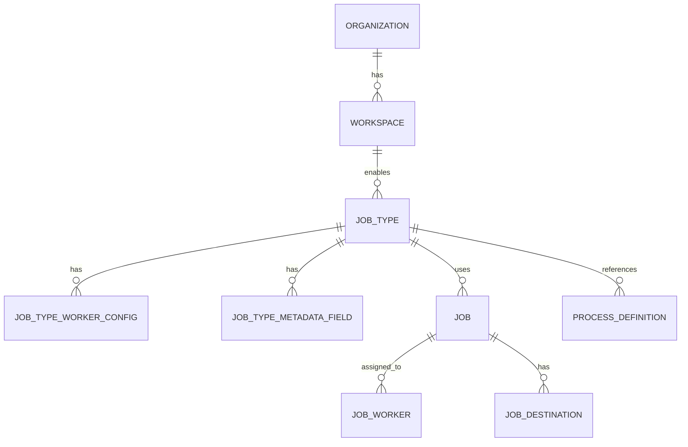

# JobType Registry Architecture

## Overview

This document defines the JobType Registry system for ZanaFleet, enabling multi-vertical support (delivery, moving, wholesale, fleet, marketplace) with flexible configuration per workspace.

## 1. JobType Entity Schema

### Core Entity Design

```typescript
// apps/api/src/modules/job-type/entities/job-type.entity.ts

import {
  Entity,
  PrimaryColumn,
  Column,
  CreateDateColumn,
  UpdateDateColumn,
  Index,
  OneToMany,
} from 'typeorm';

import { JobTypeStatus, JobTypeMode } from '../dto/job-type.enums';
import { JobTypeWorkerConfigEntity } from './job-type-worker-config.entity';
import { JobTypeMetadataFieldEntity } from './job-type-metadata-field.entity';

/**
 * Vertical Enum
 * Defines the business vertical/domain
 */
export enum Vertical {
  DELIVERY = 'delivery',
  MOVING = 'moving',
  WHOLESALE = 'wholesale',
  FLEET = 'fleet',
  MARKETPLACE = 'marketplace',
}

/**
 * JobType Entity
 *
 * Represents a job type template that defines:
 * - Which vertical it belongs to
 * - Worker type requirements
 * - Required metadata fields
 * - Workflow template reference
 * - Assignment strategy
 * - Pricing strategy
 * - UI layout configuration
 * - SLA rules
 *
 * Key Design Decisions:
 * - Uses JSONB for flexible configuration (strategies, UI layouts)
 * - References ProcessDefinitionEntity for workflow templates
 * - Separate entities for worker configs and metadata fields for normalized data
 */
@Entity('job_types')
@Index(['workspaceId'])
@Index(['vertical'])
@Index(['status'])
export class JobTypeEntity {
  @PrimaryColumn('uuid')
  id!: string;

  @Column('uuid')
  workspaceId!: string;

  @Column('varchar', { length: 255 })
  name!: string;

  @Column('text', { nullable: true })
  description!: string | null;

  @Column('enum', { enum: Vertical })
  vertical!: Vertical;

  @Column('enum', { enum: JobTypeMode })
  mode!: JobTypeMode;

  @Column('enum', { enum: JobTypeStatus, default: JobTypeStatus.ACTIVE })
  status!: JobTypeStatus;

  // Worker Configuration
  @OneToMany(() => JobTypeWorkerConfigEntity, (config) => config.jobType, { cascade: true })
  workerConfigs!: JobTypeWorkerConfigEntity[];

  // Metadata Fields
  @OneToMany(() => JobTypeMetadataFieldEntity, (field) => field.jobType, { cascade: true })
  metadataFields!: JobTypeMetadataFieldEntity[];

  // Workflow Template Reference (links to ProcessDefinitionEntity)
  @Column('uuid', { nullable: true })
  workflowDefinitionId!: string | null;

  // Assignment Strategy (JSONB for flexibility)
  @Column('jsonb', { default: {} })
  assignmentStrategy!: AssignmentStrategyConfig;

  // Pricing Strategy (JSONB for flexibility)
  @Column('jsonb', { default: {} })
  pricingStrategy!: PricingStrategyConfig;

  // UI Layout Configuration (JSONB for flexibility)
  @Column('jsonb', { default: {} })
  uiLayoutConfig!: UILayoutConfig;

  // SLA Rules (JSONB for flexibility)
  @Column('jsonb', { default: {} })
  slaRules!: SLARulesConfig;

  // Multi-worker and Multi-destination flags
  @Column('boolean', { default: false })
  supportsMultipleWorkers!: boolean;

  @Column('boolean', { default: false })
  supportsMultipleDestinations!: boolean;

  // Vertical-specific settings (flexible JSONB)
  @Column('jsonb', { nullable: true })
  verticalSpecificSettings!: Record<string, unknown> | null;

  @CreateDateColumn({ type: 'timestamp with time zone' })
  createdAt!: Date;

  @UpdateDateColumn({ type: 'timestamp with time zone' })
  updatedAt!: Date;
}

/**
 * Assignment Strategy Configuration
 */
interface AssignmentStrategyConfig {
  type: 'manual' | 'auto' | 'bidding' | 'hybrid';
  autoAssignmentRules?: {
    maxDistanceKm?: number;
    maxLoadFactor?: number;
    preferredWorkerTypes?: string[];
    fallbackToBidding?: boolean;
  };
  biddingConfig?: {
    biddingWindowMinutes: number;
    minBidders: number;
    visibility: 'all' | 'nearby' | 'preferred';
  };
  hybridConfig?: {
    autoThresholdMinutes: number;
    escalateOnThresholdBreach: boolean;
  };
}

/**
 * Pricing Strategy Configuration
 */
interface PricingStrategyConfig {
  type: 'fixed' | 'dynamic' | 'hourly' | 'distance' | 'hybrid';
  basePrice?: number;
  currency?: string;
  distanceRate?: number;
  hourlyRate?: number;
  surgeMultiplierRules?: {
    timeBased?: { peakHours: string[]; multiplier: number }[];
    demandBased?: { threshold: number; multiplier: number }[];
  };
  calculationFormula?: string;
}

/**
 * UI Layout Configuration
 */
interface UILayoutConfig {
  formSections?: UILayoutSection[];
  detailView?: {
    showMap?: boolean;
    showTimeline?: boolean;
    showWorkerList?: boolean;
    showPricingBreakdown?: boolean;
  };
  consumerBooking?: {
    enabled: boolean;
    publicUrl?: string;
    requireAuthentication?: boolean;
    allowScheduleFuture?: boolean;
    maxAdvanceBookingDays?: number;
  };
}

interface UILayoutSection {
  id: string;
  title: string;
  order: number;
  fields: {
    key: string;
    type:
      | 'text'
      | 'number'
      | 'date'
      | 'datetime'
      | 'select'
      | 'multiselect'
      | 'file'
      | 'location'
      | 'address';
    label: string;
    required: boolean;
    placeholder?: string;
    options?: { value: string; label: string }[];
    validation?: { min?: number; max?: number; pattern?: string };
  }[];
}

/**
 * SLA Rules Configuration
 */
interface SLARulesConfig {
  acceptanceDeadlineMinutes?: number;
  completionDeadlineMinutes?: number;
  arrivalDeadlineMinutes?: number;
  escalationRules?: {
    afterMinutes: number;
    notifyRoles: string[];
    action: 'reassign' | 'notify' | 'escalate';
  }[];
  penaltyConfig?: {
    latePenaltyAmount?: number;
    latePenaltyType?: 'flat' | 'percentage';
    gracePeriodMinutes?: number;
  };
}
```

### Supporting Entities

```typescript
// Worker Configuration Entity
@Entity('job_type_worker_configs')
export class JobTypeWorkerConfigEntity {
  @PrimaryColumn('uuid')
  id!: string;

  @Column('uuid')
  jobTypeId!: string;

  @ManyToOne(() => JobTypeEntity, (jt) => jt.workerConfigs)
  jobType!: JobTypeEntity;

  @Column('varchar', { length: 100 })
  workerType!: string;

  @Column('int', { default: 1 })
  minWorkers!: number;

  @Column('int', { nullable: true })
  maxWorkers!: number | null;

  @Column('boolean', { default: false })
  required!: boolean;

  @Column('jsonb', { nullable: true })
  qualifications!: Record<string, unknown> | null;
}

// Metadata Field Entity
@Entity('job_type_metadata_fields')
export class JobTypeMetadataFieldEntity {
  @PrimaryColumn('uuid')
  id!: string;

  @Column('uuid')
  jobTypeId!: string;

  @ManyToOne(() => JobTypeEntity, (jt) => jt.metadataFields)
  jobType!: JobTypeEntity;

  @Column('varchar', { length: 100 })
  fieldKey!: string;

  @Column('varchar', { length: 255 })
  displayName!: string;

  @Column('text', { nullable: true })
  description!: string | null;

  @Column('enum', { enum: MetadataFieldType, default: MetadataFieldType.TEXT })
  fieldType!: MetadataFieldType;

  @Column('boolean', { default: false })
  required!: boolean;

  @Column('boolean', { default: false })
  isCustomerEditable!: boolean;

  @Column('jsonb', { nullable: true })
  validationRules!: ValidationRules | null;

  @Column('int', { nullable: true })
  displayOrder!: number | null;

  @Column('jsonb', { nullable: true })
  uiConfig!: Record<string, unknown> | null;
}

enum MetadataFieldType {
  TEXT = 'text',
  NUMBER = 'number',
  BOOLEAN = 'boolean',
  DATE = 'date',
  DATETIME = 'datetime',
  SELECT = 'select',
  MULTISELECT = 'multiselect',
  FILE = 'file',
  LOCATION = 'location',
  ADDRESS = 'address',
  PHONE = 'phone',
  EMAIL = 'email',
}

interface ValidationRules {
  min?: number;
  max?: number;
  minLength?: number;
  maxLength?: number;
  pattern?: string;
  allowedValues?: string[];
}
```

---

## 2. How JobType Attaches to Workspace

### Relationship Model



### Database Schema

```sql
-- Core JobType table
CREATE TABLE job_types (
  id UUID PRIMARY KEY DEFAULT gen_random_uuid(),
  workspace_id UUID NOT NULL REFERENCES workspaces(id) ON DELETE CASCADE,
  name VARCHAR(255) NOT NULL,
  description TEXT,
  vertical VARCHAR(50) NOT NULL,
  mode VARCHAR(50) NOT NULL DEFAULT 'internal',
  status VARCHAR(50) NOT NULL DEFAULT 'active',

  -- Foreign Keys
  workflow_definition_id UUID REFERENCES process_definitions(definition_id),

  -- Configuration (JSONB)
  assignment_strategy JSONB DEFAULT '{}',
  pricing_strategy JSONB DEFAULT '{}',
  ui_layout_config JSONB DEFAULT '{}',
  sla_rules JSONB DEFAULT '{}',

  -- Flags
  supports_multiple_workers BOOLEAN DEFAULT false,
  supports_multiple_destinations BOOLEAN DEFAULT false,

  -- Flexible settings
  vertical_specific_settings JSONB,

  created_at TIMESTAMPTZ DEFAULT NOW(),
  updated_at TIMESTAMPTZ DEFAULT NOW(),

  CONSTRAINT valid_vertical CHECK (vertical IN ('delivery', 'moving', 'wholesale', 'fleet', 'marketplace'))
);

CREATE INDEX idx_job_types_workspace ON job_types(workspace_id);
CREATE INDEX idx_job_types_vertical ON job_types(vertical);
CREATE INDEX idx_job_types_status ON job_types(status);

-- Worker Configs
CREATE TABLE job_type_worker_configs (
  id UUID PRIMARY KEY DEFAULT gen_random_uuid(),
  job_type_id UUID NOT NULL REFERENCES job_types(id) ON DELETE CASCADE,
  worker_type VARCHAR(100) NOT NULL,
  min_workers INTEGER DEFAULT 1,
  max_workers INTEGER,
  required BOOLEAN DEFAULT false,
  qualifications JSONB,

  UNIQUE(job_type_id, worker_type)
);

-- Metadata Fields
CREATE TABLE job_type_metadata_fields (
  id UUID PRIMARY KEY DEFAULT gen_random_uuid(),
  job_type_id UUID NOT NULL REFERENCES job_types(id) ON DELETE CASCADE,
  field_key VARCHAR(100) NOT NULL,
  display_name VARCHAR(255) NOT NULL,
  description TEXT,
  field_type VARCHAR(50) NOT NULL DEFAULT 'text',
  required BOOLEAN DEFAULT false,
  is_customer_editable BOOLEAN DEFAULT false,
  validation_rules JSONB,
  display_order INTEGER,
  ui_config JSONB,

  UNIQUE(job_type_id, field_key)
);

-- Junction table for workspace -> job_types sharing
CREATE TABLE workspace_job_types (
  workspace_id UUID NOT NULL REFERENCES workspaces(id) ON DELETE CASCADE,
  job_type_id UUID NOT NULL REFERENCES job_types(id) ON DELETE CASCADE,
  enabled_at TIMESTAMPTZ DEFAULT NOW(),
  enabled_by UUID REFERENCES actors(id),

  PRIMARY KEY (workspace_id, job_type_id)
);
```

### Workspace Attachment Patterns

```typescript
// Pattern 1: Direct ownership - JobType belongs to workspace
@Entity('job_types')
export class JobTypeEntity {
  @Column('uuid')
  workspaceId!: string; // Owner workspace
}

// Pattern 2: Template inheritance
@Entity('job_types')
export class JobTypeEntity {
  @Column('uuid', { nullable: true })
  baseTemplateId!: string | null; // Template this job type was derived from
}

// Pattern 3: Cross-workspace sharing via junction table
// Use workspace_job_types table to enable a job type in multiple workspaces
```

---

## 3. How UI Reads JobType to Render Pages

### API Design for UI Consumption

```typescript
// apps/api/src/modules/job-type/controllers/job-type-config.controller.ts

@Controller('job-types')
export class JobTypeConfigController {
  constructor(private readonly jobTypeService: JobTypeService) {}

  /**
   * GET /job-types/:id/ui-config
   * Returns complete UI configuration for rendering
   */
  @Get(':id/ui-config')
  @UseGuards(WorkspaceContextGuard)
  async getJobTypeUIConfig(
    @Param('id') jobTypeId: string,
    @WorkspaceContext() context: WorkspaceContext
  ): Promise<JobTypeUIConfigResponse> {
    const jobType = await this.jobTypeService.findById(jobTypeId, context.workspaceId);
    return this.transformToUIConfig(jobType);
  }

  /**
   * GET /job-types/active/ui-configs
   * Returns all active job types for the current workspace
   */
  @Get('active/ui-configs')
  @UseGuards(WorkspaceContextGuard)
  async getActiveJobTypeConfigs(
    @WorkspaceContext() context: WorkspaceContext
  ): Promise<JobTypeUIConfigResponse[]> {
    const jobTypes = await this.jobTypeService.findActiveByWorkspace(context.workspaceId);
    return jobTypes.map((jt) => this.transformToUIConfig(jt));
  }

  private transformToUIConfig(jobType: JobTypeEntity): JobTypeUIConfigResponse {
    return {
      id: jobType.id,
      name: jobType.name,
      vertical: jobType.vertical,
      mode: jobType.mode,
      metadataFields: jobType.metadataFields
        .sort((a, b) => (a.displayOrder ?? 0) - (b.displayOrder ?? 0))
        .map((f) => ({
          key: f.fieldKey,
          label: f.displayName,
          type: f.fieldType,
          required: f.required,
          editableByCustomer: f.isCustomerEditable,
          placeholder: f.uiConfig?.placeholder as string | undefined,
          options: f.uiConfig?.options as SelectOption[] | undefined,
          validation: f.validationRules,
        })),
      uiLayout: {
        sections: jobType.uiLayoutConfig.formSections ?? [],
        detailView: jobType.uiLayoutConfig.detailView ?? {},
        consumerBooking: jobType.uiLayoutConfig.consumerBooking,
      },
      workerTypes: jobType.workerConfigs.map((wc) => ({
        type: wc.workerType,
        minCount: wc.minWorkers,
        maxCount: wc.maxWorkers,
        required: wc.required,
      })),
      supportsMultiWorker: jobType.supportsMultipleWorkers,
      supportsMultiDestination: jobType.supportsMultipleDestinations,
    };
  }
}
```

### Frontend Integration Pattern

```typescript
// React hook for fetching and caching job type configuration
function useJobTypeConfig({ jobTypeId, workspaceId }: UseJobTypeConfigOptions) {
  const queryClient = useQueryClient();

  const configQuery = useQuery({
    queryKey: ['jobTypeConfig', jobTypeId, workspaceId],
    queryFn: () => fetchJobTypeUIConfig(jobTypeId!, workspaceId),
    enabled: !!jobTypeId,
  });

  // Transform config into form schema (Zod)
  const formSchema = useMemo(() => {
    if (!configQuery.data) return null;

    return z.object(
      configQuery.data.metadataFields.reduce((acc, field) => {
        let fieldSchema: z.ZodTypeAny;

        switch (field.type) {
          case 'text':
            fieldSchema = z.string();
            if (field.validation?.minLength) {
              fieldSchema = (fieldSchema as z.ZodString).min(field.validation.minLength);
            }
            if (field.validation?.maxLength) {
              fieldSchema = (fieldSchema as z.ZodString).max(field.validation.maxLength);
            }
            break;
          case 'number':
            fieldSchema = z.number();
            if (field.validation?.min !== undefined) {
              fieldSchema = (fieldSchema as z.ZodNumber).min(field.validation.min);
            }
            if (field.validation?.max !== undefined) {
              fieldSchema = (fieldSchema as z.ZodNumber).max(field.validation.max);
            }
            break;
          case 'select':
            fieldSchema = z.enum(field.options?.map((o) => o.value) as [string, ...string[]]);
            break;
          case 'boolean':
            fieldSchema = z.boolean();
            break;
          case 'date':
          case 'datetime':
            fieldSchema = z.string().datetime();
            break;
          default:
            fieldSchema = z.unknown();
        }

        acc[field.key] = field.required ? fieldSchema : fieldSchema.optional();
        return acc;
      }, {} as Record<string, z.ZodTypeAny>)
    );
  }, [configQuery.data]);

  return { config: configQuery.data, isLoading: configQuery.isLoading, formSchema };
}

// Dynamic Form Renderer Component
function JobTypeFormRenderer({
  jobTypeId,
  onSubmit,
}: {
  jobTypeId: string;
  onSubmit: (data: any) => void;
}) {
  const { config, formSchema } = useJobTypeConfig({ jobTypeId, workspaceId: useWorkspaceId() });
  const form = useForm({ schema: formSchema });

  if (!config) return <Skeleton />;

  return (
    <Form form={form} onSubmit={onSubmit}>
      {config.uiLayout.sections.map((section) => (
        <FormSection key={section.id} title={section.title}>
          {section.fields.map((field) => (
            <FieldRenderer
              key={field.key}
              field={field}
              register={form.register}
              control={form.control}
            />
          ))}
        </FormSection>
      ))}
      <FormSubmit />
    </Form>
  );
}
```

---

## 4. How to Avoid Hardcoded Branching in Backend

### Strategy Pattern with JobType-Driven Resolution

```typescript
// apps/api/src/modules/job/services/job-type-resolver.service.ts

/**
 * JobTypeResolver Service
 * Resolves the appropriate handler/strategy based on JobType configuration
 */
@Injectable()
export class JobTypeResolverService {
  constructor(
    private readonly jobTypeRepository: JobTypeRepository,
    private readonly strategyRegistry: JobStrategyRegistry
  ) {}

  async resolveCreationStrategy(
    jobTypeId: string,
    workspaceId: string
  ): Promise<JobCreationStrategy> {
    const jobType = await this.jobTypeRepository.findById(jobTypeId, workspaceId);

    if (!jobType) {
      throw new JobTypeNotFoundException(jobTypeId);
    }

    // Get strategy from registry based on job type's configuration
    const strategy = this.strategyRegistry.getStrategy(
      jobType.assignmentStrategy.type,
      jobType.mode
    );

    return strategy;
  }

  async resolvePricingCalculator(
    jobTypeId: string,
    workspaceId: string
  ): Promise<PricingCalculator> {
    const jobType = await this.jobTypeRepository.findById(jobTypeId, workspaceId);
    return this.pricingCalculatorRegistry.getCalculator(
      jobType.pricingStrategy.type,
      jobType.pricingStrategy
    );
  }
}

/**
 * Strategy Registry - Central registry for all job-related strategies
 */
@Injectable()
export class JobStrategyRegistry {
  private strategies = new Map<string, JobCreationStrategy>();

  constructor(
    private autoStrategy: AutoAssignmentStrategy,
    private manualStrategy: ManualAssignmentStrategy,
    private biddingStrategy: BiddingAssignmentStrategy,
    private hybridStrategy: HybridAssignmentStrategy
  ) {
    // Register strategies with composite keys
    this.strategies.set('auto:internal', autoStrategy);
    this.strategies.set('auto:marketplace', autoStrategy);
    this.strategies.set('manual:internal', manualStrategy);
    this.strategies.set('manual:marketplace', manualStrategy);
    this.strategies.set('bidding:marketplace', biddingStrategy);
    this.strategies.set('hybrid:internal', hybridStrategy);
  }

  getStrategy(assignmentType: string, mode: string): JobCreationStrategy {
    const key = `${assignmentType}:${mode}`;
    return this.strategies.get(key) ?? this.strategies.get('manual:internal')!;
  }
}
```

### Command Handler Pattern

```typescript
// apps/api/src/modules/job/handlers/create-job.handler.ts

@CommandHandler(CreateJobCommand)
export class CreateJobHandler implements ICommandHandler<CreateJobCommand> {
  constructor(
    private readonly jobTypeResolver: JobTypeResolverService,
    private readonly eventBus: EventBus
  ) {}

  async execute(command: CreateJobCommand): Promise<JobCreatedEvent> {
    const { data, workspaceId } = command;

    // 1. Get job type configuration
    const jobType = await this.jobTypeService.findById(data.jobTypeId, workspaceId);

    // 2. Validate metadata against job type's required fields
    this.validateMetadata(jobType, data.metadata);

    // 3. Validate worker requirements
    this.validateWorkerRequirements(jobType, data.assignedWorkers);

    // 4. Resolve and execute creation strategy (no branching on vertical!)
    const strategy = await this.jobTypeResolver.resolveCreationStrategy(
      data.jobTypeId,
      workspaceId
    );
    const job = await strategy.create({ ...data, jobType });

    // 5. Calculate pricing using job type's strategy
    const pricing = await this.jobTypeResolver.resolvePricingCalculator(
      data.jobTypeId,
      workspaceId
    );
    const calculatedPrice = await pricing.calculate(job, data.pricingInput);

    // 6. Emit event
    const event = new JobCreatedEvent({
      jobId: job.id,
      workspaceId,
      jobTypeId: jobType.id,
      vertical: jobType.vertical,
      metadata: data.metadata,
      assignedWorkers: data.assignedWorkers,
      destinations: data.destinations,
      calculatedPrice,
      createdBy: data.createdBy,
    });

    await this.eventBus.publish(event);
    return event;
  }

  private validateMetadata(jobType: JobTypeEntity, metadata: Record<string, unknown>): void {
    const requiredFields = jobType.metadataFields.filter((f) => f.required).map((f) => f.fieldKey);
    const missingFields = requiredFields.filter((key) => !(key in metadata));

    if (missingFields.length > 0) {
      throw new MissingRequiredMetadataException(missingFields);
    }
  }
}
```

### SLA Enforcement Pattern

```typescript
// apps/api/src/modules/job/services/sla-enforcement.service.ts

@Injectable()
export class SLAEnforcementService {
  constructor(
    private readonly jobTypeService: JobTypeService,
    private readonly notificationService: NotificationService
  ) {}

  async enforceSLA(jobId: string): Promise<void> {
    const job = await this.jobRepository.findById(jobId);
    const jobType = await this.jobTypeService.findById(job.jobTypeId, job.workspaceId);
    const slaRules = jobType.slaRules;

    if (!slaRules) return;

    const now = new Date();
    const createdAt = job.createdAt;

    // Check acceptance deadline
    if (slaRules.acceptanceDeadlineMinutes && !job.acceptedAt) {
      const deadline = addMinutes(createdAt, slaRules.acceptanceDeadlineMinutes);
      if (now > deadline) {
        await this.handleSLAViolation(job, 'acceptance', slaRules);
      }
    }
  }

  private async handleSLAViolation(
    job: JobEntity,
    type: string,
    slaRules: SLARulesConfig
  ): Promise<void> {
    if (slaRules.penaltyConfig) {
      await this.applyPenalty(job, slaRules.penaltyConfig);
    }
    if (slaRules.escalationRules) {
      for (const rule of slaRules.escalationRules) {
        await this.executeEscalation(job, type, rule);
      }
    }
  }
}
```

---

## 5. Strategy for Adding New Vertical in Under 1 Day

### Vertical Onboarding Checklist

| Step      | Task                                           | Time        |
| --------- | ---------------------------------------------- | ----------- |
| 1         | Add new vertical to `Vertical` enum            | 5 min       |
| 2         | Create JobType template JSON                   | 15 min      |
| 3         | Create workflow definition reference           | 10 min      |
| 4         | Register UI components in frontend             | 20 min      |
| 5         | Implement pricing/assignment adapters (if new) | 15 min      |
| **Total** |                                                | **~65 min** |

### Implementation Example: Adding "Wholesale" Vertical

```typescript
// Step 1: Update enum
export enum Vertical {
  DELIVERY = 'delivery',
  MOVING = 'moving',
  WHOLESALE = 'wholesale',  // NEW
  FLEET = 'fleet',
  MARKETPLACE = 'marketplace',
}

// Step 2: Create wholesale job type template
const WHOLESALE_JOB_TYPE_TEMPLATE = {
  name: 'Wholesale Delivery',
  vertical: Vertical.WHOLESALE,
  workerConfigs: [
    { workerType: 'driver', minWorkers: 1, required: true },
    { workerType: 'loader', minWorkers: 2, maxWorkers: 4, required: true },
  ],
  metadataFields: [
    { fieldKey: 'inventory_list', displayName: 'Inventory List', fieldType: 'file', required: true },
    { fieldKey: 'delivery_window', displayName: 'Delivery Window', fieldType: 'datetime', required: true },
    { fieldKey: 'lift_type', displayName: 'Lift Type', fieldType: 'select', options: ['ground', 'elevator', 'stairs'] },
    { fieldKey: 'packing_required', displayName: 'Packing Required', fieldType: 'boolean' },
  ],
  assignmentStrategy: { type: 'auto' },
  pricingStrategy: { type: 'distance', basePrice: 50, distanceRate: 2.5 },
  uiLayoutConfig: {
    formSections: [
      { id: 'inventory', title: 'Inventory Details', fields: ['inventory_list', 'item_count'] },
      { id: 'logistics', title: 'Logistics', fields: ['delivery_window', 'lift_type', 'packing_required'] },
    ],
    detailView: { showMap: true, showWorkerList: true },
  },
  slaRulesDeadlineMinutes: 30,
    completionDeadlineMinutes: : {
    acceptance240,
  },
  supportsMultipleDestinations: true,
  supportsMultipleWorkers: true,
};

// Step 3: Seed service
@Injectable()
export class JobTypeSeedService {
  async seedWholesaleVertical(): Promise<void> {
    const template = WHOLESALE_JOB_TYPE_TEMPLATE;
    for (const workspace of await this.getEligibleWorkspaces()) {
      await this.createJobTypeFromTemplate(workspace.id, template);
    }
  }
}
```

### Pre-Built Template Library

```typescript
export const JOB_TYPE_TEMPLATES = {
  delivery: { standard: {}, express: {}, scheduled: {} },
  moving: { home_move: {}, office_move: {}, furniture_delivery: {} },
  wholesale: { bulk_delivery: {}, restock: {} },
  fleet: { charter: {}, rental: {} },
  marketplace: { on_demand: {}, booking: {} },
};
```

---

## 6. Pros/Cons: Strict vs Flexible JobType Schemas

### Strict Schema Approach

```typescript
@Entity('job_types')
export class JobTypeEntity {
  // Fixed columns for each aspect
  @Column('enum', { enum: PricingType })
  pricingType!: PricingType;

  @Column('enum', { enum: AssignmentType })
  assignmentType!: AssignmentType;

  // Each feature has dedicated columns
  @Column('int', { nullable: true })
  acceptanceDeadlineMinutes!: number | null;

  @Column('int', { nullable: true })
  completionDeadlineMinutes!: number | null;
}
```

| Pros                                                   | Cons                                                    |
| ------------------------------------------------------ | ------------------------------------------------------- |
| **Type Safety**: Full TypeORM/TypeScript checking      | **Schema Migration**: ALTER TABLE for new features      |
| **Query Performance**: Native columns, indexed, faster | **Inflexible**: Hard to add new configurations          |
| **Validation**: Database-level constraints             | **Feature Freeze**: Can't add verticals without changes |
| **Documentation**: Schema is self-documenting          | **Maintenance**: Each feature = migration + code        |
| **IDE Support**: Auto-complete for all fields          | **Coupling**: Business logic tied to schema             |

### Flexible Schema Approach (JSONB) - Current Design

```typescript
@Entity('job_types')
export class JobTypeEntity {
  // JSONB columns for flexibility
  @Column('jsonb', { default: {} })
  assignmentStrategy!: AssignmentStrategyConfig;

  @Column('jsonb', { default: {} })
  pricingStrategy!: PricingStrategyConfig;

  @Column('jsonb', { default: {} })
  slaRules!: SLARulesConfig;

  // Only core fields are strict
  @Column('enum', { enum: Vertical })
  vertical!: Vertical;
}

interface AssignmentStrategyConfig {
  type: 'manual' | 'auto' | 'bidding' | 'hybrid';
  // ... flexible configuration
}
```

| Pros                                                 | Cons                                             |
| ---------------------------------------------------- | ------------------------------------------------ |
| **Extensibility**: Add strategies without migrations | **Query Complexity**: JSONB queries more complex |
| **Rapid Development**: New verticals in hours        | **Type Safety**: Lose compile-time checking      |
| **No Downtime**: Schema-free configuration           | **Performance**: Larger storage, slower reads    |
| **Vertical Agnostic**: Any configuration possible    | **Validation**: Need app-level validation        |
| **A/B Testing**: Easy to create variants             | **Debugging**: Harder to inspect stored values   |

### Recommendation: Hybrid Approach

Use **Hybrid** as designed in this document:

1. **Strict Core Fields** (queries, indexing, FK):

   - `id`, `workspaceId`, `vertical`, `mode`, `status`
   - `workflowDefinitionId` (FK)
   - `supportsMultipleWorkers`, `supportsMultipleDestinations`

2. **Normalized Relations** (data integrity):

   - `workerConfigs` (OneToMany)
   - `metadataFields` (OneToMany)

3. **Flexible JSONB** (configuration):
   - `assignmentStrategy`, `pricingStrategy`
   - `uiLayoutConfig`, `slaRules`
   - `verticalSpecificSettings`

---

## Summary

The JobType Registry design provides:

1. **Multi-vertical support** via `Vertical` enum and flexible `verticalSpecificSettings`
2. **Workspace attachment** via `workspaceId` FK and optional sharing via junction table
3. **UI integration** via `/ui-config` endpoints returning transformed configuration
4. **No hardcoded branching** via Strategy pattern resolution based on JobType configuration
5. **Rapid vertical onboarding** via templates and seed services
6. **Hybrid schema** balancing type safety with flexibility
