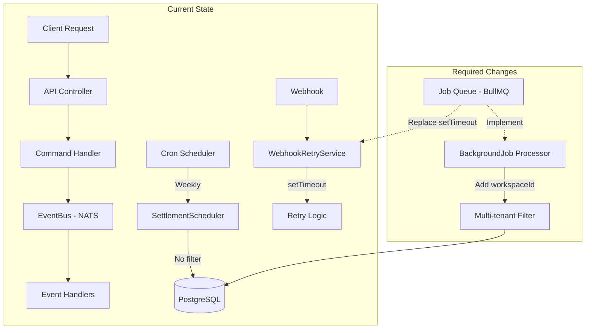

# Background Job Queue System Audit Report

**Audit Date:** 2026-02-23
**Auditor:** Architect Mode Analysis
**Scope:** ZanaFleet NestJS API Monorepo - Background Job Queue System

---

## Executive Summary

This audit evaluates the background job queue system in the ZanaFleet codebase. The system currently consists of:

- **Schedule Module Integration:** `@nestjs/schedule` is integrated at the application root level
- **Job Queue Interface:** A skeletal abstraction layer exists for BullMQ/Temporal but is **not implemented**
- **Cron Jobs:** Only one production cron job exists (`SettlementSchedulerService`)
- **Event-Driven Agents:** Agent runtime with event triggers and scheduled triggers
- **Webhook Retry:** Uses setTimeout-based scheduling (not production-ready)

**Overall Assessment:** ⚠️ **PARTIAL IMPLEMENTATION** - The foundation exists but critical production capabilities are missing.

---

## 1. Job Queue Infrastructure

### 1.1 Schedule Module

| Aspect                        | Status         | Location                                                         | Notes                             |
| ----------------------------- | -------------- | ---------------------------------------------------------------- | --------------------------------- |
| `@nestjs/schedule` dependency | ✅ Implemented | `package.json:61`                                                | Version 6.1.1                     |
| ScheduleModule.forRoot()      | ✅ Implemented | [`apps/api/src/app.module.ts:75`](apps/api/src/app.module.ts:75) | Properly initialized              |
| Cron decorators               | ⚠️ Partial     | 1 found                                                          | Only `SettlementSchedulerService` |
| Dynamic cron jobs             | ❌ Missing     | -                                                                | No runtime cron management        |

### 1.2 BullMQ/Job Queue

| Aspect               | Status             | Location                                                                                                               | Notes                             |
| -------------------- | ------------------ | ---------------------------------------------------------------------------------------------------------------------- | --------------------------------- |
| BullMQ package       | ❌ Missing         | `package.json`                                                                                                         | Not in dependencies               |
| ioredis              | ✅ Present         | `package.json:71`                                                                                                      | Available but not used for queues |
| JobQueue interface   | ⚠️ Partial         | [`apps/api/src/modules/agents/queue/job-queue.interface.ts`](apps/api/src/modules/agents/queue/job-queue.interface.ts) | Only skeleton - no implementation |
| BullMQJobQueue class | ❌ Not Implemented | [`job-queue.interface.ts:84`](apps/api/src/modules/agents/queue/job-queue.interface.ts:84)                             | All methods are stubs             |

**Critical Finding:** The job queue abstraction is defined but has **zero actual implementation**. All methods in `BullMQJobQueue` return null/0 or have TODO comments.

---

## 2. Cron Job Usage

### 2.1 Existing Cron Jobs

```typescript
// Location: apps/api/src/modules/settlement/services/settlement-scheduler.service.ts

@Cron(CronExpression.EVERY_WEEK)
async processWeeklySettlements(): Promise<void> {
  // Processes ALL rider accounts across ALL workspaces
}
```

| Cron Job                   | Frequency | Status    | Multi-Tenant Aware |
| -------------------------- | --------- | --------- | ------------------ |
| `processWeeklySettlements` | Weekly    | ✅ Active | ❌ **NO**          |

### 2.2 Agent Scheduled Triggers

The agent system defines scheduled triggers in agent configurations:

```typescript
// Location: apps/api/src/modules/agents/examples/risk-monitoring.agent.ts:59
{
  type: AgentTriggerType.SCHEDULED,
  cronExpression: '*/15 * * * *', // Every 15 minutes
  timezone: 'UTC',
}
```

However, these are **not actually registered** with the NestJS scheduler - they're just configuration.

---

## 3. Multi-Tenant Scoping Analysis

### 3.1 BackgroundJob Interface

```typescript
// Location: apps/api/src/modules/agents/types/index.ts:261
export interface BackgroundJob {
  id: string;
  name: string;
  agentId: string;
  payload: Record<string, unknown>;
  correlationId: string;
  idempotencyKey: string;
  retryPolicy: RetryPolicy;
  priority?: number;
  scheduledAt?: Date;
  createdAt: Date;
  // ❌ MISSING: workspaceId
  // ❌ MISSING: organizationId
}
```

**Status:** ❌ **CRITICAL GAP** - `BackgroundJob` interface lacks `workspaceId` and `organizationId` for multi-tenant isolation.

### 3.2 Agent Multi-Tenancy (for comparison)

```typescript
// Agent interface HAS tenantScope - apps/api/src/modules/agents/types/index.ts:104
tenantScope: TenantScope;  // Contains workspaceId, organizationId

// AgentContext also HAS workspaceId - line 123
workspaceId: string;
organizationId?: string;
```

**Finding:** Agents are multi-tenant aware, but the `BackgroundJob` interface they use is **not**.

### 3.3 Settlement Scheduler Multi-Tenancy

```typescript
// Location: apps/api/src/modules/settlement/services/settlement-scheduler.service.ts:61
async processSettlementsForPeriod(periodStart: Date, periodEnd: Date): Promise<void> {
  const riderAccounts = await this.accountRepository.find({
    where: { accountType: AccountType.RIDER },
    // ❌ NO workspaceId filter - processes ALL workspaces
  });
}
```

**Status:** ❌ **CRITICAL VULNERABILITY** - Processes settlements for ALL workspaces in a single job execution.

---

## 4. Retry & Failure Handling

### 4.1 Event Bus Retry Service

| Aspect                   | Status         | Location                                                                                                         |
| ------------------------ | -------------- | ---------------------------------------------------------------------------------------------------------------- |
| Exponential backoff      | ✅ Implemented | [`apps/api/src/core/event-bus/services/retry.service.ts`](apps/api/src/core/event-bus/services/retry.service.ts) |
| Configurable max retries | ✅ Implemented | Default: 3                                                                                                       |
| Configurable base delay  | ✅ Implemented | Default: 1000ms                                                                                                  |
| Multiplier support       | ✅ Implemented | Default: 2                                                                                                       |
| onRetry callback         | ✅ Implemented | Optional hook                                                                                                    |

### 4.2 Webhook Retry Service

| Aspect                          | Status         | Location                                                                                                                     |
| ------------------------------- | -------------- | ---------------------------------------------------------------------------------------------------------------------------- |
| Exponential backoff             | ✅ Implemented | [`apps/api/src/core/webhook/services/webhook-retry.service.ts`](apps/api/src/core/webhook/services/webhook-retry.service.ts) |
| **setTimeout-based scheduling** | ⚠️ **FRAGILE** | Line 78 - won't survive process restart                                                                                      |
| Database state tracking         | ✅ Implemented | Tracks attemptNumber, nextRetryAt                                                                                            |
| Max retry limit                 | ✅ Implemented | Default: 3                                                                                                                   |

**Critical Issue:** Webhook retries use `setTimeout()` which is **not production-ready**:

- ❌ Won't survive process restart
- ❌ Not distributed - runs on single instance
- ❌ No backpressure handling

### 4.3 Agent Retry Policies

```typescript
// Location: apps/api/src/modules/agents/types/index.ts:39
export interface RetryPolicy {
  maxRetries: number;
  initialBackoffMs: number;
  maxBackoffMs: number;
  backoffMultiplier: number;
  retryableErrors?: string[];
}
```

| Agent           | Max Retries | Initial Backoff | Max Backoff | Multiplier |
| --------------- | ----------- | --------------- | ----------- | ---------- |
| Risk Monitoring | 5           | 2000ms          | 60000ms     | 2          |

---

## 5. Event-Driven Workflow Integration

### 5.1 Event Bus (NATS)

| Aspect                   | Status         | Location                                                                                               |
| ------------------------ | -------------- | ------------------------------------------------------------------------------------------------------ |
| NATS client              | ✅ Implemented | [`apps/api/src/core/event-bus/event-bus.service.ts`](apps/api/src/core/event-bus/event-bus.service.ts) |
| Event publishing         | ✅ Implemented | publish() method                                                                                       |
| Retry on publish failure | ✅ Implemented | Uses RetryService                                                                                      |
| Metrics integration      | ✅ Implemented | Publishes to MetricsService                                                                            |

### 5.2 Agent Event Triggers

```typescript
// Location: apps/api/src/modules/agents/types/index.ts:69
export interface AgentTrigger {
  type: AgentTriggerType;
  eventPattern?: string;
  eventTypes?: string[];
  cronExpression?: string;
  timezone?: string;
  conditions?: Record<string, unknown>;
  debounceWindowMs?: number;
}
```

| Trigger Type | Status         | Implementation                                                                                                                          |
| ------------ | -------------- | --------------------------------------------------------------------------------------------------------------------------------------- |
| EVENT        | ✅ Implemented | [`agent-runtime.service.ts:64`](apps/api/src/modules/agents/runtime/agent-runtime.service.ts:64) - handleEvent()                        |
| SCHEDULED    | ⚠️ Stub Only   | [`agent-runtime.service.ts:91`](apps/api/src/modules/agents/runtime/agent-runtime.service.ts:91) - runScheduled() exists but not called |
| MANUAL       | ❌ Missing     | No implementation                                                                                                                       |

### 5.3 Background Job → Event Integration

The `JobQueue` interface has:

- ✅ `enqueue(job: BackgroundJob)`
- ✅ `process(handler)` for workers
- ✅ `getStatus()` for monitoring
- ❌ **Not implemented** - all methods are stubs

---

## 6. Gap Analysis Summary

### Critical Gaps (Production Blockers)

| Gap                                  | Severity    | Impact                         | Location                                                                                                            |
| ------------------------------------ | ----------- | ------------------------------ | ------------------------------------------------------------------------------------------------------------------- |
| No BullMQ implementation             | 🔴 Critical | Cannot process background jobs | [`job-queue.interface.ts`](apps/api/src/modules/agents/queue/job-queue.interface.ts)                                |
| BackgroundJob missing workspaceId    | 🔴 Critical | No multi-tenant isolation      | [`types/index.ts:261`](apps/api/src/modules/agents/types/index.ts:261)                                              |
| SettlementScheduler no tenant filter | 🔴 Critical | Data leakage across workspaces | [`settlement-scheduler.service.ts:61`](apps/api/src/modules/settlement/services/settlement-scheduler.service.ts:61) |
| setTimeout for webhook retries       | 🔴 Critical | Unreliable in production       | [`webhook-retry.service.ts:78`](apps/api/src/core/webhook/services/webhook-retry.service.ts:78)                     |

### Important Gaps (Should Fix)

| Gap                             | Severity  | Impact                               | Location                                                                                   |
| ------------------------------- | --------- | ------------------------------------ | ------------------------------------------------------------------------------------------ |
| No scheduled agent execution    | 🟠 High   | Agent triggers not wired             | [`agent-runtime.service.ts`](apps/api/src/modules/agents/runtime/agent-runtime.service.ts) |
| No dead letter queue (DLQ)      | 🟠 High   | Failed jobs lost                     | JobQueue interface missing DLQ config                                                      |
| No job visibility/monitoring    | 🟠 High   | No admin UI for jobs                 | -                                                                                          |
| No job prioritization by tenant | 🟡 Medium | Cannot prioritize high-value tenants | -                                                                                          |

### Missing Features (Enhancements)

| Feature                       | Status     | Notes                          |
| ----------------------------- | ---------- | ------------------------------ |
| Distributed locking           | ❌ Missing | Needed for multi-instance cron |
| Job scheduling (delayed jobs) | ❌ Missing | Only immediate enqueue         |
| Bulk job operations           | ❌ Missing | No batch enqueue               |
| Job chaining/dependencies     | ❌ Missing | No workflow pipelines          |

---

## 7. Production Readiness Assessment

### ✅ What's Working

1. **Event Bus (NATS)** - Robust event publishing with retry
2. **RetryService** - Proper exponential backoff implementation
3. **Schedule Module** - Properly initialized
4. **Agent Type Definitions** - Well-designed interfaces with multi-tenant support
5. **Webhook Delivery Logging** - Persistent retry state in database

### ⚠️ Needs Work

1. **Cron Job Multi-Tenancy** - Must filter by workspaceId
2. **Job Queue Implementation** - Must implement BullMQ
3. **Webhook Retry** - Must use proper queue instead of setTimeout
4. **BackgroundJob Interface** - Must add tenant scope

### ❌ Not Ready for Production

1. **SettlementSchedulerService** - Processes all tenants together (security issue)
2. **BackgroundJob processing** - No actual implementation exists
3. **Scheduled Agent Triggers** - Not wired to scheduler

---

## 8. Recommendations

### Priority 1: Critical Fixes

1. **Implement BullMQ Job Queue**

   - Add `bullmq` package to dependencies
   - Implement `BullMQJobQueue` class
   - Add workspaceId to BackgroundJob interface

2. **Fix Settlement Scheduler Multi-Tenancy**

   - Query settlements per workspace or per organization
   - Consider scheduled jobs per tenant

3. **Replace setTimeout with Queue-Based Retry**
   - Move webhook retries to BullMQ
   - Use scheduled delays in Redis

### Priority 2: Essential Features

4. **Wire Scheduled Agent Triggers**

   - Register cron expressions with NestJS scheduler
   - Add `@Cron` decorators to agent executor

5. **Implement Dead Letter Queue**
   - Configure DLQ for failed jobs
   - Add monitoring/alerts for DLQ growth

### Priority 3: Production Hardening

6. **Add Job Visibility APIs**

   - Job status endpoints
   - Admin UI for job management

7. **Implement Distributed Locking**
   - Prevent duplicate cron job execution
   - Use Redis-based locks

---

## 9. Architecture Diagram



---

## Appendix: File Locations Reference

| Component             | File Path                                                                                                                                              |
| --------------------- | ------------------------------------------------------------------------------------------------------------------------------------------------------ |
| Schedule Module Setup | [`apps/api/src/app.module.ts:75`](apps/api/src/app.module.ts:75)                                                                                       |
| Job Queue Interface   | [`apps/api/src/modules/agents/queue/job-queue.interface.ts`](apps/api/src/modules/agents/queue/job-queue.interface.ts)                                 |
| BackgroundJob Type    | [`apps/api/src/modules/agents/types/index.ts:261`](apps/api/src/modules/agents/types/index.ts:261)                                                     |
| Settlement Scheduler  | [`apps/api/src/modules/settlement/services/settlement-scheduler.service.ts`](apps/api/src/modules/settlement/services/settlement-scheduler.service.ts) |
| Event Bus Retry       | [`apps/api/src/core/event-bus/services/retry.service.ts`](apps/api/src/core/event-bus/services/retry.service.ts)                                       |
| Webhook Retry         | [`apps/api/src/core/webhook/services/webhook-retry.service.ts`](apps/api/src/core/webhook/services/webhook-retry.service.ts)                           |
| Agent Runtime         | [`apps/api/src/modules/agents/runtime/agent-runtime.service.ts`](apps/api/src/modules/agents/runtime/agent-runtime.service.ts)                         |

---

_End of Audit Report_
