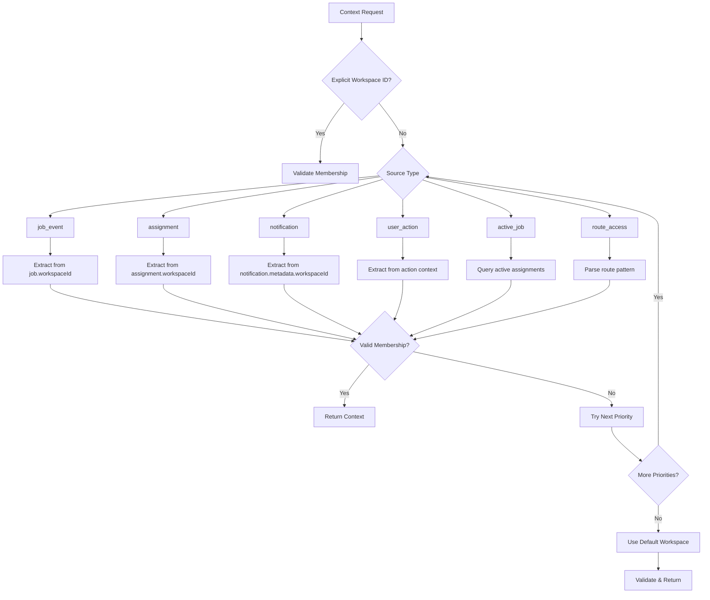
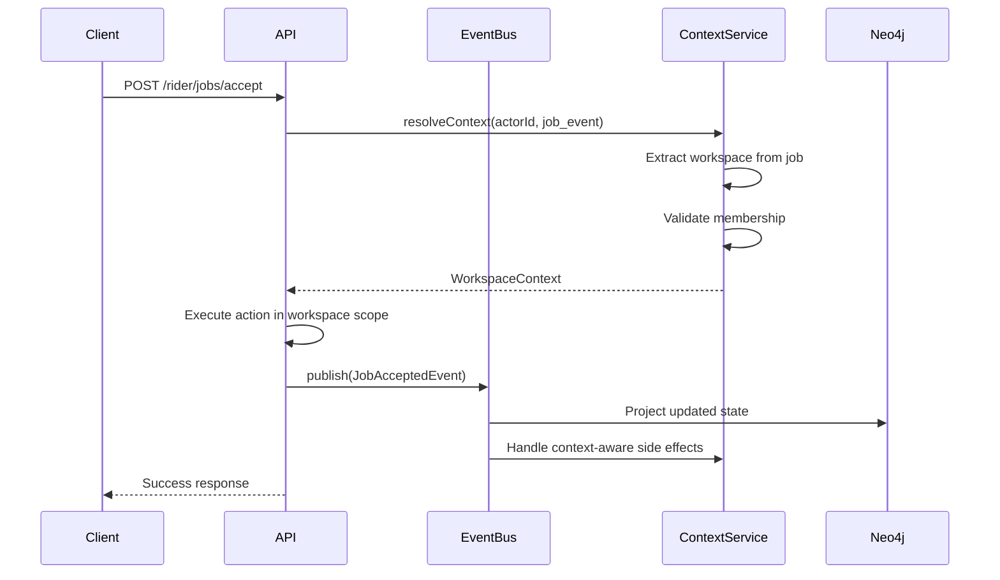
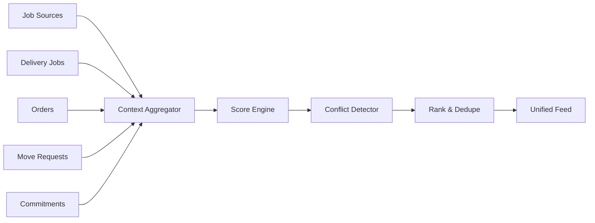
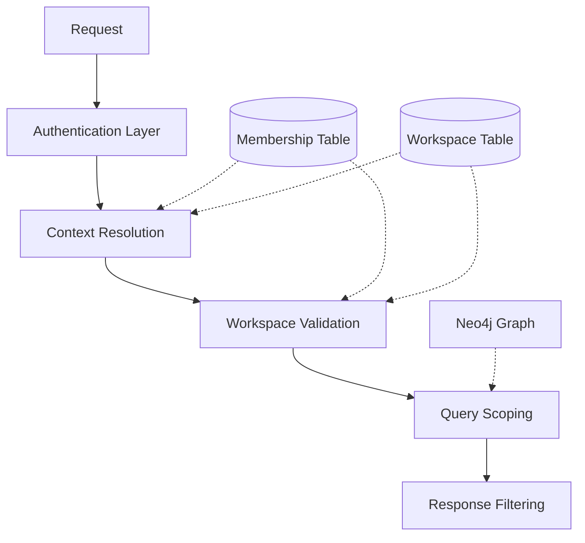

# Multi-Workspace Context Resolution Engine - Complete Specification

## Executive Summary

This document defines the complete Context Resolution Engine that enables seamless multi-workspace operations for ZanaFleet. The engine handles context inference, role projection, job feed aggregation, conflict resolution, and notification disambiguation while maintaining strict data isolation.

### Design Principles

1. **Zero Manual Switching** - UI never requires explicit workspace selection for normal operations
2. **Absorb Complexity Internally** - All workspace resolution logic hidden from users
3. **Strict Isolation** - No cross-tenant data leakage under any circumstances
4. **Real-time Reconciliation** - Feed updates immediately reflect workspace state changes

---

## Part 1: Context Inference Algorithm

### 1.1 Priority Chain Resolution

The context inference follows a strict priority chain. Each source is evaluated in order, and the first valid context wins.



### 1.2 Source-Specific Resolution Rules

#### Job Event Resolution

```
Input: JobCreatedEvent | JobAssignedEvent | JobCompletedEvent
Logic:
  1. Extract job.workspaceId from event payload
  2. Query MembershipEntity where actorId = event.actorId AND workspaceId = job.workspaceId
  3. If membership exists → return context with roles
  4. If not → reject with DATA_ISOLATION_VIOLATION error
```

#### Assignment Resolution

```
Input: { actorId, assignmentId, assignmentType }
Logic:
  1. Query assignment (Delivery | Order | MoveRequest) by assignmentId
  2. Extract workspaceId from assignment
  3. Validate actor membership in workspace
  4. Return context with assignment-specific role overrides
```

#### Notification Origin Resolution

```
Input: NotificationEntity
Logic:
  1. Extract workspaceId from notification.metadata.workspaceId
  2. If not present → extract from notification.entityId + notification.entityType
  3. Validate actor membership
  4. Return context with NOTIFICATION_SOURCE flag
```

#### User Action Resolution

```
Input: { actorId, action, resource, resourceId }
Logic:
  1. Map action + resource to intent
  2. If resourceId provided → resolve workspace from resource
  3. Otherwise → use default workspace with action context
  4. Return context with inferred action intent
```

#### Active Job Resolution

```
Input: { actorId }
Logic:
  1. Query all active jobs (status IN [ASSIGNED, PICKED_UP, IN_TRANSIT])
  2. Filter where assignedRiderId = actorId
  3. Order by scheduledPickupTime ASC
  4. Take first → extract workspaceId
  5. Return context with ACTIVE_JOB_SOURCE flag
  6. If no active jobs → fall through to default
```

#### Route Access Resolution

```
Input: { actorId, route, method }
Logic:
  1. Match route against ROUTE_PATTERNS (see Section 1.3)
  2. Extract potential workspaceId from route params
  3. Infer intended role from route prefix
  4. Validate actor has inferred role in extracted workspace
  5. Return context with ROUTE_SOURCE flag
```

### 1.3 Route Pattern Matching

```typescript
const ROUTE_PATTERNS = [
  // Rider patterns
  { pattern: /^\/api\/v1\/rider(\/.*)?$/, role: 'RIDER', workspaceSource: 'active_job_or_default' },
  {
    pattern: /^\/api\/v1\/rider\/jobs\/([a-f0-9-]+)\/accept$/,
    role: 'RIDER',
    workspaceSource: 'job_id',
  },
  { pattern: /^\/api\/v1\/rider\/jobs\/([a-f0-9-]+)$/, role: 'RIDER', workspaceSource: 'job_id' },
  {
    pattern: /^\/api\/v1\/rider\/earnings$/,
    role: 'RIDER',
    workspaceSource: 'active_job_or_default',
  },

  // Customer patterns
  {
    pattern: /^\/api\/v1\/customer(\/.*)?$/,
    role: 'CUSTOMER',
    workspaceSource: 'active_order_or_default',
  },
  { pattern: /^\/api\/v1\/orders\/([a-f0-9-]+)$/, role: 'CUSTOMER', workspaceSource: 'order_id' },

  // Business owner patterns
  { pattern: /^\/api\/v1\/business(\/.*)?$/, role: 'BUSINESS_OWNER', workspaceSource: 'default' },
  {
    pattern: /^\/api\/v1\/shops\/([a-f0-9-]+)\/jobs$/,
    role: 'BUSINESS_OWNER',
    workspaceSource: 'shop_id',
  },
  {
    pattern: /^\/api\/v1\/shops\/([a-f0-9-]+)\/jobs\/([a-f0-9-]+)$/,
    role: 'BUSINESS_OWNER',
    workspaceSource: 'shop_id',
  },

  // Admin patterns
  {
    pattern: /^\/api\/v1\/admin\/workspaces(\/.*)?$/,
    role: 'ADMIN',
    workspaceSource: 'route_param:workspaceId',
  },
  {
    pattern: /^\/api\/v1\/admin\/workspaces\/([a-f0-9-]+)(\/.*)?$/,
    role: 'ADMIN',
    workspaceSource: 'route_param:workspaceId',
  },
  { pattern: /^\/api\/v1\/ops(\/.*)?$/, role: 'OPS', workspaceSource: 'default' },
];

function extractWorkspaceId(source: string, match: string[], actorId: string): string {
  switch (source) {
    case 'job_id':
      // Look up job to get workspaceId
      const job = await jobRepository.findOne({ where: { id: match[1] } });
      if (!job) throw new Error('Job not found');
      return job.workspaceId;
    case 'order_id':
      const order = await orderRepository.findOne({ where: { id: match[1] } });
      if (!order) throw new Error('Order not found');
      return order.workspaceId;
    case 'shop_id':
      // Get shop's workspaceId
      const shop = await shopRepository.findOne({ where: { workspaceId: match[1] } });
      return shop?.workspaceId || actorId;
    case 'default':
      // Most recent membership's workspace
      const membership = await getMostRecentMembership(actorId);
      return membership?.workspaceId || actorId;
    case 'active_job_or_default':
      // From first active (assigned) job or most recent membership
      const membershipByJob = await getActiveJobMembership(actorId);
      return membershipByJob?.workspaceId || actorId;
    case 'route_param:workspaceId':
      // Direct workspace in route, after validation
      const workspaceId = validateMembershipInRoute(match[1], actorId);
      return workspaceId;
  }
}

function validateMembershipInRoute(workspaceId: string, actorId: string): string {
  // Validate actor workspace membership
  const membership = await getMembership(actorId, workspaceId);
  if (!membership) throw new Error('Membership not found');
  return workspaceId;
}
```

### 1.4 Default Workspace Selection

When no explicit workspace can be inferred:

```typescript
async function getDefaultWorkspace(actorId: string): Promise<WorkspaceContext> {
  // Priority 1: Explicit default workspace flag
  const explicitDefault = await membershipRepository.findOne({
    where: { actorId, defaultWorkspace: true },
  });
  if (explicitDefault) return buildContext(explicitDefault);

  // Priority 2: Most recent membership (by 'since' field)
  const recentMembership = await membershipRepository.findOne({
    where: { actorId },
    order: { since: 'DESC' },
  });
  if (recentMembership) return buildContext(recentMembership);

  // Priority 3: First membership (oldest)
  const firstMembership = await membershipRepository.findOne({
    where: { actorId },
    order: { since: 'ASC' },
  });
  if (firstMembership) return buildContext(firstMembership);

  // FAIL: Actor has no memberships
  throw new ActorIsolationError('Actor has no workspace memberships');
}
```

---

## Part 2: Event Routing Flow

### 2.1 Event Bus Integration

All context-related events flow through the existing EventBusService (NATS-based). New event types are added for context awareness.



### 2.2 Context-Aware Event Types

```typescript
// Events that carry workspace context
interface WorkspaceContextEvent extends BaseEvent {
  workspaceId: string;
  actorId: string;
  contextSource: ContextSource;
  resolvedAt: Date;
}

// New event types
interface JobOfferedEvent extends WorkspaceContextEvent {
  eventType: 'Job.OfferedV1';
  jobId: string;
  jobType: 'delivery' | 'order' | 'move_request';
  expiresAt: Date;
}

interface JobAcceptedEvent extends WorkspaceContextEvent {
  eventType: 'Job.AcceptedV1';
  jobId: string;
  previousStatus: JobStatus;
  newStatus: JobStatus;
}

interface EarningsUpdatedEvent extends WorkspaceContextEvent {
  eventType: 'Earnings.UpdatedV1';
  workspaceId: string; // Explicit - for multi-workspace breakdown
  amount: number;
  periodStart: Date;
  periodEnd: Date;
}
```

### 2.3 Event Routing Rules

```typescript
const CONTEXT_EVENT_ROUTING = {
  // Job events → route to workspace-specific subject
  'Job.*': {
    routingKey: 'workspace.{workspaceId}.job.{eventType}',
    contextEnrich: true,
  },

  // Notification events → route to actor's current context
  'Notification.*': {
    routingKey: 'actor.{actorId}.notification.{eventType}',
    contextEnrich: true,
  },

  // Earnings events → route by workspace for isolation
  'Earnings.*': {
    routingKey: 'workspace.{workspaceId}.earnings.{eventType}',
    contextEnrich: true,
  },
};

function routeEvent(event: BaseEvent, context: WorkspaceContext): string {
  const rules = CONTEXT_EVENT_ROUTING[event.eventType.split('.')[0]];
  if (!rules) return event.eventType; // Default routing

  let key = rules.routingKey;
  key = key.replace('{workspaceId}', context.workspaceId);
  key = key.replace('{actorId}', context.actorId);
  key = key.replace('{eventType}', event.eventType);

  return key;
}
```

---

## Part 3: Authorization Resolution Logic

### 3.1 Permission Matrix

```typescript
const ROLE_PERMISSIONS = {
  RIDER: [
    'job:view_own',
    'job:accept',
    'job:complete',
    'job:view_available',
    'earnings:view_own',
    'earnings:view_by_workspace',
    'profile:view_own',
    'profile:update_own',
    'notification:view_own',
  ],
  CUSTOMER: [
    'order:view_own',
    'order:create',
    'order:cancel_own',
    'profile:view_own',
    'profile:update_own',
  ],
  BUSINESS_OWNER: [
    'workspace:view',
    'job:view_all',
    'job:create',
    'job:assign',
    'job:cancel',
    'earnings:view_workspace',
    'analytics:view_workspace',
    'rider:view_workspace',
    'shop:manage',
  ],
  ADMIN: [
    'workspace:view',
    'workspace:manage',
    'member:view',
    'member:invite',
    'member:remove',
    'role:assign',
    'policy:view',
    'policy:manage',
    'job:view_all',
    'job:assign',
    'job:reassign',
    'analytics:view_workspace',
  ],
  OPS: [
    'job:view_all',
    'job:assign',
    'job:reassign',
    'rider:view_all',
    'rider:manage_status',
    'analytics:view_all',
  ],
};
```

### 3.2 Authorization Guardrails

```typescript
interface AuthorizationRequest {
  actorId: string;
  action: string; // e.g., 'job:accept'
  resource: string; // e.g., 'job'
  resourceId?: string;
  workspaceId: string;
}

async function authorize(request: AuthorizationRequest): Promise<AuthorizationResult> {
  // 1. Verify actor membership in workspace
  const membership = await membershipRepository.findOne({
    where: { actorId: request.actorId, workspaceId: request.workspaceId },
  });

  if (!membership) {
    return { allowed: false, reason: 'ACTOR_NOT_IN_WORKSPACE' };
  }

  // 2. Get permissions for role
  const rolePermissions = ROLE_PERMISSIONS[membership.role];

  // 3. Check if action is permitted
  const [resource, permission] = request.action.split(':');
  const hasPermission =
    rolePermissions.includes(request.action) ||
    rolePermissions.includes(`${resource}:*`) ||
    rolePermissions.includes('*:*'); // Super admin

  if (!hasPermission) {
    return { allowed: false, reason: 'INSUFFICIENT_PERMISSIONS' };
  }

  // 4. For resource-specific actions, verify ownership
  if (request.resourceId && !request.action.includes('_own') && !request.action.includes('_all')) {
    const ownership = await verifyOwnership(request);
    if (!ownership) {
      return { allowed: false, reason: 'RESOURCE_ACCESS_DENIED' };
    }
  }

  // 5. Check for cross-workspace escalation attempt
  if (await isCrossWorkspaceEscalation(request)) {
    return { allowed: false, reason: 'CROSS_WORKSPACE_ESCALATION_BLOCKED' };
  }

  return { allowed: true, role: membership.role };
}

// Prevent privilege escalation between workspaces
async function isCrossWorkspaceEscalation(request: AuthorizationRequest): Promise<boolean> {
  // If request specifies a different workspace than current context
  const currentContext = await contextService.resolve({
    actorId: request.actorId,
    source: 'api',
  });

  if (currentContext.workspaceId !== request.workspaceId) {
    // Check if actor has explicit cross-workspace capability
    const capability = await capabilityRepository.findOne({
      where: {
        actorId: request.actorId,
        capability: 'cross_workspace_access',
        targetWorkspace: request.workspaceId,
      },
    });
    return !capability; // Block if no explicit capability
  }

  return false;
}
```

### 3.3 Role Override Rules

Certain operations temporarily elevate or modify role permissions:

```typescript
const ROLE_OVERRIDES = {
  // When accepting a job, rider gains temporary access to job's workspace
  'job:accept': {
    temporaryRole: 'RIDER_ASSIGNED',
    scope: 'job_workspace',
    duration: 'job_completion',
  },

  // Business owner viewing rider details in their shop's context
  'rider:view': {
    requiresWorkspaceBinding: true,
    scope: 'shop_workspace',
  },
};
```

---

## Part 4: Unified Feed Generation Strategy

### 4.1 Feed Architecture



### 4.2 Feed Request Flow

```typescript
interface UnifiedFeedRequest {
  actorId: string;
  // Context hints (optional - engine will resolve if missing)
  currentWorkspaceId?: string;
  currentRole?: MembershipRole;
  // Filtering
  jobTypes?: JobType[];
  statusFilter?: JobStatus[];
  distanceRadiusMeters?: number;
  // Pagination
  limit?: number;
  offset?: number;
}

async function generateUnifiedFeed(request: UnifiedFeedRequest): Promise<UnifiedFeedResponse> {
  // 1. Resolve actor's context (all workspaces + roles)
  const context = await contextService.resolve({
    actorId: request.actorId,
    source: 'feed_request',
  });

  // 2. Get all accessible workspaces based on role
  const accessibleWorkspaces = await roleService.getAccessibleWorkspaces(
    request.actorId,
    context.roles
  );

  // 3. Fetch jobs from each source
  const jobPromises = accessibleWorkspaces.map((workspace) =>
    fetchJobsForWorkspace(workspace, request)
  );
  const jobResults = await Promise.allSettled(jobPromises);

  // 4. Flatten and deduplicate
  const allJobs = jobResults.filter((r) => r.status === 'fulfilled').flatMap((r) => r.value);

  // 5. Score and rank
  const scoredJobs = await scoreJobs(allJobs, request.actorId);

  // 6. Detect and mark conflicts
  const jobsWithConflicts = await detectConflicts(scoredJobs, request.actorId);

  // 7. Apply pagination
  const paginated = jobsWithConflicts.slice(request.offset, request.offset + request.limit);

  return {
    jobs: paginated,
    total: jobsWithConflicts.length,
    hasMore: request.offset + request.limit < jobsWithConflicts.length,
    workspaces: accessibleWorkspaces.map((w) => ({
      workspaceId: w.workspaceId,
      workspaceName: w.workspaceName,
      jobCount: allJobs.filter((j) => j.workspaceId === w.workspaceId).length,
    })),
  };
}
```

### 4.3 Scoring Algorithm

```typescript
interface ScoringConfig {
  weights: {
    distance: number; // -1 to 0 (negative = closer is better)
    earnings: number; // 0 to 1 (higher = better)
    slaUrgency: number; // 0 to 1 (urgent but feasible = better)
    acceptanceRate: number; // 0 to 1 (rider historically accepts = better)
    preferenceMatch: number; // 0 to 1 (matches rider prefs = better)
    rating: number; // 0 to 1 (business rating = better)
  };
  factors: {
    maxDistanceMeters: number;
    maxEarningsDiff: number;
    slaWindowMinutes: number;
  };
}

const DEFAULT_SCORING_CONFIG: ScoringConfig = {
  weights: {
    distance: -0.3,
    earnings: 0.25,
    slaUrgency: 0.2,
    acceptanceRate: 0.15,
    preferenceMatch: 0.1,
    rating: 0.1,
  },
  factors: {
    maxDistanceMeters: 10000,
    maxEarningsDiff: 500,
    slaWindowMinutes: 120,
  },
};

function scoreJob(job: JobFeedItem, actor: ActorProfile, config: ScoringConfig): number {
  // Normalize each factor to 0-1 range
  const distanceScore = normalizeDistance(job.distanceMeters, config.factors.maxDistanceMeters);
  const earningsScore = normalizeEarnings(job.earnings, config.factors.maxEarningsDiff);
  const slaScore = calculateSlaUrgency(job.slaDeadline, config.factors.slaWindowMinutes);
  const acceptanceScore = actor.historicalAcceptanceRate ?? 0.5;
  const preferenceScore = calculatePreferenceMatch(job, actor.preferences);
  const ratingScore = job.businessRating ?? 0.5;

  // Weighted sum
  const rawScore =
    distanceScore * config.weights.distance +
    earningsScore * config.weights.earnings +
    slaScore * config.weights.slaUrgency +
    acceptanceScore * config.weights.acceptanceRate +
    preferenceScore * config.weights.preferenceMatch +
    ratingScore * config.weights.rating;

  // Scale to 0-100
  return Math.max(0, Math.min(100, (rawScore + 1) * 50));
}
```

### 4.4 Real-time Feed Updates

```typescript
// Subscribe to workspace-specific job updates
function subscribeToFeedUpdates(actorId: string): Observable<FeedUpdate> {
  // Subscribe to all workspaces the actor has access to
  return new Observable((subscriber) => {
    const eventBus = getEventBus();

    // Subscribe to job events across all accessible workspaces
    const subscriptions = accessibleWorkspaces.map((workspaceId) => {
      return eventBus.subscribe(`workspace.${workspaceId}.job.*`, (event: JobEvent) => {
        const update = transformToFeedUpdate(event);
        if (matchesFeedCriteria(update, actorId)) {
          subscriber.next(update);
        }
      });
    });

    return () => subscriptions.forEach((s) => s.unsubscribe());
  });
}
```

---

## Part 5: Conflict Resolution Rules

### 5.1 Conflict Types

```typescript
enum ConflictType {
  DOUBLE_BOOKING = 'double_booking',
  SLA_VIOLATION = 'sla_violation',
  POLICY_VIOLATION = 'policy_violation',
  ZONE_RESTRICTION = 'zone_restriction',
  CAPABILITY_MISMATCH = 'capability_mismatch',
}

interface JobConflict {
  type: ConflictType;
  existingJobId: string;
  proposedJobId: string;
  severity: 'blocking' | 'warning';
  message: string;
  resolution?: ConflictResolution;
}

interface ConflictResolution {
  action: 'block' | 'warn' | 'auto_resolve';
  suggestedAlternative?: string;
}
```

### 5.2 Double Booking Detection

```typescript
interface TimeWindow {
  start: Date;
  end: Date;
  bufferMinutes: number;
}

async function detectDoubleBooking(actorId: string, proposedJob: Job): Promise<JobConflict | null> {
  // Get all active assignments
  const activeJobs = await jobRepository.find({
    where: {
      assignedRiderId: actorId,
      status: In([JobStatus.ASSIGNED, JobStatus.PICKED_UP, JobStatus.IN_TRANSIT]),
    },
  });

  // Calculate proposed job time window
  const proposedWindow = calculateJobTimeWindow(proposedJob);

  for (const activeJob of activeJobs) {
    const activeWindow = calculateJobTimeWindow(activeJob);

    // Check for overlap with buffer
    if (doWindowsOverlap(proposedWindow, activeWindow)) {
      return {
        type: ConflictType.DOUBLE_BOOKING,
        existingJobId: activeJob.id,
        proposedJobId: proposedJob.id,
        severity: 'blocking',
        message: `Accepting this job would conflict with job ${activeJob.id}`,
        resolution: {
          action: 'warn',
          suggestedAlternative: `Complete ${activeJob.id} first, then accept this job`,
        },
      };
    }
  }

  return null;
}

function calculateJobTimeWindow(job: Job): TimeWindow {
  const pickupTime = job.scheduledPickupTime ?? job.createdAt;
  const estimatedDuration = job.estimatedDurationMinutes ?? 60;
  const bufferMinutes = 15;

  return {
    start: new Date(pickupTime.getTime() - bufferMinutes * 60 * 1000),
    end: new Date(pickupTime.getTime() + estimatedDuration * 60 * 1000 + bufferMinutes * 60 * 1000),
    bufferMinutes,
  };
}

function doWindowsOverlap(a: TimeWindow, b: TimeWindow): boolean {
  return a.start < b.end && b.start < a.end;
}
```

### 5.3 SLA Conflict Detection

```typescript
async function detectSlaConflict(actorId: string, proposedJob: Job): Promise<JobConflict | null> {
  // Get active jobs with tight SLAs
  const activeJobs = await jobRepository.find({
    where: {
      assignedRiderId: actorId,
      status: In([JobStatus.ASSIGNED, JobStatus.PICKED_UP]),
    },
  });

  const now = new Date();
  const proposedPickupTime = proposedJob.scheduledPickupTime ?? now;
  const proposedDuration = proposedJob.estimatedDurationMinutes ?? 30;

  for (const activeJob of activeJobs) {
    if (!activeJob.slaDeadline) continue;

    const timeToSla = activeJob.slaDeadline.getTime() - now.getTime();
    const timeToCompleteProposed =
      proposedPickupTime.getTime() - now.getTime() + proposedDuration * 60 * 1000;

    // If completing proposed job would breach existing SLA
    if (timeToCompleteProposed > timeToSla) {
      return {
        type: ConflictType.SLA_VIOLATION,
        existingJobId: activeJob.id,
        proposedJobId: proposedJob.id,
        severity: 'blocking',
        message: `Accepting this job would cause SLA breach on job ${activeJob.id}`,
        resolution: {
          action: 'block',
        },
      };
    }
  }

  return null;
}
```

### 5.4 Simultaneous Offer Handling

When a rider receives multiple job offers simultaneously:

```typescript
interface OfferResolution {
  selectedJob: Job;
  rejectedJobs: Job[];
  reason: string;
}

async function resolveSimultaneousOffers(
  actorId: string,
  offers: JobOffer[]
): Promise<OfferResolution> {
  if (offers.length === 0) {
    throw new Error('No offers to resolve');
  }

  if (offers.length === 1) {
    return {
      selectedJob: offers[0].job,
      rejectedJobs: [],
      reason: 'Single offer',
    };
  }

  // Score each offer
  const scoredOffers = await Promise.all(
    offers.map(async (offer) => ({
      offer,
      score: await scoreJob(offer.job, actorId),
      conflicts: await checkAllConflicts(actorId, offer.job),
    }))
  );

  // Filter out offers with blocking conflicts
  const validOffers = scoredOffers.filter(
    (o) => !o.conflicts.some((c) => c.severity === 'blocking')
  );

  if (validOffers.length === 0) {
    // All offers have conflicts - return highest scoring anyway with warning
    scoredOffers.sort((a, b) => b.score - a.score);
    return {
      selectedJob: scoredOffers[0].offer.job,
      rejectedJobs: offers
        .filter((o) => o.job.id !== scoredOffers[0].offer.job.id)
        .map((o) => o.job),
      reason: 'All offers had conflicts - selected highest scoring',
    };
  }

  // Select highest scoring valid offer
  validOffers.sort((a, b) => b.score - a.score);
  const selected = validOffers[0];

  return {
    selectedJob: selected.offer.job,
    rejectedJobs: offers.filter((o) => o.job.id !== selected.offer.job.id).map((o) => o.job),
    reason: `Selected based on composite score: ${selected.score.toFixed(2)}`,
  };
}
```

---

## Part 6: Notification Disambiguation Strategy

### 6.1 Notification Context Extraction

```typescript
interface NotificationContext {
  notificationId: string;
  workspaceId: string;
  actorId: string;
  entityType: string;
  entityId: string;
  action: string;
  deepLink: string;
}

async function extractNotificationContext(
  notification: NotificationEntity
): Promise<NotificationContext> {
  // Priority 1: Explicit workspace in metadata
  if (notification.metadata?.workspaceId) {
    return {
      notificationId: notification.id,
      workspaceId: notification.metadata.workspaceId,
      actorId: notification.actorId,
      entityType: notification.entityType,
      entityId: notification.entityId,
      action: notification.action,
      deepLink: generateDeepLink(notification),
    };
  }

  // Priority 2: Derive from entity
  const entity = await resolveEntity(notification.entityType, notification.entityId);
  if (entity?.workspaceId) {
    return {
      notificationId: notification.id,
      workspaceId: entity.workspaceId,
      actorId: notification.actorId,
      entityType: notification.entityType,
      entityId: notification.entityId,
      action: notification.action,
      deepLink: generateDeepLink(notification),
    };
  }

  // Priority 3: Fallback to actor's default workspace
  const defaultContext = await contextService.resolve({
    actorId: notification.actorId,
    source: 'notification',
  });

  return {
    notificationId: notification.id,
    workspaceId: defaultContext.workspaceId,
    actorId: notification.actorId,
    entityType: notification.entityType,
    entityId: notification.entityId,
    action: notification.action,
    deepLink: generateDeepLink(notification),
  };
}
```

### 6.2 Multi-Workspace Notification Routing

```typescript
// When actor belongs to multiple workspaces, notifications must be routed correctly
async function routeNotification(
  actorId: string,
  notification: NotificationPayload
): Promise<NotificationDelivery> {
  // Get actor's current active context
  const currentContext = await contextService.resolve({
    actorId,
    source: 'notification',
    notificationId: notification.id,
  });

  // Determine if notification is for current workspace or needs context switch
  const isForCurrentWorkspace = notification.workspaceId === currentContext.workspaceId;

  if (isForCurrentWorkspace) {
    return {
      delivery: 'immediate',
      requiresContextSwitch: false,
      targetWorkspace: currentContext.workspaceId,
    };
  }

  // Notification is for different workspace - need to resolve which workspace to show
  // For riders: always route to workspace where action is happening
  // For admins: could route to any, but prefer current for consistency

  return {
    delivery: 'deferred',
    requiresContextSwitch: true,
    targetWorkspace: notification.workspaceId,
    contextSource: notification.workspaceId,
    message: `This notification is for a different workspace. Switch?`,
  };
}
```

### 6.3 Deep Link Resolution

```typescript
function generateDeepLink(notification: NotificationEntity): string {
  const baseUrl = process.env.APP_BASE_URL;

  // Map notification types to routes
  const routeMap: Record<string, string> = {
    job_offered: '/rider/jobs/{jobId}/accept',
    job_assigned: '/rider/jobs/{jobId}',
    job_completed: '/rider/jobs/{jobId}/details',
    earnings_deposited: '/rider/earnings',
    order_created: '/customer/orders/{orderId}',
    job_created: '/business/jobs/{jobId}',
  };

  const route = routeMap[notification.action] ?? '/';
  const workspaceParam = notification.metadata?.workspaceId
    ? `?workspace=${notification.metadata.workspaceId}`
    : '';

  return `${baseUrl}${route.replace('{jobId}', notification.entityId)}${workspaceParam}`;
}
```

---

## Part 7: Data Isolation Guarantees

### 7.1 Isolation Layers



### 7.2 Workspace Scoping Enforcement

```typescript
// All queries MUST be automatically scoped to workspace
function applyWorkspaceScope<T>(
  query: SelectQueryBuilder<T>,
  workspaceId: string,
  alias: string
): SelectQueryBuilder<T> {
  return query.andWhere(`${alias}.workspaceId = :workspaceId`, { workspaceId });
}

// Middleware that wraps all repository queries
function workspaceScopedQuery<T>(
  repository: Repository<T>,
  actorId: string,
  baseQuery: SelectQueryBuilder<T>
): SelectQueryBuilder<T> {
  // Get actor's allowed workspaces
  const memberships = await membershipRepository.find({
    where: { actorId },
  });

  const workspaceIds = memberships.map((m) => m.workspaceId);

  // Scoped query - will return nothing if actor has no memberships
  if (workspaceIds.length === 0) {
    return baseQuery.andWhere('1 = 0'); // Return nothing
  }

  return baseQuery.andWhere(`${repository.metadata.tableName}.workspaceId IN (:...workspaceIds)`, {
    workspaceIds,
  });
}
```

### 7.3 Neo4j Isolation

```cypher
// Always filter by workspace in Neo4j queries
MATCH (actor:Actor {id: $actorId})-[:MEMBER_OF]->(workspace:Workspace)
WHERE workspace.id IN $accessibleWorkspaces
OPTIONAL MATCH (actor)-[:ASSIGNED_TO]->(job:Job)
WHERE job.workspaceId IN $accessibleWorkspaces
RETURN job
```

### 7.4 Cross-Workspace Attack Prevention

```typescript
// Validate no cross-workspace data leakage
async function validateIsolation(
  actorId: string,
  resourceId: string,
  resourceType: string
): Promise<boolean> {
  // Get actor's accessible workspaces
  const memberships = await membershipRepository.find({
    where: { actorId },
  });
  const workspaceIds = new Set(memberships.map((m) => m.workspaceId));

  // Get resource's workspace
  const resource = await resolveEntity(resourceType, resourceId);
  if (!resource) return false;

  // Strict check - resource must be in actor's accessible workspaces
  if (!workspaceIds.has(resource.workspaceId)) {
    // Log potential isolation violation
    logger.warn('ISOLATION_VIOLATION', {
      actorId,
      resourceType,
      resourceId,
      resourceWorkspace: resource.workspaceId,
      actorWorkspaces: [...workspaceIds],
    });
    return false;
  }

  return true;
}
```

---

## Part 8: Performance Considerations

### 8.1 Caching Strategy

```typescript
// L1 Cache: In-memory for current request context
// L2 Cache: Redis for cross-instance context
// L3 Cache: Neo4j for graph relationships

const CACHE_TTL = {
  contextResolution: 300, // 5 minutes
  roleProjection: 600, // 10 minutes
  jobFeed: 30, // 30 seconds (real-time important)
  workspaceMembership: 3600, // 1 hour
  permissions: 1800, // 30 minutes
};

async function getCachedContext(actorId: string): Promise<WorkspaceContext | null> {
  const cacheKey = `context:${actorId}`;

  // Check L1
  const l1 = l1Cache.get(cacheKey);
  if (l1) return l1;

  // Check L2
  const l2 = await redis.get(cacheKey);
  if (l2) {
    const parsed = JSON.parse(l2);
    l1Cache.set(cacheKey, parsed, CACHE_TTL.contextResolution);
    return parsed;
  }

  return null;
}
```

### 8.2 Query Optimization

```typescript
// Optimize multi-workspace queries
async function fetchJobsOptimized(actorId: string, workspaces: string[]): Promise<Job[]> {
  // Use UNION ALL for separate workspace queries (parallel execution)
  const queries = workspaces
    .map(
      (workspaceId) => `
    SELECT * FROM deliveries
    WHERE workspace_id = '${workspaceId}'
    AND status IN ('REQUESTED', 'ASSIGNED')
    LIMIT 50
  `
    )
    .join(' UNION ALL ');

  // Execute as single query
  return repository.query(queries);
}
```

### 8.3 Indexing Strategy

```sql
-- MembershipEntity indexes
CREATE INDEX idx_membership_actor ON memberships(actor_id);
CREATE INDEX idx_membership_workspace ON memberships(workspace_id);
CREATE INDEX idx_membership_actor_workspace ON memberships(actor_id, workspace_id);
CREATE INDEX idx_membership_default ON memberships(actor_id, default_workspace) WHERE default_workspace = true;

-- Job table indexes for feed queries
CREATE INDEX idx_job_workspace_status ON jobs(workspace_id, status);
CREATE INDEX idx_job_workspace_sla ON jobs(workspace_id, scheduled_pickup_time);
CREATE INDEX idx_job_rider_status ON jobs(assigned_rider_id, status) WHERE assigned_rider_id IS NOT NULL;

-- Neo4j indexes
CREATE INDEX actor_workspace FOR (a:Actor)-[m:MEMBER_OF]->(w:Workspace) ON (a.id, w.id);
```

### 8.4 Real-time Feed Performance

```typescript
// Batch feed updates to reduce push frequency
const FEED_UPDATE_BATCH_INTERVAL = 500; // 500ms batching

class FeedUpdateBatcher {
  private pendingUpdates: Map<string, FeedUpdate[]> = new Map();
  private timer: NodeJS.Timer;

  constructor() {
    this.timer = setInterval(() => this.flush(), FEED_UPDATE_BATCH_INTERVAL);
  }

  addUpdate(actorId: string, update: FeedUpdate) {
    if (!this.pendingUpdates.has(actorId)) {
      this.pendingUpdates.set(actorId, []);
    }
    this.pendingUpdates.get(actorId)!.push(update);
  }

  private flush() {
    for (const [actorId, updates] of this.pendingUpdates) {
      // Deduplicate and send batch
      const deduped = this.deduplicate(updates);
      this.sendToActor(actorId, deduped);
    }
    this.pendingUpdates.clear();
  }
}
```

---

## Implementation Checklist

- [ ] ContextResolutionService - Priority chain resolution
- [ ] RoleProjectionService - Route-based role inference
- [ ] UnifiedJobFeedService - Cross-workspace aggregation
- [ ] ConflictDetectionService - Double-booking & SLA checks
- [ ] NotificationContextService - Disambiguation
- [ ] WorkspaceScopedQueries - Automatic isolation
- [ ] Feed subscription WebSocket handler
- [ ] Performance monitoring dashboards
