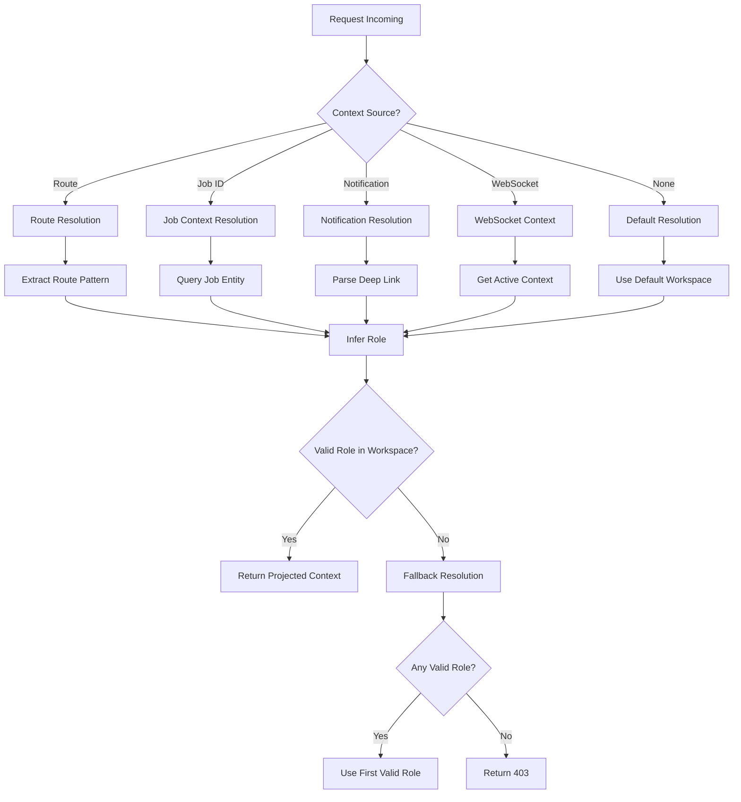
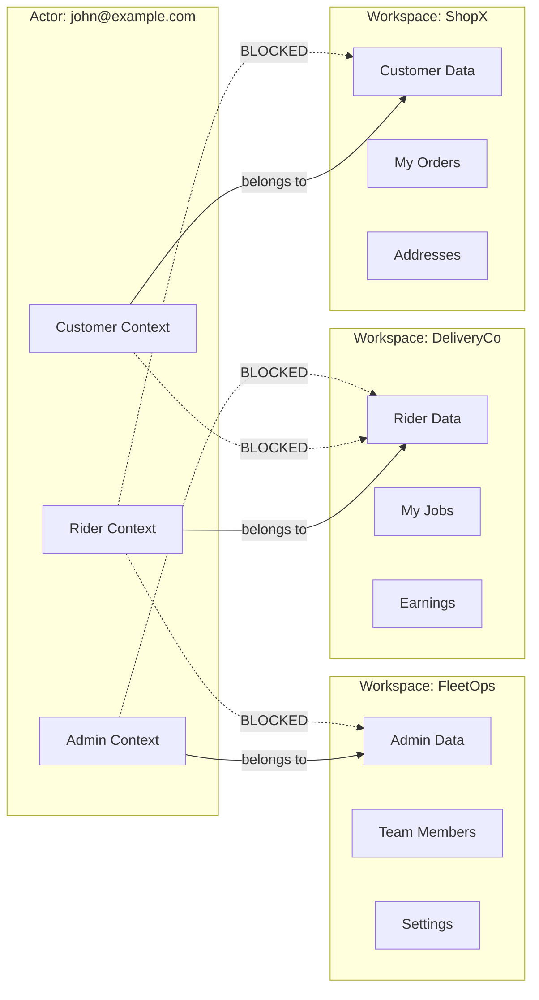

# Role Projection Engine Design

## Executive Summary

This document outlines the design for a **Role Projection Engine** that enables a single human actor to operate in multiple roles across multiple workspaces without cognitive overhead. The system automatically infers the correct role based on context signals, eliminating the need for users to manually select "Which role are you acting as?"

## Problem Statement

Currently, multi-tenant SaaS platforms suffer from:

1. **Role Confusion**: Users must manually select roles, leading to decision fatigue
2. **Context Switching**: No automatic workspace/role context based on action
3. **Security Gaps**: Manual role selection can lead to privilege escalation
4. **Poor UX**: "Which role are you acting as?" prompts break flow

## Design Goals

1. **Zero Cognitive Load**: UI never asks role selection questions
2. **Context-Aware**: Automatic role inference from action, route, job, notification
3. **Secure by Default**: Guardrails prevent privilege escalation
4. **Cross-Role Safety**: Prevent accidental cross-workspace contamination

---

## 1. Unified Profile Model

### 1.1 Current State Analysis

The existing system has:

- **ActorEntity**: Single identity per user (`apps/api/src/modules/actor/entities/actor.entity.ts`)
- **MembershipEntity**: Workspace-scoped role (`apps/api/src/modules/workspace/entities/membership.entity.ts`)
- **MembershipRole**: RIDER, ADMIN, OPS, BUSINESS_OWNER (`apps/api/src/modules/workspace/dto/workspace.enums.ts`)

### 1.2 Proposed Unified Profile Model

```typescript
// New: UnifiedActorProfile - aggregates all roles across workspaces
interface UnifiedActorProfile {
  actorId: string;
  primaryEmail: string;

  // All workspace memberships aggregated
  workspaceMemberships: WorkspaceRoleBinding[];

  // Computed: Active context for quick lookups
  activeContexts: ActiveContext[];

  // Computed: Role precedence for conflict resolution
  rolePrecedence: RolePrecedenceConfig;

  // Preference: Default role per action type
  rolePreferences: RolePreferenceMap;
}

interface WorkspaceRoleBinding {
  workspaceId: string;
  workspaceName: string;
  workspaceType: WorkspaceType;
  role: MembershipRole;
  isDefault: boolean;
  joinedAt: Date;
  permissions: string[];
}

interface ActiveContext {
  contextType: 'job' | 'route' | 'notification' | 'websocket';
  contextId: string;
  workspaceId: string;
  role: MembershipRole;
  expiresAt: Date;
  metadata: Record<string, unknown>;
}

interface RolePreferenceMap {
  [actionType: string]: {
    preferredRole: MembershipRole;
    preferredWorkspaceId?: string;
    fallbackRole: MembershipRole;
  };
}
```

### 1.3 Role Precedence Configuration

```typescript
// Define priority when multiple roles could apply
const ROLE_PRECEDENCE: Record<MembershipRole, number> = {
  [MembershipRole.ADMIN]: 100, // Highest - admin actions take precedence
  [MembershipRole.OPS]: 80,
  [MembershipRole.BUSINESS_OWNER]: 60,
  [MembershipRole.RIDER]: 40,
  [MembershipRole.CUSTOMER]: 20, // Lowest - only when explicitly customer context
};
```

---

## 2. Role Resolution Flow

### 2.1 High-Level Resolution Pipeline



### 2.2 Resolution Priority Order

The system resolves role in this priority order:

| Priority | Context Source             | Example                                    |
| -------- | -------------------------- | ------------------------------------------ |
| 1        | **Active Job Context**     | User viewing job they accepted as rider    |
| 2        | **Notification Deep Link** | Clicking notification about a specific job |
| 3        | **WebSocket Event**        | Real-time update for specific job          |
| 4        | **Route Pattern**          | `/api/v1/rider/jobs/*` → RIDER role        |
| 5        | **Default Workspace**      | User's default workspace and primary role  |

### 2.3 Implementation: RoleProjectionService Enhancement

Extend the existing `RoleProjectionService` (`apps/api/src/core/context/services/role-projection.service.ts`):

```typescript
@Injectable()
export class RoleProjectionService {
  /**
   * Enhanced role projection with multi-context resolution
   */
  async projectRole(request: RoleProjectionRequest): Promise<RoleProjection> {
    const { actorId, context, explicitWorkspaceId, explicitRole } = request;

    // 1. Get all memberships
    const memberships = await this.getMemberships(actorId);

    // 2. Try context-based resolution
    let resolved = await this.resolveFromContext(context, memberships);

    // 3. Fall back to explicit params
    if (!resolved && explicitWorkspaceId) {
      resolved = await this.resolveFromWorkspace(explicitWorkspaceId, memberships);
    }

    // 4. Fall back to default
    if (!resolved) {
      resolved = this.resolveFromDefaults(memberships);
    }

    // 5. Validate and return
    return this.validateAndBuildProjection(actorId, resolved, memberships);
  }

  private async resolveFromContext(
    context: RequestContext,
    memberships: MembershipEntity[]
  ): Promise<ResolvedContext | null> {
    // Job-based resolution (highest priority)
    if (context.jobId) {
      const jobContext = await this.resolveFromJob(context.jobId, memberships);
      if (jobContext) return jobContext;
    }

    // Route-based resolution
    if (context.route) {
      const routeContext = this.resolveFromRoute(context.route, memberships);
      if (routeContext) return routeContext;
    }

    // Notification-based resolution
    if (context.notificationId) {
      const notifContext = await this.resolveFromNotification(context.notificationId, memberships);
      if (notifContext) return notifContext;
    }

    return null;
  }

  private async resolveFromJob(
    jobId: string,
    memberships: MembershipEntity[]
  ): Promise<ResolvedContext | null> {
    // Query job to find workspace
    const job = await this.jobRepository.findOne({
      where: { id: jobId },
      relations: ['workspace'],
    });

    if (!job) return null;

    // Find membership in this workspace
    const membership = memberships.find((m) => m.workspaceId === job.workspaceId);

    if (!membership) return null;

    // Infer role based on job state
    return {
      workspaceId: job.workspaceId,
      role: this.inferRoleFromJobState(job, membership.role),
      source: 'job_context',
      contextId: jobId,
    };
  }
}
```

---

## 3. Intent-Based Role Inference Logic

### 3.1 Intent Classification

Each user action implies a role. The system maps intents to roles:

```typescript
interface IntentRoleMapping {
  intent: ActionIntent;
  requiredPermissions: string[];
  impliedRole: MembershipRole;
  workspaceSource: 'from_context' | 'from_resource' | 'default';
}

const INTENT_ROLE_MAPPINGS: IntentRoleMapping[] = [
  // Rider intents
  {
    intent: 'job.accept',
    requiredPermissions: ['job:accept'],
    impliedRole: MembershipRole.RIDER,
    workspaceSource: 'from_resource',
  },
  {
    intent: 'job.complete',
    requiredPermissions: ['job:complete'],
    impliedRole: MembershipRole.RIDER,
    workspaceSource: 'from_resource',
  },
  {
    intent: 'job.view_own',
    requiredPermissions: ['job:view_own'],
    impliedRole: MembershipRole.RIDER,
    workspaceSource: 'from_context',
  },

  // Business Owner intents
  {
    intent: 'job.create',
    requiredPermissions: ['job:create'],
    impliedRole: MembershipRole.BUSINESS_OWNER,
    workspaceSource: 'from_context',
  },
  {
    intent: 'pricing.update',
    requiredPermissions: ['pricing:update'],
    impliedRole: MembershipRole.BUSINESS_OWNER,
    workspaceSource: 'from_context',
  },

  // Admin intents
  {
    intent: 'member.invite',
    requiredPermissions: ['member:invite'],
    impliedRole: MembershipRole.ADMIN,
    workspaceSource: 'from_context',
  },
  {
    intent: 'workspace.settings',
    requiredPermissions: ['workspace:update'],
    impliedRole: MembershipRole.ADMIN,
    workspaceSource: 'from_context',
  },

  // Ops intents
  {
    intent: 'job.reassign',
    requiredPermissions: ['job:reassign'],
    impliedRole: MembershipRole.OPS,
    workspaceSource: 'from_resource',
  },
  {
    intent: 'analytics.view',
    requiredPermissions: ['analytics:view'],
    impliedRole: MembershipRole.OPS,
    workspaceSource: 'from_context',
  },
];
```

### 3.2 Route Pattern to Role Mapping

Enhance existing route mappings (`apps/api/src/core/context/services/role-projection.service.ts`):

```typescript
const ENHANCED_ROUTE_MAPPINGS: RouteRoleMapping[] = [
  // Rider routes
  {
    pattern: /^\/api\/v1\/rider(\/.*)?$/,
    inferRole: () => MembershipRole.RIDER,
    inferWorkspace: () => null, // From job context
    intent: 'rider.dashboard',
  },
  {
    pattern: /^\/api\/v1\/rider\/jobs\/([a-f0-9-]+)\/accept$/,
    inferRole: () => MembershipRole.RIDER,
    inferWorkspace: (match) => null, // From job entity
    intent: 'job.accept',
  },
  {
    pattern: /^\/api\/v1\/rider\/jobs\/([a-f0-9-]+)\/complete$/,
    inferRole: () => MembershipRole.RIDER,
    inferWorkspace: (match) => null,
    intent: 'job.complete',
  },

  // Customer routes (NEW)
  {
    pattern: /^\/api\/v1\/customer(\/.*)?$/,
    inferRole: () => MembershipRole.CUSTOMER,
    inferWorkspace: () => null,
    intent: 'customer.dashboard',
  },
  {
    pattern: /^\/api\/v1\/customer\/orders(\/.*)?$/,
    inferRole: () => MembershipRole.CUSTOMER,
    inferWorkspace: () => null,
    intent: 'order.view',
  },

  // Business routes
  {
    pattern: /^\/api\/v1\/business(\/.*)?$/,
    inferRole: () => MembershipRole.BUSINESS_OWNER,
    inferWorkspace: () => null,
    intent: 'business.dashboard',
  },
  {
    pattern: /^\/api\/v1\/business\/jobs(\/.*)?$/,
    inferRole: () => MembershipRole.BUSINESS_OWNER,
    inferWorkspace: () => null,
    intent: 'job.manage',
  },

  // Admin routes
  {
    pattern: /^\/api\/v1\/admin\/workspaces(\/.*)?$/,
    inferRole: () => MembershipRole.ADMIN,
    inferWorkspace: (match) => match[1]?.replace('/', ''),
    intent: 'workspace.manage',
  },

  // Ops routes
  {
    pattern: /^\/api\/v1\/ops(\/.*)?$/,
    inferRole: () => MembershipRole.OPS,
    inferWorkspace: () => null,
    intent: 'ops.dashboard',
  },
];
```

---

## 4. Guardrails to Prevent Privilege Escalation

### 4.1 Security Principles

1. **Least Privilege**: Default to lowest required role
2. **Context Isolation**: Roles scoped to specific workspaces
3. **Audit Trail**: All role switches logged
4. **Rate Limiting**: Prevent rapid role switching

### 4.2 Guardrail Implementation

```typescript
interface RoleSwitchGuardrail {
  checkRoleSwitch(
    actorId: string,
    fromRole: MembershipRole,
    toRole: MembershipRole,
    workspaceId: string
  ): Promise<GuardrailResult>;
}

@Injectable()
export class PrivilegeEscalationGuard implements RoleSwitchGuardrail {
  async checkRoleSwitch(
    actorId: string,
    fromRole: MembershipRole,
    toRole: MembershipRole,
    workspaceId: string
  ): Promise<GuardrailResult> {
    // 1. Check if actor has the target role in this workspace
    const membership = await this.membershipRepository.findOne({
      where: { actorId, workspaceId },
    });

    if (!membership || membership.role !== toRole) {
      return {
        allowed: false,
        reason: `Actor does not have ${toRole} role in workspace ${workspaceId}`,
        code: 'INVALID_ROLE_ASSIGNMENT',
      };
    }

    // 2. Check for suspicious role escalation patterns
    if (this.isEscalation(fromRole, toRole)) {
      const recentSwitches = await this.getRecentRoleSwitches(actorId);

      if (recentSwitches.length > 3) {
        return {
          allowed: false,
          reason: 'Too many role switches detected - possible privilege escalation',
          code: 'RATE_LIMIT_EXCEEDED',
        };
      }

      // Log for security review
      await this.logSuspiciousActivity(actorId, fromRole, toRole, workspaceId);
    }

    // 3. Check time-based restrictions
    const roleHoldTime = await this.getRoleHoldTime(actorId, workspaceId, toRole);
    if (roleHoldTime < MIN_ROLE_HOLD_TIME_MS) {
      return {
        allowed: false,
        reason: `Role held for less than ${MIN_ROLE_HOLD_TIME_MS}ms`,
        code: 'ROLE_HOLD_TIME_VIOLATION',
      };
    }

    return { allowed: true };
  }

  private isEscalation(from: MembershipRole, to: MembershipRole): boolean {
    return ROLE_PRECEDENCE[to] > ROLE_PRECEDENCE[from];
  }
}

const MIN_ROLE_HOLD_TIME_MS = 5000; // 5 seconds
```

### 4.3 Workspace Boundary Enforcement

```typescript
@Injectable()
export class WorkspaceBoundaryGuard {
  /**
   * Ensures actors cannot access data from one workspace while acting as another
   */
  async enforceBoundary(
    actorId: string,
    targetWorkspaceId: string,
    projectedRole: MembershipRole
  ): Promise<BoundaryCheckResult> {
    // 1. Verify membership exists
    const membership = await this.membershipRepository.findOne({
      where: { actorId, workspaceId: targetWorkspaceId },
    });

    if (!membership) {
      return {
        allowed: false,
        reason: 'No membership in target workspace',
        code: 'WORKSPACE_BOUNDARY_VIOLATION',
      };
    }

    // 2. Verify role matches
    if (membership.role !== projectedRole) {
      return {
        allowed: false,
        reason: `Projected role ${projectedRole} does not match membership role ${membership.role}`,
        code: 'ROLE_MISMATCH',
      };
    }

    // 3. Check for cross-workspace data access patterns
    const recentCrossWorkspace = await this.getCrossWorkspaceAccess(actorId);
    if (recentCrossWorkspace.length > MAX_CROSS_WORKSPACE_PER_MINUTE) {
      return {
        allowed: false,
        reason: 'Too many cross-workspace access attempts',
        code: 'CROSS_WORKSPACE_RATE_LIMIT',
      };
    }

    return { allowed: true };
  }
}

const MAX_CROSS_WORKSPACE_PER_MINUTE = 10;
```

---

## 5. Preventing Cross-Role Contamination

### 5.1 Data Isolation Architecture



### 5.2 Contamination Prevention Rules

```typescript
interface ContaminationRule {
  sourceRole: MembershipRole;
  targetDataTypes: string[];
  action: 'allow' | 'block' | 'audit';
}

const CONTAMINATION_RULES: ContaminationRule[] = [
  // Rider cannot access customer data in their own workspace
  {
    sourceRole: MembershipRole.RIDER,
    targetDataTypes: ['customer_profile', 'payment_methods', 'addresses'],
    action: 'block',
  },

  // Customer cannot access rider job history
  {
    sourceRole: MembershipRole.CUSTOMER,
    targetDataTypes: ['rider_earnings', 'rider_stats', 'rider_location'],
    action: 'block',
  },

  // Admin accessing any data requires audit
  {
    sourceRole: MembershipRole.ADMIN,
    targetDataTypes: ['*'],
    action: 'audit',
  },
];

@Injectable()
export class ContaminationPreventionService {
  async checkAccess(
    actorId: string,
    projectedRole: MembershipRole,
    workspaceId: string,
    dataType: string,
    action: 'read' | 'write' | 'delete'
  ): Promise<ContaminationResult> {
    const rule = this.findRule(projectedRole, dataType);

    if (!rule) {
      return { allowed: true }; // No rule = allow
    }

    if (rule.action === 'block') {
      await this.logBlockedAccess(actorId, projectedRole, workspaceId, dataType);
      return {
        allowed: false,
        reason: `Role ${projectedRole} cannot access ${dataType}`,
        code: 'CONTAMINATION_PREVENTED',
      };
    }

    if (rule.action === 'audit') {
      await this.createAuditLog(actorId, projectedRole, workspaceId, dataType, action);
    }

    return { allowed: true };
  }
}
```

---

## 6. Smart Dashboard Merging Logic

### 6.1 Unified Dashboard Composition

When a user has multiple roles, the dashboard merges data intelligently:

```typescript
interface DashboardMergeConfig {
  role: MembershipRole;
  priority: number;
  dataSources: DashboardDataSource[];
  layout: 'tabs' | 'sidebar' | 'unified';
}

const DASHBOARD_MERGE_CONFIGS: DashboardMergeConfig[] = [
  {
    role: MembershipRole.RIDER,
    priority: 10,
    dataSources: [
      { type: 'my_jobs', workspaceScope: 'current' },
      { type: 'earnings', workspaceScope: 'all_rider_workspaces' },
      { type: 'performance', workspaceScope: 'current' },
    ],
    layout: 'unified',
  },
  {
    role: MembershipRole.BUSINESS_OWNER,
    priority: 20,
    dataSources: [
      { type: 'my_jobs', workspaceScope: 'current' },
      { type: 'team_members', workspaceScope: 'current' },
      { type: 'analytics', workspaceScope: 'current' },
    ],
    layout: 'tabs',
  },
  {
    role: MembershipRole.ADMIN,
    priority: 30,
    dataSources: [
      { type: 'workspace_overview', workspaceScope: 'current' },
      { type: 'member_list', workspaceScope: 'current' },
      { type: 'system_settings', workspaceScope: 'current' },
    ],
    layout: 'sidebar',
  },
];

@Injectable()
export class SmartDashboardService {
  async buildDashboard(
    actorId: string,
    projectedRole: MembershipRole,
    workspaceId: string
  ): Promise<DashboardResponse> {
    const memberships = await this.getMemberships(actorId);
    const currentMembership = memberships.find((m) => m.workspaceId === workspaceId);

    // Get merge config for role
    const config = this.getMergeConfig(projectedRole);

    // Fetch data from multiple sources
    const dataPromises = config.dataSources.map((source) =>
      this.fetchDashboardData(actorId, source, memberships)
    );

    const dataResults = await Promise.all(dataPromises);

    // Merge based on layout type
    const merged = this.mergeData(dataResults, config.layout);

    return {
      role: projectedRole,
      workspaceId,
      layout: config.layout,
      data: merged,
      availableWorkspaces: this.getSwitchableWorkspaces(memberships),
    };
  }
}
```

### 6.2 Role-Based View Switching

The UI automatically switches views without user intervention:

```typescript
// Frontend: Automatic role detection and view rendering
interface UnifiedDashboardProps {
  actorId: string;
  // No role prop - inferred from context!
}

const UnifiedDashboard: React.FC<UnifiedDashboardProps> = ({ actorId }) => {
  const { data: context } = useQuery(GET_PROJECTED_CONTEXT, {
    variables: { actorId },
  });

  // Role is automatically projected - no user selection needed!
  const { role, workspaceId } = context.projectedContext;

  switch (role) {
    case MembershipRole.RIDER:
      return <RiderDashboard workspaceId={workspaceId} />;
    case MembershipRole.BUSINESS_OWNER:
      return <BusinessDashboard workspaceId={workspaceId} />;
    case MembershipRole.ADMIN:
      return <AdminDashboard workspaceId={workspaceId} />;
    case MembershipRole.CUSTOMER:
      return <CustomerDashboard workspaceId={workspaceId} />;
    default:
      return <DefaultDashboard />;
  }
};
```

---

## 7. Conflict Edge Cases and Mitigation

### 7.1 Conflict Scenarios

| Scenario                               | Description                             | Mitigation                                             |
| -------------------------------------- | --------------------------------------- | ------------------------------------------------------ |
| **Same role in multiple workspaces**   | User is RIDER in both Workspace A and B | Use active job context; fallback to default workspace  |
| **Rider + Customer in same workspace** | User can both deliver and order         | Infer from action intent; job-related = rider          |
| **Admin + Ops conflict**               | User has both roles                     | Admin takes precedence for admin routes                |
| **Stale context**                      | Cached role no longer valid             | TTL-based expiration; re-validate on sensitive actions |
| **Missing membership**                 | Role projected but no membership        | Fallback to default role; log anomaly                  |
| **Rapid role switching**               | Suspicious activity pattern             | Rate limiting; require re-authentication               |

### 7.2 Conflict Resolution Algorithm

```typescript
interface ConflictResolutionResult {
  selectedRole: MembershipRole;
  selectedWorkspaceId: string;
  reasoning: string;
}

@Injectable()
export class ConflictResolutionService {
  resolveConflict(
    contexts: ResolvedContext[],
    memberships: MembershipEntity[],
    requestContext: RequestContext
  ): ConflictResolutionResult {
    // 1. Filter to valid contexts only
    const validContexts = contexts.filter((c) =>
      this.isValidMembership(c.workspaceId, c.role, memberships)
    );

    if (validContexts.length === 0) {
      return this.fallbackToDefault(memberships);
    }

    // 2. Apply priority based on context source
    const priorityMap = {
      job_context: 100,
      notification: 90,
      websocket: 80,
      route: 70,
      default: 50,
    };

    validContexts.sort((a, b) => (priorityMap[b.source] || 0) - (priorityMap[a.source] || 0));

    // 3. Return highest priority
    const selected = validContexts[0];
    return {
      selectedRole: selected.role,
      selectedWorkspaceId: selected.workspaceId,
      reasoning: `Selected from ${selected.source} context`,
    };
  }

  private fallbackToDefault(memberships: MembershipEntity[]): ConflictResolutionResult {
    const defaultMembership = memberships.find((m) => m.isDefault) || memberships[0];

    return {
      selectedRole: defaultMembership.role,
      selectedWorkspaceId: defaultMembership.workspaceId,
      reasoning: 'Fallback to default workspace/role',
    };
  }
}
```

### 7.3 Stale Context Handling

```typescript
@Injectable()
export class StaleContextHandler {
  private readonly CONTEXT_TTL_MS = {
    job_context: 15 * 60 * 1000, // 15 minutes
    notification: 5 * 60 * 1000, // 5 minutes
    websocket: 2 * 60 * 1000, // 2 minutes
    route: 30 * 60 * 1000, // 30 minutes
  };

  isContextValid(context: ActiveContext): boolean {
    const ttl = this.CONTEXT_TTL_MS[context.contextType] || 0;
    const age = Date.now() - new Date(context.expiresAt).getTime() + ttl;
    return age < ttl;
  }

  async refreshContext(context: ActiveContext): Promise<ActiveContext> {
    // Re-query to get fresh data
    if (context.contextType === 'job') {
      return this.refreshJobContext(context.contextId);
    }
    // ... other types
  }
}
```

---

## 8. Implementation Roadmap

### Phase 1: Foundation (Week 1)

- [ ] Extend MembershipEntity with additional metadata
- [ ] Create UnifiedActorProfile service
- [ ] Implement basic RoleProjectionService enhancement

### Phase 2: Context Resolution (Week 2)

- [ ] Add job-based context resolution
- [ ] Add notification deep-link resolution
- [ ] Implement route pattern enhancements

### Phase 3: Security & Guardrails (Week 3)

- [ ] Implement PrivilegeEscalationGuard
- [ ] Add WorkspaceBoundaryGuard
- [ ] Create ContaminationPreventionService

### Phase 4: Dashboard & UX (Week 4)

- [ ] Implement SmartDashboardService
- [ ] Create frontend role inference hooks
- [ ] Remove role selection UI components

### Phase 5: Testing & Refinement (Week 5)

- [ ] Load testing with multiple roles
- [ ] Security penetration testing
- [ ] User flow validation

---

## 9. Summary

This Role Projection Engine design achieves:

✅ **Zero Cognitive Load**: Users never see "Which role are you acting as?"
✅ **Automatic Inference**: Role resolved from job, route, notification, or action intent
✅ **Security by Default**: Guardrails prevent privilege escalation and cross-workspace contamination
✅ **Smart Merging**: Dashboard intelligently combines data from applicable contexts
✅ **Conflict Resolution**: Clear 优先级 rules handle edge cases

The implementation extends existing infrastructure (`RoleProjectionService`, `MembershipEntity`) while adding new capabilities for context-aware role resolution.
