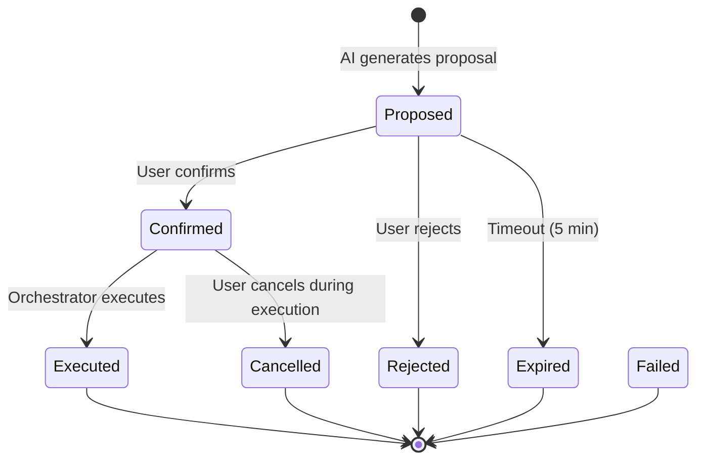
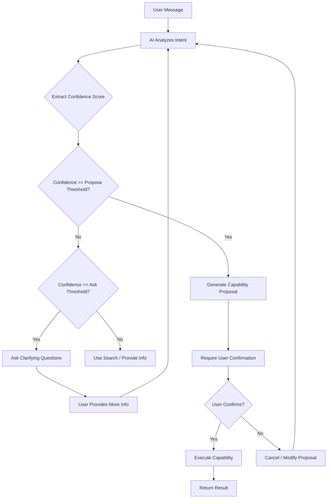
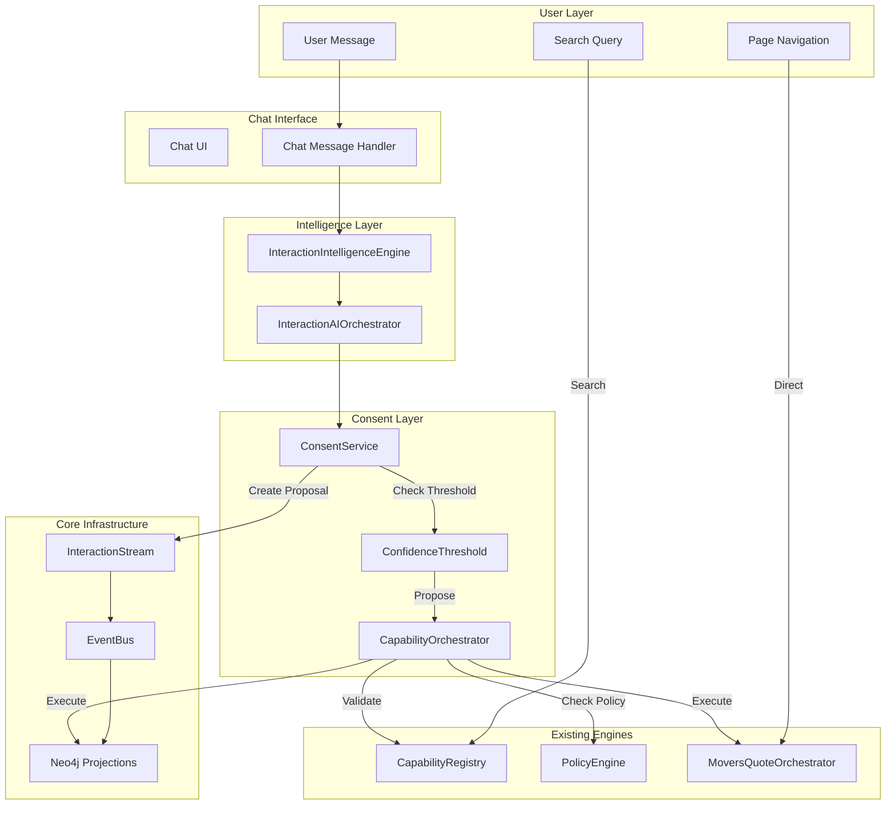
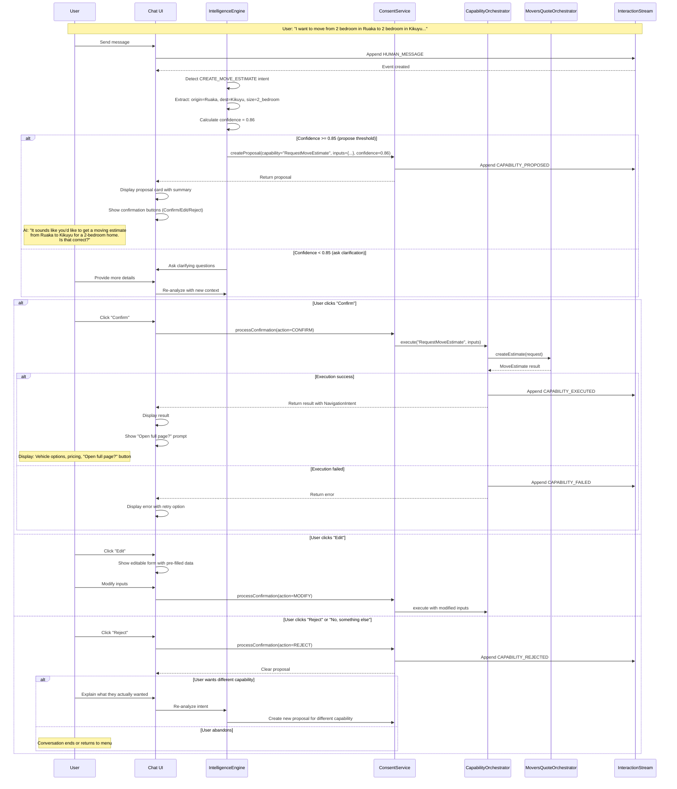

# Consent-Driven Navigation Architecture for ZanaFleet

**Version:** 1.0.0  
**Date:** 2026-02-14  
**Status:** Architectural Design  
**Supersedes:** All auto-invocation patterns

---

## 1. Executive Summary

This document defines the consent-driven navigation architecture for ZanaFleet's chat-first experience. The architecture ensures that AI never auto-executes capabilities and users always remain in control of all system actions. This is a critical architectural upgrade that establishes user sovereignty as the foundational principle of the platform.

### 1.1 Design Principles (Non-Negotiable)

| Principle | Description |
|-----------|-------------|
| **AI Never Auto-Executes** | AI generates suggestions and proposals, but never commits to execution without explicit user confirmation |
| **AI Always Restates Intent** | Before any action, AI must restate its understanding of user intent for verification |
| **User Confirms Before Execution** | Every capability execution requires explicit user confirmation through a clear confirmation UI |
| **Pages Remain Fully Usable Without Chat** | All features must be accessible via direct navigation, search, or API - chat is optional |
| **Chat Augments, Not Replaces UI** | Chat provides convenience and guidance, but canonical UI surfaces remain primary |
| **AI Errors Must Not Break Product Flow** | If AI fails, users can still accomplish tasks through alternative paths |

---

## 2. CapabilityProposal Model

The `CapabilityProposal` is the core domain model that tracks AI-suggested capabilities before user confirmation.

### 2.1 TypeScript Interface

```typescript
/**
 * CapabilityProposal Status Enum
 * 
 * Lifecycle: proposed → confirmed | rejected | expired → executed (if confirmed)
 */
export enum CapabilityProposalStatus {
  PROPOSED = 'proposed',      // AI suggested, awaiting user response
  CONFIRMED = 'confirmed',   // User explicitly approved
  REJECTED = 'rejected',     // User explicitly declined
  EXPIRED = 'expired',       // Timed out without response
  EXECUTED = 'executed',     // Successfully executed after confirmation
  FAILED = 'failed',         // Execution failed
  CANCELLED = 'cancelled',   // User cancelled mid-flow
}

/**
 * CapabilityProposal Entity
 * 
 * Tracks a single AI-suggested capability with full audit trail
 */
export interface CapabilityProposal {
  /** Unique identifier for this proposal */
  proposalId: string;
  
  /** The capability being proposed (e.g., 'RequestMoveEstimate', 'CreateOrder') */
  capabilityName: string;
  
  /** Extracted inputs from user message - these are inferred, not confirmed */
  extractedInputs: Record<string, unknown>;
  
  /** AI confidence score (0-1) - determines if clarification is needed */
  confidenceScore: number;
  
  /** List of inputs that are missing or uncertain - requires user clarification */
  missingInputs: string[];
  
  /** Human-readable summary of what AI thinks user wants */
  summary: string;
  
  /** Current status in the proposal lifecycle */
  status: CapabilityProposalStatus;
  
  /** The stream this proposal belongs to */
  streamId: string;
  
  /** The event that triggered this proposal */
  sourceEventId: string;
  
  /** Timestamp when proposal was created */
  createdAt: Date;
  
  /** Timestamp when proposal was last updated */
  updatedAt: Date;
  
  /** Timestamp when proposal expires (default: 5 minutes) */
  expiresAt: Date;
  
  /** Reasoning chain from AI analysis */
  reasoning: ReasoningStep[];
  
  /** Suggested alternatives if user wants something different */
  alternatives?: ProposalAlternative[];
  
  /** Invocation mode requested by AI */
  proposedInvocationMode?: InvocationMode;
}

/**
 * Alternative proposal when user rejects current one
 */
export interface ProposalAlternative {
  capabilityName: string;
  description: string;
  extractedInputs: Record<string, unknown>;
}

/**
 * Reasoning step from AI analysis
 */
export interface ReasoningStep {
  step: string;
  reasoning: string;
  confidence: number;
  timestamp: Date;
}
```

### 2.2 Entity Definition (TypeORM)

```typescript
@Entity('capability_proposals')
@Index(['streamId', 'status'])
@Index(['expiresAt'])
export class CapabilityProposalEntity {
  @PrimaryColumn('uuid')
  proposalId!: string;

  @Column('varchar', { length: 255 })
  capabilityName!: string;

  @Column('jsonb')
  extractedInputs!: Record<string, unknown>;

  @Column('float')
  confidenceScore!: number;

  @Column('text', { array: true })
  missingInputs!: string[];

  @Column('text')
  summary!: string;

  @Column('enum', { enum: CapabilityProposalStatus })
  status!: CapabilityProposalStatus;

  @Column('uuid')
  streamId!: string;

  @Column('uuid')
  sourceEventId!: string;

  @CreateDateColumn()
  createdAt!: Date;

  @UpdateDateColumn()
  updatedAt!: Date;

  @Column('timestamp with time zone')
  expiresAt!: Date;

  @Column('jsonb')
  reasoning!: ReasoningStep[];

  @Column('jsonb', { nullable: true })
  alternatives!: ProposalAlternative[];

  @Column('enum', { enum: InvocationMode, nullable: true })
  proposedInvocationMode!: InvocationMode;
}
```

---

## 3. Confirmation Workflow

The confirmation workflow ensures user sovereignty by requiring explicit confirmation before any capability execution.

### 3.1 Workflow States



### 3.2 Workflow Implementation

```typescript
/**
 * ConfirmationAction Enum
 * 
 * All possible user responses to a capability proposal
 */
export enum ConfirmationAction {
  CONFIRM = 'confirm',         // User approves execution
  REJECT = 'reject',          // User declines execution
  MODIFY = 'modify',          // User wants to change parameters
  EDIT = 'edit',              // User wants to edit specific fields
  REQUEST_CLARIFICATION = 'request_clarification', // User wants AI to explain
  CANCEL = 'cancel',          // User cancels the proposal
  SWITCH_CAPABILITY = 'switch_capability', // User wants different capability
}

/**
 * UserConfirmation Event
 * 
 * Captured when user responds to a proposal
 */
export interface UserConfirmation {
  confirmationId: string;
  proposalId: string;
  streamId: string;
  action: ConfirmationAction;
  modifiedInputs?: Record<string, unknown>; // If user modified inputs
  reason?: string; // Optional reason for rejection/cancellation
  actorId: string;
  actorType: 'USER' | 'SYSTEM';
  timestamp: Date;
}

/**
 * ConfirmationService
 * 
 * Handles the confirmation workflow
 */
@Injectable()
export class ConsentConfirmationService {
  /**
   * Create a new proposal from AI analysis
   * 
   * IMPORTANT: This does NOT execute the capability
   * It only creates a proposal and appends to InteractionStream
   */
  async createProposal(
    streamId: string,
    sourceEventId: string,
    capabilityName: string,
    extractedInputs: Record<string, unknown>,
    confidenceScore: number,
    missingInputs: string[],
    summary: string,
    reasoning: ReasoningStep[],
    alternatives?: ProposalAlternative[]
  ): Promise<CapabilityProposal> {
    const proposalId = generateUUID();
    const now = new Date();
    
    const proposal: CapabilityProposal = {
      proposalId,
      capabilityName,
      extractedInputs,
      confidenceScore,
      missingInputs,
      summary,
      status: CapabilityProposalStatus.PROPOSED,
      streamId,
      sourceEventId,
      createdAt: now,
      updatedAt: now,
      expiresAt: new Date(now.getTime() + 5 * 60 * 1000), // 5 minute expiry
      reasoning,
      alternatives,
    };

    // Persist proposal
    await this.proposalRepository.save(proposal);

    // Append PROPOSAL_CREATED event to InteractionStream (append-only, immutable)
    await this.appendToInteractionStream(
      streamId,
      InteractionEventType.CAPABILITY_PROPOSED,
      {
        proposalId,
        capabilityName,
        summary,
        confidenceScore,
        missingInputs,
        expiresAt: proposal.expiresAt,
      },
      sourceEventId
    );

    return proposal;
  }

  /**
   * Process user confirmation
   * 
   * This is the ONLY path to capability execution
   * User must explicitly confirm before execute() is called
   */
  async processConfirmation(
    proposalId: string,
    action: ConfirmationAction,
    actorId: string,
    modifiedInputs?: Record<string, unknown>
  ): Promise<ConfirmationResult> {
    const proposal = await this.proposalRepository.findById(proposalId);
    
    if (!proposal) {
      throw new ProposalNotFoundError(proposalId);
    }

    if (proposal.status !== CapabilityProposalStatus.PROPOSED) {
      throw new InvalidProposalStateError(
        `Proposal ${proposalId} is not in PROPOSED state: ${proposal.status}`
      );
    }

    if (new Date() > proposal.expiresAt) {
      await this.expireProposal(proposalId);
      throw new ProposalExpiredError(proposalId);
    }

    const confirmation: UserConfirmation = {
      confirmationId: generateUUID(),
      proposalId,
      streamId: proposal.streamId,
      action,
      modifiedInputs,
      actorId,
      actorType: 'USER',
      timestamp: new Date(),
    };

    // Append confirmation to InteractionStream (append-only, immutable)
    await this.appendToInteractionStream(
      proposal.streamId,
      this.mapActionToEventType(action),
      confirmation,
      proposalId
    );

    // Process based on action
    switch (action) {
      case ConfirmationAction.CONFIRM:
        return await this.confirmProposal(proposal, confirmation);
      
      case ConfirmationAction.REJECT:
        return await this.rejectProposal(proposal, confirmation);
      
      case ConfirmationAction.MODIFY:
      case ConfirmationAction.EDIT:
        return await this.modifyProposal(proposal, confirmation, modifiedInputs!);
      
      case ConfirmationAction.CANCEL:
        return await this.cancelProposal(proposal, confirmation);
      
      case ConfirmationAction.REQUEST_CLARIFICATION:
        return await this.requestClarification(proposal, confirmation);
      
      case ConfirmationAction.SWITCH_CAPABILITY:
        return await this.switchCapability(proposal, confirmation, modifiedInputs);
      
      default:
        throw new UnknownConfirmationActionError(action);
    }
  }

  /**
   * Execute capability AFTER confirmation
   * 
   * This is ONLY called after user explicitly confirms
   * CRITICAL: This method must NEVER be called without prior confirmation
   */
  private async confirmProposal(
    proposal: CapabilityProposal,
    confirmation: UserConfirmation
  ): Promise<ConfirmationResult> {
    // Update proposal status
    proposal.status = CapabilityProposalStatus.CONFIRMED;
    proposal.updatedAt = new Date();
    await this.proposalRepository.save(proposal);

    // Trigger execution via CapabilityOrchestrator
    // IMPORTANT: execute() is ONLY called here, after confirmation
    const executionResult = await this.capabilityOrchestrator.execute(
      proposal.capabilityName,
      proposal.extractedInputs,
      proposal.proposedInvocationMode || InvocationMode.CONVERSATIONAL
    );

    // Update proposal based on execution result
    if (executionResult.success) {
      proposal.status = CapabilityProposalStatus.EXECUTED;
      proposal.updatedAt = new Date();
      await this.proposalRepository.save(proposal);

      // Append execution success event
      await this.appendToInteractionStream(
        proposal.streamId,
        InteractionEventType.CAPABILITY_EXECUTED,
        {
          proposalId: proposal.proposalId,
          capabilityName: proposal.capabilityName,
          navigationIntent: executionResult.navigationIntent,
        },
        confirmation.confirmationId
      );
    } else {
      proposal.status = CapabilityProposalStatus.FAILED;
      proposal.updatedAt = new Date();
      await this.proposalRepository.save(proposal);

      // Append execution failure event
      await this.appendToInteractionStream(
        proposal.streamId,
        InteractionEventType.CAPABILITY_FAILED,
        {
          proposalId: proposal.proposalId,
          capabilityName: proposal.capabilityName,
          error: executionResult.error,
        },
        confirmation.confirmationId
      );
    }

    return {
      success: executionResult.success,
      proposal,
      navigationIntent: executionResult.navigationIntent,
      executionResult: executionResult.result,
    };
  }
}
```

### 3.3 InteractionStream Integration

```typescript
/**
 * New event types for consent-driven flow
 */
export enum InteractionEventType {
  // ... existing types ...
  
  // Consent-related events (NEW)
  CAPABILITY_PROPOSED = 'CAPABILITY_PROPOSED',
  CAPABILITY_CONFIRMED = 'CAPABILITY_CONFIRMED',
  CAPABILITY_REJECTED = 'CAPABILITY_REJECTED',
  CAPABILITY_MODIFIED = 'CAPABILITY_MODIFIED',
  CAPABILITY_CANCELLED = 'CAPABILITY_CANCELLED',
  CAPABILITY_EXECUTED = 'CAPABILITY_EXECUTED',
  CAPABILITY_FAILED = 'CAPABILITY_FAILED',
  CAPABILITY_EXPIRED = 'CAPABILITY_EXPIRED',
  NAVIGATION_INTENT = 'NAVIGATION_INTENT',
}
```

---

## 4. ChatResponse Structure

The updated ChatResponse structure supports consent-driven interactions.

### 4.1 TypeScript Interface

```typescript
import { CapabilityProposal } from './capability-proposal.model';
import { NavigationIntent } from './navigation-intent.model';

/**
 * Action Types for suggested actions
 */
export enum ActionType {
  CONFIRM = 'confirm',
  REJECT = 'reject',
  NAVIGATE = 'navigate',
  SEARCH = 'search',
  EDIT = 'edit',
  CANCEL = 'cancel',
  GET_HELP = 'get_help',
}

/**
 * Action suggested to user
 */
export interface Action {
  type: ActionType;
  label: string;
  description?: string;
  payload?: Record<string, unknown>;
  icon?: string;
}

/**
 * UI Component for rich responses
 */
export interface UIComponent {
  type: 'proposal_card' | 'confirmation_dialog' | 'navigation_prompt' | 'form_preview' | 'error_message';
  data: Record<string, unknown>;
  actions: Action[];
}

/**
 * ChatResponse - Updated for consent-driven flow
 * 
 * This is the response structure returned by the AI after analyzing user input
 */
export interface ChatResponse {
  /** Primary text response from AI */
  text: string;
  
  /** Capability proposals (if any) - requires user confirmation before execution */
  proposals?: CapabilityProposal[];
  
  /** Suggested actions user can take */
  suggestedActions?: Action[];
  
  /** Rich UI components to render */
  components?: UIComponent[];
  
  /** Whether this response requires user confirmation before proceeding */
  requiresConfirmation: boolean;
  
  /** Confidence score for the entire response */
  confidenceScore?: number;
  
  /** Intent detected from user message */
  intentDetected?: string;
  
  /** Whether AI is asking clarifying questions */
  isClarificationRequest?: boolean;
  
  /** Questions AI is asking to better understand intent */
  clarificationQuestions?: string[];
  
  /** Navigation intent (if AI suggested navigation) */
  navigationIntent?: NavigationIntent;
  
  /** Metadata for debugging/audit */
  metadata?: {
    processingTimeMs?: number;
    modelVersion?: string;
    reasoningChain?: ReasoningStep[];
  };
}

/**
 * Example ChatResponse with proposal
 */
const exampleResponse: ChatResponse = {
  text: "It sounds like you'd like to get a moving estimate from Ruaka to Kikuyu for a 2-bedroom home. Is that correct? Would you like me to show you available vehicle options?",
  proposals: [
    {
      proposalId: "uuid-1234",
      capabilityName: "RequestMoveEstimate",
      extractedInputs: {
        origin: "Ruaka",
        destination: "Kikuyu",
        houseSize: "2_bedroom",
        originLat: -1.2154,
        originLng: 36.8907,
        destLat: -1.3476,
        destLng: 36.6352,
      },
      confidenceScore: 0.86,
      missingInputs: [],
      summary: "Moving estimate from Ruaka to Kikuyu for 2-bedroom home",
      status: CapabilityProposalStatus.PROPOSED,
      streamId: "stream-uuid",
      sourceEventId: "event-uuid",
      createdAt: new Date(),
      updatedAt: new Date(),
      expiresAt: new Date(Date.now() + 5 * 60 * 1000),
      reasoning: [
        {
          step: "Intent Detection",
          reasoning: "Detected CREATE_MOVE_ESTIMATE intent from keywords 'move', 'estimate'",
          confidence: 0.92,
          timestamp: new Date(),
        },
        {
          step: "Entity Extraction",
          reasoning: "Extracted Ruaka as origin, Kikuyu as destination, 2_bedroom as house size",
          confidence: 0.85,
          timestamp: new Date(),
        },
      ],
      proposedInvocationMode: InvocationMode.INLINE_PREVIEW,
    },
  ],
  suggestedActions: [
    {
      type: ActionType.CONFIRM,
      label: "Yes, show me vehicle options",
      description: "Get moving estimate with vehicle recommendations",
    },
    {
      type: ActionType.EDIT,
      label: "Edit details",
      description: "Change origin, destination, or home size",
    },
    {
      type: ActionType.REJECT,
      label: "No, something else",
      description: "That's not what I wanted",
    },
  ],
  components: [
    {
      type: "proposal_card",
      data: {
        summary: "Moving estimate from Ruaka to Kikuyu",
        details: [
          { label: "From", value: "Ruaka" },
          { label: "To", value: "Kikuyu" },
          { label: "Home Size", value: "2 Bedroom" },
        ],
      },
      actions: [
        { type: ActionType.CONFIRM, label: "Confirm" },
        { type: ActionType.EDIT, label: "Edit" },
        { type: ActionType.REJECT, label: "Reject" },
      ],
    },
  ],
  requiresConfirmation: true,
  confidenceScore: 0.86,
  intentDetected: "CREATE_MOVE_ESTIMATE",
  navigationIntent: {
    targetRoute: "/movers/estimate",
    hydrationData: {
      origin: "Ruaka",
      destination: "Kikuyu",
      houseSize: "2_bedroom",
    },
    reason: "User confirmed moving estimate request",
    invocationMode: InvocationMode.INLINE_PREVIEW,
  },
};
```

---

## 5. CapabilityOrchestrator with Explicit Execute

The CapabilityOrchestrator is redesigned to ONLY execute after explicit user confirmation.

### 5.1 Invocation Mode Enum

```typescript
/**
 * InvocationMode - How the capability result should be presented
 * 
 * Determines the UX after user confirmation
 */
export enum InvocationMode {
  /** Default - show result in chat conversation */
  CONVERSATIONAL = 'conversational',
  
  /** Show preview inline within the chat */
  INLINE_PREVIEW = 'inline_preview',
  
  /** Navigate to full page view */
  PAGE_REDIRECT = 'page_redirect',
  
  /** Execute in background, notify when done */
  BACKGROUND_ACTION = 'background_action',
}
```

### 5.2 Orchestrator Interface

```typescript
import { CapabilityProposal } from './capability-proposal.model';
import { NavigationIntent } from './navigation-intent.model';

/**
 * Execution result from CapabilityOrchestrator
 */
export interface ExecutionResult {
  success: boolean;
  result?: unknown;
  navigationIntent?: NavigationIntent;
  error?: string;
  processingTimeMs: number;
}

/**
 * CapabilityOrchestrator
 * 
 * CRITICAL: The execute() method must ONLY be called:
 * 1. After user explicitly confirms a proposal
 * 2. Via direct API call (for non-chat flows)
 * 
 * This method must NEVER be auto-invoked by AI
 */
@Injectable()
export class CapabilityOrchestrator {
  /**
   * Execute a capability with explicit confirmation
   * 
   * @param capabilityName - Name of capability to execute
   * @param inputs - Inputs for the capability (from confirmed proposal)
   * @param invocationMode - How to present the result
   * 
   * CRITICAL: This should ONLY be called after user confirmation
   * The system should enforce this via the ConsentConfirmationService
   */
  async execute(
    capabilityName: string,
    inputs: Record<string, unknown>,
    invocationMode: InvocationMode = InvocationMode.CONVERSATIONAL
  ): Promise<ExecutionResult> {
    const startTime = Date.now();
    
    // Validate inputs
    if (!capabilityName || !inputs) {
      return {
        success: false,
        error: 'Capability name and inputs are required',
        processingTimeMs: Date.now() - startTime,
      };
    }

    // Get capability definition
    const capability = await this.capabilityRegistry.get(capabilityName);
    if (!capability) {
      return {
        success: false,
        error: `Capability not found: ${capabilityName}`,
        processingTimeMs: Date.now() - startTime,
      };
    }

    // Check policy (permissions, rate limits, etc.)
    const policyCheck = await this.policyEngine.check({
      capability: capabilityName,
      inputs,
      actor: this.currentActor,
    });

    if (!policyCheck.allowed) {
      return {
        success: false,
        error: `Policy denied: ${policyCheck.reason}`,
        processingTimeMs: Date.now() - startTime,
      };
    }

    try {
      // Execute the capability via appropriate handler
      const result = await this.executeCapability(capability, inputs);
      
      // Generate navigation intent based on invocation mode
      const navigationIntent = this.generateNavigationIntent(
        capabilityName,
        result,
        invocationMode
      );

      return {
        success: true,
        result,
        navigationIntent,
        processingTimeMs: Date.now() - startTime,
      };
    } catch (error) {
      this.logger.error(`Capability execution failed: ${error}`, error);
      
      return {
        success: false,
        error: error instanceof Error ? error.message : 'Unknown error',
        processingTimeMs: Date.now() - startTime,
      };
    }
  }

  /**
   * Execute capability - delegates to appropriate domain service
   */
  private async executeCapability(
    capability: CapabilityDefinition,
    inputs: Record<string, unknown>
  ): Promise<unknown> {
    switch (capability.category) {
      case 'MOVE_ESTIMATE':
        return await this.moversService.createEstimate(inputs as MoversEstimateRequestDto);
      
      case 'ORDER':
        return await this.orderService.create(inputs);
      
      case 'PAYMENT':
        return await this.paymentService.process(inputs);
      
      // ... other categories
      
      default:
        throw new Error(`Unknown capability category: ${capability.category}`);
    }
  }

  /**
   * Generate navigation intent based on invocation mode
   */
  private generateNavigationIntent(
    capabilityName: string,
    result: unknown,
    mode: InvocationMode
  ): NavigationIntent {
    const baseRoute = this.getRouteForCapability(capabilityName);
    
    return {
      targetRoute: baseRoute,
      hydrationData: this.extractHydrationData(result),
      reason: `Executed ${capabilityName}`,
      invocationMode: mode,
    };
  }

  /**
   * Get canonical route for a capability
   */
  private getRouteForCapability(capabilityName: string): string {
    const routeMap: Record<string, string> = {
      RequestMoveEstimate: '/movers/estimate',
      CreateOrder: '/orders/new',
      MakePayment: '/payments/checkout',
      GetSupport: '/support/ticket',
      // ... other mappings
    };
    
    return routeMap[capabilityName] || '/';
  }

  /**
   * Extract data needed to hydrate the target page
   */
  private extractHydrationData(result: unknown): Record<string, unknown> {
    // Implementation depends on result structure
    // This extracts the minimal data needed to render the target page
    if (result && typeof result === 'object') {
      return result as Record<string, unknown>;
    }
    return {};
  }
}
```

---

## 6. NavigationIntent Abstraction

The NavigationIntent model handles navigation after capability execution.

### 6.1 TypeScript Interface

```typescript
/**
 * NavigationIntent
 * 
 * Represents the intent to navigate to a page after capability execution
 * The UI decides HOW to handle this intent based on invocation mode
 */
export interface NavigationIntent {
  /** Canonical route to the page */
  targetRoute: string;
  
  /** Data to pre-populate/hydrate the page */
  hydrationData: Record<string, unknown>;
  
  /** Human-readable reason for navigation */
  reason: string;
  
  /** How the UI should present this navigation */
  invocationMode: InvocationMode;
  
  /** Optional: Title for the destination */
  pageTitle?: string;
  
  /** Optional: Whether to replace current history entry */
  replaceHistory?: boolean;
  
  /** Optional: Analytics context */
  analyticsContext?: {
    capabilityName: string;
    executionTimeMs: number;
    confidenceScore: number;
  };
}

/**
 * UI Handler for NavigationIntent
 * 
 * The frontend uses this to decide how to handle navigation
 */
export interface NavigationHandler {
  /**
   * Handle navigation based on invocation mode
   */
  handleNavigation(intent: NavigationIntent): void;
  
  /**
   * Check if inline preview is supported for this intent
   */
  supportsInlinePreview(): boolean;
  
  /**
   * Check if full page redirect is needed
   */
  shouldRedirectFullPage(intent: NavigationIntent): boolean;
}

// Frontend implementation example:
// 
// function handleNavigationIntent(intent: NavigationIntent) {
//   switch (intent.invocationMode) {
//     case InvocationMode.INLINE_PREVIEW:
//       if (supportsInlinePreview()) {
//         openInlinePreview(intent.targetRoute, intent.hydrationData);
//       } else {
//         // Fallback to conversational
//         showInChat(intent);
//       }
//       break;
//       
//     case InvocationMode.PAGE_REDIRECT:
//       navigateTo(intent.targetRoute, intent.hydrationData);
//       break;
//       
//     case InvocationMode.CONVERSATIONAL:
//       showInChat(intent);
//       break;
//       
//     case InvocationMode.BACKGROUND_ACTION:
//       showNotification('Action completed', intent);
//       break;
//   }
//   
//   // Always ask: "Open full page view?"
//   if (intent.invocationMode !== InvocationMode.PAGE_REDIRECT) {
//     showNavigationPrompt(intent);
//   }
// }
```

---

## 7. Confidence Threshold Strategy

Different confidence thresholds determine whether AI proposes, asks questions, or seeks clarification.

### 7.1 Threshold Configuration

```typescript
/**
 * Confidence Threshold Configuration
 * 
 * Based on capability type and potential impact
 */
export interface ConfidenceThresholdConfig {
  /** Capability category */
  category: string;
  
  /** Minimum confidence to propose (not ask) */
  proposeThreshold: number;
  
  /** Minimum confidence to suggest with confirmation */
  suggestThreshold: number;
  
  /** Whether to always require confirmation */
  alwaysRequireConfirmation: boolean;
  
  /** Whether to ask clarification questions below threshold */
  askClarificationBelow: number;
}

/**
 * Default thresholds by capability category
 */
export const DEFAULT_CONFIDENCE_THRESHOLDS: ConfidenceThresholdConfig[] = [
  {
    category: 'MOVE_ESTIMATE',
    proposeThreshold: 0.85,
    suggestThreshold: 0.70,
    alwaysRequireConfirmation: true,
    askClarificationBelow: 0.70,
  },
  {
    category: 'ORDER',
    proposeThreshold: 0.90,
    suggestThreshold: 0.75,
    alwaysRequireConfirmation: true,
    askClarificationBelow: 0.75,
  },
  {
    category: 'PAYMENT',
    proposeThreshold: 0.95,
    suggestThreshold: 0.85,
    alwaysRequireConfirmation: true,
    askClarificationBelow: 0.85,
  },
  {
    category: 'SUPPORT',
    proposeThreshold: 0.80,
    suggestThreshold: 0.65,
    alwaysRequireConfirmation: false,
    askClarificationBelow: 0.65,
  },
  {
    category: 'INFORMATION',
    proposeThreshold: 0.70,
    suggestThreshold: 0.50,
    alwaysRequireConfirmation: false,
    askClarificationBelow: 0.50,
  },
];

/**
 * Decision based on confidence level
 */
export enum ConfidenceDecision {
  /** Propose capability with confirmation required */
  PROPOSE = 'propose',
  
  /** Ask clarifying questions before proposing */
  ASK_CLARIFICATION = 'ask_clarification',
  
  /** Provide information without proposing */
  RESPOND = 'respond',
  
  /** Use search instead of AI inference */
  USE_SEARCH = 'use_search',
  
  /** Request human assistance */
  ESCALATE = 'escalate',
}

/**
 * Confidence Threshold Service
 */
@Injectable()
export class ConfidenceThresholdService {
  private thresholds: Map<string, ConfidenceThresholdConfig> = new Map();

  constructor(configs: ConfidenceThresholdConfig[]) {
    configs.forEach(config => {
      this.thresholds.set(config.category, config);
    });
  }

  /**
   * Determine what to do based on confidence score
   */
  getDecision(
    capabilityCategory: string,
    confidenceScore: number,
    missingInputs: string[]
  ): ConfidenceDecision {
    const threshold = this.thresholds.get(capabilityCategory);
    
    if (!threshold) {
      // Default: require confirmation but don't ask clarification
      return confidenceScore >= 0.7 
        ? ConfidenceDecision.PROPOSE 
        : ConfidenceDecision.RESPOND;
    }

    // If there are missing inputs, always ask clarification
    if (missingInputs.length > 0 && confidenceScore < threshold.askClarificationBelow) {
      return ConfidenceDecision.ASK_CLARIFICATION;
    }

    // Below clarification threshold - use search or respond
    if (confidenceScore < threshold.askClarificationBelow) {
      return ConfidenceDecision.USE_SEARCH;
    }

    // Below suggest threshold - respond with suggestion (not proposal)
    if (confidenceScore < threshold.suggestThreshold) {
      return ConfidenceDecision.RESPOND;
    }

    // Above propose threshold - propose with confirmation
    return ConfidenceDecision.PROPOSE;
  }

  /**
   * Check if confirmation is required for this capability
   */
  requiresConfirmation(capabilityCategory: string): boolean {
    const threshold = this.thresholds.get(capabilityCategory);
    return threshold?.alwaysRequireConfirmation ?? true;
  }
}
```

### 7.2 Confidence-Based Response Flow



---

## 8. Page Hydration Model

Pages must work independently of chat - chat can optionally hydrate them with pre-filled data.

### 8.1 Page Hydration Interface

```typescript
/**
 * PageHydrationData
 * 
 * Data that can be passed from chat to page for pre-filling
 */
export interface PageHydrationData {
  /** The route being navigated to */
  route: string;
  
  /** Data to pre-populate formData?: fields */
  form Record<string, unknown>;
  
  /** Data to pre-filter lists/grids */
  filters?: Record<string, unknown>;
  
  /** Context for the page */
  context?: {
    source: 'chat' | 'menu' | 'search' | 'api' | 'notification';
    capabilityName?: string;
    proposalId?: string;
    confidenceScore?: number;
  };
}

/**
 * PageHydrationService
 * 
 * Handles hydration of pages from various sources
 */
@Injectable()
export class PageHydrationService {
  /**
   * Hydrate page from chat proposal
   * 
   * Called when user confirms a proposal and wants to see full page
   */
  async hydrateFromProposal(
    proposalId: string,
    targetRoute: string
  ): Promise<PageHydrationData> {
    const proposal = await this.proposalRepository.findById(proposalId);
    
    if (!proposal) {
      throw new ProposalNotFoundError(proposalId);
    }

    // Transform extracted inputs to form data based on target route
    const formData = this.transformToFormData(proposal.extractedInputs, targetRoute);

    return {
      route: targetRoute,
      formData,
      context: {
        source: 'chat',
        capabilityName: proposal.capabilityName,
        proposalId: proposal.proposalId,
        confidenceScore: proposal.confidenceScore,
      },
    };
  }

  /**
   * Hydrate page from direct navigation (menu, bookmark, etc.)
   * 
   * Pages must handle missing data gracefully
   */
  async hydrateFromNavigation(
    route: string,
    queryParams: Record<string, string>
  ): Promise<PageHydrationData> {
    return {
      route,
      formData: queryParams,
      context: {
        source: 'menu',
      },
    };
  }

  /**
   * Transform extracted inputs to route-specific form data
   */
  private transformToFormData(
    inputs: Record<string, unknown>,
    route: string
  ): Record<string, unknown> {
    // Route-specific transformation
    switch (route) {
      case '/movers/estimate':
        return {
          fromLocation: inputs.origin,
          toLocation: inputs.destination,
          houseSize: inputs.houseSize,
          // ... other movers-specific fields
        };
      
      case '/orders/new':
        return {
          // ... order-specific fields
        };
      
      default:
        return inputs;
    }
  }
}
```

### 8.2 Page Independence Guarantee

```typescript
/**
 * Page Controller Example - /movers/estimate
 * 
 * Pages must work without chat - they handle their own form validation
 */
@Controller('movers/estimate')
export class MoversEstimateController {
  /**
   * GET /movers/estimate
   * 
   * Direct navigation - no hydration data
   * Page shows empty form
   */
  @Get()
  async showEstimateForm(): Promise<MoversEstimateResponseDto> {
    return createEstimateSuccessResponse({
      // Return empty form structure
      formFields: this.getFormFields(),
      availableVehicles: [],
      pricing: null,
    });
  }

  /**
   * GET /movers/estimate?from=Ruaka&to=Kikuyu&size=2_bedroom
   * 
   * Navigation with query params - hydrate from URL
   */
  @Get()
  async showEstimateFormWithParams(
    @Query() params: MoversEstimateRequestDto
  ): Promise<MoversEstimateResponseDto> {
    // Validate and process
    const validationErrors = validateMoversEstimateRequest(params);
    if (validationErrors.length > 0) {
      return createEstimateErrorResponse(validationErrors);
    }

    // Process estimate
    const estimate = await this.quoteOrchestrator.createEstimate(params);
    
    return createEstimateSuccessResponse(estimate);
  }

  /**
   * POST /movers/estimate
   * 
   * Direct form submission - works without chat
   */
  @Post()
  async createEstimate(
    @Body() request: MoversEstimateRequestDto
  ): Promise<MoversEstimateResponseDto> {
    // Full validation - must work without chat
    const validationErrors = validateMoversEstimateRequest(request);
    if (validationErrors.length > 0) {
      return createEstimateErrorResponse(validationErrors);
    }

    try {
      const estimate = await this.quoteOrchestrator.createEstimate(request);
      return createEstimateSuccessResponse(estimate);
    } catch (error) {
      return createEstimateErrorResponse([error.message]);
    }
  }
}
```

---

## 9. Failure Tolerance Strategy

The system must remain functional when AI is unavailable or fails.

### 9.1 Failure Scenarios and Mitigations

```typescript
/**
 * Failure Tolerance Configuration
 */
export interface FailureToleranceConfig {
  /** Enable fallback when AI fails */
  enableAIFallback: boolean;
  
  /** Fallback strategy when AI unavailable */
  fallbackStrategy: 'search' | 'direct_navigation' | 'human_support';
  
  /** Whether to allow direct API access when AI fails */
  allowDirectAPI: boolean;
  
  /** Timeout for AI responses before fallback */
  aiTimeoutMs: number;
}

/**
 * Failure Mode Handlers
 */
@Injectable()
export class FailureToleranceService {
  /**
   * Handle AI failure - gracefully degrade
   */
  async handleAIFailure(
    failureType: 'timeout' | 'error' | 'unavailable',
    userMessage: string,
    context: InteractionIntelligenceContext
  ): Promise<FallbackResponse> {
    this.logger.warn(`AI failure: ${failureType} - falling back to ${this.config.fallbackStrategy}`);

    switch (this.config.fallbackStrategy) {
      case 'search':
        return await this.fallbackToSearch(userMessage, context);
      
      case 'direct_navigation':
        return await this.fallbackToNavigation(userMessage, context);
      
      case 'human_support':
        return await this.fallbackToHumanSupport(userMessage, context);
      
      default:
        return this.createErrorResponse('Service temporarily unavailable');
    }
  }

  /**
   * Fallback to search capability
   */
  private async fallbackToSearch(
    userMessage: string,
    context: InteractionIntelligenceContext
  ): Promise<FallbackResponse> {
    // Use search service to find relevant content
    const searchResults = await this.searchService.search(userMessage, {
      limit: 5,
      contextType: context.contextType,
    });

    return {
      text: `I couldn't process that request right now, but here are some results that might help:`,
      suggestions: searchResults.map(result => ({
        type: ActionType.NAVIGATE,
        label: result.title,
        payload: { url: result.url },
      })),
      requiresConfirmation: false,
    };
  }

  /**
   * Fallback to direct navigation suggestions
   */
  private async fallbackToNavigation(
    userMessage: string,
    context: InteractionIntelligenceContext
  ): Promise<FallbackResponse> {
    // Analyze message for navigation intent (simple keyword matching)
    const navSuggestion = this.suggestNavigation(userMessage);

    if (navSuggestion) {
      return {
        text: `I couldn't process that request right now. Would you like to go directly to the ${navSuggestion.page} page?`,
        suggestions: [
          {
            type: ActionType.NAVIGATE,
            label: `Go to ${navSuggestion.page}`,
            payload: { route: navSuggestion.route },
          },
        ],
        requiresConfirmation: false,
      };
    }

    // No clear navigation - suggest search or human support
    return {
      text: `I couldn't understand that request. You can try searching or contact support for help.`,
      suggestions: [
        { type: ActionType.SEARCH, label: 'Search Help' },
        { type: ActionType.GET_HELP, label: 'Contact Support' },
      ],
      requiresConfirmation: false,
    };
  }

  /**
   * Fallback to human support
   */
  private async fallbackToHumanSupport(
    userMessage: string,
    context: InteractionIntelligenceContext
  ): Promise<FallbackResponse> {
    // Create support ticket
    const ticket = await this.supportService.createTicket({
      subject: 'AI Assistance Required',
      description: `User message: ${userMessage}\nContext: ${JSON.stringify(context)}`,
      priority: 'medium',
    });

    return {
      text: `I'm having trouble understanding your request right now. A support agent will be with you shortly. Your ticket #${ticket.id} has been created.`,
      suggestions: [
        { type: ActionType.NAVIGATE, label: 'View Ticket', payload: { route: `/support/ticket/${ticket.id}` } },
      ],
      requiresConfirmation: false,
    };
  }
}
```

### 9.2 Core System Independence

```typescript
/**
 * Core System Services - Must work without AI
 * 
 * These services are ALWAYS available and never depend on AI
 */
export const CORE_INDEPENDENT_SERVICES = [
  // Direct API access
  'MoversController',      // Create estimates via REST
  'OrdersController',      // Create orders via REST
  'PaymentsController',    // Process payments via REST
  'SearchService',        // Search content
  
  // Event processing
  'CapabilityRegistry',    // Discover capabilities
  'PolicyEngine',         // Enforce permissions
  'InteractionStream',   // Log events (append-only)
  
  // Data access
  'Neo4jService',         // Graph queries
  'EventRepository',      // Event persistence
];
```

---

## 10. Integration with Existing Engines

### 10.1 Integration Points



### 10.2 Integration Service

```typescript
/**
 * ConsentIntegrationService
 * 
 * Integrates consent flow with existing ZanaFleet modules
 */
@Injectable()
export class ConsentIntegrationService {
  constructor(
    private readonly capabilityRegistry: CapabilityRegistry,
    private readonly policyEngine: PolicyEngine,
    private readonly confidenceThreshold: ConfidenceThresholdService,
    private readonly consentConfirmation: ConsentConfirmationService,
    private readonly capabilityOrchestrator: CapabilityOrchestrator,
    private readonly interactionStream: InteractionStreamService,
  ) {}

  /**
   * Process user message through consent-aware flow
   * 
   * 1. Analyze intent
   * 2. Determine confidence decision
   * 3. Create proposal if confidence is high enough
   * 4. Return response with proposals for user confirmation
   */
  async processConsentAwareMessage(
    streamId: string,
    message: string,
    context: InteractionIntelligenceContext
  ): Promise<ChatResponse> {
    // Step 1: Analyze intent using existing IntelligenceEngine
    const recommendation = await this.intelligenceEngine.analyze(context);
    
    // Step 2: Determine confidence decision
    const category = this.getCapabilityCategory(recommendation.intentDetected?.intent);
    const decision = this.confidenceThreshold.getDecision(
      category,
      recommendation.confidenceScore,
      recommendation.missingInputs
    );

    // Step 3: Generate response based on decision
    switch (decision) {
      case ConfidenceDecision.PROPOSE:
        return await this.createProposalResponse(
          streamId,
          message,
          recommendation,
          category
        );
      
      case ConfidenceDecision.ASK_CLARIFICATION:
        return this.createClarificationResponse(recommendation);
      
      case ConfidenceDecision.USE_SEARCH:
        return this.createSearchSuggestionResponse(message);
      
      case ConfidenceDecision.RESPOND:
        return this.createInformationalResponse(recommendation);
      
      case ConfidenceDecision.ESCALATE:
        return this.createEscalationResponse(recommendation);
      
      default:
        return this.createDefaultResponse(recommendation);
    }
  }

  /**
   * Handle user confirmation - executes capability AFTER confirmation
   * 
   * CRITICAL: This is the ONLY path to execute capabilities
   */
  async handleConfirmation(
    proposalId: string,
    action: ConfirmationAction,
    actorId: string,
    modifiedInputs?: Record<string, unknown>
  ): Promise<ExecutionResult> {
    // Process through ConsentConfirmationService
    const result = await this.consentConfirmation.processConfirmation(
      proposalId,
      action,
      actorId,
      modifiedInputs
    );

    // If confirmed and execution succeeded, update Neo4j
    if (result.success && result.navigationIntent) {
      await this.updateContextGraph(result);
    }

    return result;
  }

  /**
   * Get capability category from intent
   */
  private getCapabilityCategory(intent?: IntentType): string {
    const categoryMap: Record<string, string> = {
      [IntentType.CREATE_ORDER]: 'ORDER',
      [IntentType.GET_ESTIMATE]: 'MOVE_ESTIMATE',
      [IntentType.MAKE_PAYMENT]: 'PAYMENT',
      [IntentType.GET_SUPPORT]: 'SUPPORT',
      [IntentType.CHECK_STATUS]: 'INFORMATION',
    };
    
    return categoryMap[intent || ''] || 'INFORMATION';
  }

  /**
   * Update Neo4j context graph after capability execution
   */
  private async updateContextGraph(result: ConfirmationResult): Promise<void> {
    // Publish event for Neo4j projection
    this.eventBus.publish(new CapabilityExecutedEvent(
      result.proposal.capabilityName,
      result.proposal.streamId,
      result.executionResult,
      result.navigationIntent
    ));
  }
}
```

---

## 11. Auditability via InteractionStream

Every consent-related action is logged to InteractionStream as an immutable event.

### 11.1 Audit Event Types

```typescript
/**
 * Consent-related audit events
 */
export enum ConsentAuditEventType {
  // Proposal lifecycle
  PROPOSAL_CREATED = 'consent.proposal.created',
  PROPOSAL_CONFIRMED = 'consent.proposal.confirmed',
  PROPOSAL_REJECTED = 'consent.proposal.rejected',
  PROPOSAL_MODIFIED = 'consent.proposal.modified',
  PROPOSAL_CANCELLED = 'consent.proposal.cancelled',
  PROPOSAL_EXPIRED = 'consent.proposal.expired',
  
  // Execution lifecycle
  EXECUTION_STARTED = 'consent.execution.started',
  EXECUTION_COMPLETED = 'consent.execution.completed',
  EXECUTION_FAILED = 'consent.execution.failed',
  
  // Clarification
  CLARIFICATION_REQUESTED = 'consent.clarification.requested',
  CLARIFICATION_PROVIDED = 'consent.clarification.provided',
  
  // Navigation
  NAVIGATION_INTENT_GENERATED = 'consent.navigation.intent_generated',
  NAVIGATION_COMPLETED = 'consent.navigation.completed',
  
  // AI Fallback
  AI_FALLBACK_TRIGGERED = 'consent.fallback.triggered',
}

/**
 * Full audit event structure
 */
export interface ConsentAuditEvent {
  eventId: string;
  eventType: ConsentAuditEventType;
  streamId: string;
  proposalId?: string;
  timestamp: Date;
  actor: {
    id: string;
    type: 'USER' | 'AI_AGENT' | 'SYSTEM';
  };
  payload: {
    // Event-specific payload
    [key: string]: unknown;
  };
  metadata: {
    confidenceScore?: number;
    processingTimeMs?: number;
    ipAddress?: string;
    userAgent?: string;
  };
}
```

### 11.2 Audit Query Service

```typescript
/**
 * ConsentAuditService
 * 
 * Provides audit query capabilities for consent events
 */
@Injectable()
export class ConsentAuditService {
  /**
   * Get full proposal history for a stream
   */
  async getProposalHistory(streamId: string): Promise<ProposalHistory> {
    const events = await this.interactionEventRepository.findByStreamIdAndTypes(
      streamId,
      [
        InteractionEventType.CAPABILITY_PROPOSED,
        InteractionEventType.CAPABILITY_CONFIRMED,
        InteractionEventType.CAPABILITY_REJECTED,
        InteractionEventType.CAPABILITY_EXECUTED,
        InteractionEventType.CAPABILITY_FAILED,
      ]
    );

    return this.buildProposalHistory(events);
  }

  /**
   * Get user's consent decisions for analytics
   */
  async getUserConsentAnalytics(
    userId: string,
    dateRange: { start: Date; end: Date }
  ): Promise<UserConsentAnalytics> {
    const events = await this.interactionEventRepository.findByActorAndDateRange(
      userId,
      dateRange
    );

    return {
      totalProposals: events.filter(e => e.eventType === InteractionEventType.CAPABILITY_PROPOSED).length,
      confirmedCount: events.filter(e => e.eventType === InteractionEventType.CAPABILITY_CONFIRMED).length,
      rejectedCount: events.filter(e => e.eventType === InteractionEventType.CAPABILITY_REJECTED).length,
      confirmationRate: 0, // Calculated
      averageResponseTimeMs: 0, // Calculated
      mostRejectedCapability: '', // Calculated
    };
  }

  /**
   * Verify proposal was confirmed before 
   * CR execution
   *ITICAL: Used for compliance and dispute resolution
   */
  async verifyProposalConfirmed(proposalId: string): Promise<boolean> {
    const confirmEvent = await this.interactionEventRepository.findLatestByType(
      proposalId,
      InteractionEventType.CAPABILITY_CONFIRMED
    );

    return confirmEvent !== null;
  }
}
```

---

## 12. Example Flow: RequestMoveEstimate

This section demonstrates the complete consent-driven flow for requesting a moving estimate.

### 12.1 Flow Diagram



### 12.2 Example Interactions

#### Step 1: User sends message
```
User: "I want to move from 2 bedroom in Ruaka to 2 bedroom in Kikuyu..."
```

#### Step 2: AI analyzes and generates proposal
```json
{
  "proposalId": "prop-uuid-1234",
  "capabilityName": "RequestMoveEstimate",
  "extractedInputs": {
    "origin": "Ruaka",
    "destination": "Kikuyu",
    "houseSize": "2_bedroom",
    "originLat": -1.2154,
    "originLng": 36.8907,
    "destLat": -1.3476,
    "destLng": 36.6352
  },
  "confidenceScore": 0.86,
  "missingInputs": [],
  "summary": "Moving estimate from Ruaka to Kikuyu for 2-bedroom home",
  "status": "proposed"
}
```

#### Step 3: AI responds with proposal
```
"It sounds like you'd like to get a moving estimate from Ruaka to 
Kikuyu for a 2-bedroom home. Is that correct? Would you like me to 
show you available vehicle options?"

[Confirm] [Edit Details] [No, Something Else]
```

#### Step 4: User confirms
```
User clicks "Confirm"
```

#### Step 5: Execution occurs (AFTER confirmation only)
```json
{
  "success": true,
  "navigationIntent": {
    "targetRoute": "/movers/estimate",
    "hydrationData": { ... },
    "reason": "User confirmed moving estimate request",
    "invocationMode": "inline_preview"
  }
}
```

### 12.3 AI Being Wrong - Safe Handling

```
User: "No, I just wanted to know average price"
  ↓
AI: Detects user correcting intent
  ↓
System: Cancel current proposal (status = cancelled)
  ↓
System: Append CAPABILITY_CANCELLED to InteractionStream
  ↓
AI: Re-analyzes: User wants PRICE_INFORMATION, not MOVE_ESTIMATE
  ↓
AI: Creates new proposal or uses Search
  ↓
AI: "Based on recent moves in that area, the average cost for a 
2-bedroom move from Ruaka to Kikuyu is approximately KES 15,000-25,000.
Would you like me to get a precise quote?"
```

---

## 13. Summary

This consent-driven navigation architecture ensures:

1. **User Sovereignty**: AI never auto-executes - every action requires explicit user confirmation
2. **Transparency**: AI always restates inferred intent before proceeding
3. **Graceful Degradation**: When AI fails, users can still accomplish tasks via direct navigation, search, or API
4. **Auditability**: Every proposal and decision is logged to InteractionStream as immutable events
5. **Page Independence**: All features work without chat - chat is an optional enhancement layer
6. **Confidence-Based Flow**: Clear thresholds determine when AI proposes vs. asks questions

### 13.1 Key Architectural Principles

| Principle | Implementation |
|-----------|----------------|
| AI Never Auto-Executes | `CapabilityOrchestrator.execute()` ONLY called after `ConsentConfirmationService.processConfirmation()` with `CONFIRM` action |
| AI Always Restates Intent | Every proposal includes `summary` field - AI must confirm understanding |
| User Confirms Before Execution | `requiresConfirmation: true` in ChatResponse - UI enforces confirmation buttons |
| Pages Work Without Chat | Direct REST endpoints for all capabilities - pages handle their own validation |
| Chat Augments UI | Pages can be hydrated from chat proposals, but don't depend on it |
| AI Errors Don't Break Flow | `FailureToleranceService` provides search/navigation/human-support fallbacks |

### 13.2 Files to Create

| File | Purpose |
|------|---------|
| `apps/api/src/modules/consent/consent.module.ts` | Consent module definition |
| `apps/api/src/modules/consent/models/capability-proposal.model.ts` | CapabilityProposal interface |
| `apps/api/src/modules/consent/entities/capability-proposal.entity.ts` | TypeORM entity |
| `apps/api/src/modules/consent/services/consent-confirmation.service.ts` | Confirmation workflow |
| `apps/api/src/modules/consent/services/confidence-threshold.service.ts` | Threshold decisions |
| `apps/api/src/modules/consent/services/failure-tolerance.service.ts` | AI fallback handling |
| `apps/api/src/modules/consent/services/navigation-intent.service.ts` | Navigation handling |
| `apps/api/src/modules/consent/dto/chat-response.dto.ts` | Updated ChatResponse DTO |
| `apps/api/src/modules/consent/handlers/proposal-handler.ts` | Event handlers |

---

**End of Document**
