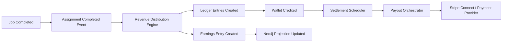
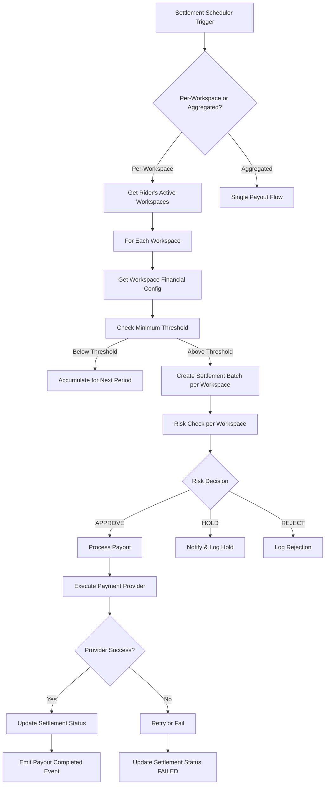

# Financial Orchestration Layer Design Specification

## ZanaFleet Multi-Workspace Earnings Architecture

**Version:** 1.0
**Date:** 2026-02-24
**Status:** Draft for Review

---

## 1. Executive Summary

This document defines the Financial Orchestration Layer for ZanaFleet, enabling riders to earn and receive payouts across multiple workspaces (SACCO, BUSINESS, MARKET, OPS) with full financial isolation per workspace while providing aggregated views for riders.

### Key Architectural Principles

- **Workspace Isolation**: Every financial operation is scoped to a workspace (accounting-level isolation)
- **Aggregation Layer**: Cross-workspace views are computed, not stored (single source of truth)
- **Immutability**: All earnings entries are append-only with correction entries for reversals
- **Event-Driven**: Financial events flow through NATS/Redis event bus
- **Dual Persistence**: Postgres for transactional data, Neo4j for relationship queries

---

## 2. Architecture Analysis

### 2.1 Current State Gaps

| Component           | Current State           | Gap Identified                            |
| ------------------- | ----------------------- | ----------------------------------------- |
| LedgerEntry         | No workspaceId          | Cannot isolate transactions per workspace |
| SettlementBatch     | No workspaceId          | Cannot do per-workspace payouts           |
| Wallet              | workspaceId = 'default' | Hardcoded, not functional                 |
| RevenueDistribution | Single commission       | No per-workspace commission rates         |

### 2.2 Event-Driven Flow (Target)



---

## 3. Data Model Design

### 3.1 Earnings Ledger Schema (Postgres)

New table for workspace-scoped earnings:

```sql
-- earnings_entries: Immutable per-workspace earnings records
CREATE TABLE earnings_entries (
    id UUID PRIMARY KEY DEFAULT gen_random_uuid(),
    rider_id UUID NOT NULL,
    workspace_id UUID NOT NULL REFERENCES workspaces(id),
    job_id UUID NOT NULL,

    -- Earnings breakdown
    gross_amount DECIMAL(18,2) NOT NULL,
    platform_fee DECIMAL(18,2) NOT NULL DEFAULT 0,
    sacco_commission DECIMAL(18,2) NOT NULL DEFAULT 0,
    net_earnings DECIMAL(18,2) NOT NULL,

    -- Commission configuration used
    commission_rate DECIMAL(5,4) NOT NULL,
    commission_type VARCHAR(20) NOT NULL, -- 'PERCENTAGE', 'FLAT', 'TIERED'

    currency VARCHAR(3) NOT NULL DEFAULT 'KES',

    -- Reference to source
    reference_type VARCHAR(50) NOT NULL, -- 'DELIVERY', 'TRIP', etc.
    reference_id UUID NOT NULL,

    -- Metadata
    metadata JSONB,

    -- Audit
    created_at TIMESTAMPTZ NOT NULL DEFAULT NOW(),
    period_date DATE NOT NULL, -- For partitioning

    -- Constraints
    CONSTRAINT chk_positive_gross CHECK (gross_amount >= 0),
    CONSTRAINT chk_positive_net CHECK (net_earnings >= 0),
    CONSTRAINT chk_fees_not_exceed_gross CHECK (platform_fee + sacco_commission <= gross_amount)
);

-- Indexes for common queries
CREATE INDEX idx_earnings_rider_period ON earnings_entries(rider_id, period_date DESC);
CREATE INDEX idx_earnings_workspace_period ON earnings_entries(workspace_id, period_date DESC);
CREATE INDEX idx_earnings_rider_workspace ON earnings_entries(rider_id, workspace_id);
CREATE INDEX idx_earnings_job ON earnings_entries(job_id);
CREATE INDEX idx_earnings_period ON earnings_entries(period_date);

-- Partition by month for scale (Postgres 12+)
CREATE TABLE earnings_entries_2026_01 PARTITION OF earnings_entries
    FOR VALUES FROM ('2026-01-01') TO ('2026-02-01');
```

### 3.2 Ledger Entry Enhancement (Add workspaceId)

Extend existing `ledger_entries` table:

```sql
-- Add workspace_id column to ledger_entries
ALTER TABLE ledger_entries
ADD COLUMN IF NOT EXISTS workspace_id UUID REFERENCES workspaces(id);

-- Composite index for workspace-scoped queries
CREATE INDEX idx_ledger_workspace_account ON ledger_entries(workspace_id, account_id);
CREATE INDEX idx_ledger_workspace_period ON ledger_entries(workspace_id, created_at);
```

### 3.3 Workspace Financial Configuration

New table for workspace-specific financial rules:

```sql
-- workspace_financial_config: Per-workspace financial settings
CREATE TABLE workspace_financial_configs (
    id UUID PRIMARY KEY DEFAULT gen_random_uuid(),
    workspace_id UUID NOT NULL UNIQUE REFERENCES workspaces(id),

    -- Commission settings
    platform_commission_rate DECIMAL(5,4) NOT NULL DEFAULT 0.10,
    platform_commission_type VARCHAR(20) NOT NULL DEFAULT 'PERCENTAGE',
    sacco_commission_rate DECIMAL(5,4), -- For SACCO workspaces
    sacco_commission_type VARCHAR(20) DEFAULT 'PERCENTAGE',

    -- Payout schedule
    payout_schedule VARCHAR(20) NOT NULL DEFAULT 'WEEKLY', -- 'DAILY', 'WEEKLY', 'BIWEEKLY', 'MONTHLY'
    payout_day_of_week INT, -- 0-6 for weekly
    payout_day_of_month INT, -- 1-28 for monthly

    -- Payout settings
    minimum_payout_threshold DECIMAL(18,2) NOT NULL DEFAULT 100,
    payout_method VARCHAR(20) NOT NULL DEFAULT 'MOBILE_MONEY',

    -- Stripe Connect
    stripe_connect_account_id VARCHAR(50), -- Platform account for workspace
    stripe_connect_enabled BOOLEAN NOT NULL DEFAULT false,

    -- Risk settings
    risk_check_enabled BOOLEAN NOT NULL DEFAULT true,
    max_payout_amount DECIMAL(18,2) NOT NULL DEFAULT 50000,

    -- Audit
    created_at TIMESTAMPTZ NOT NULL DEFAULT NOW(),
    updated_at TIMESTAMPTZ NOT NULL DEFAULT NOW(),

    -- Constraints
    CONSTRAINT chk_commission_rate CHECK (platform_commission_rate >= 0 AND platform_commission_rate <= 1),
    CONSTRAINT chk_payout_day_of_week CHECK (payout_day_of_week IS NULL OR (payout_day_of_week >= 0 AND payout_day_of_week <= 6)),
    CONSTRAINT chk_payout_day_of_month CHECK (payout_day_of_month IS NULL OR (payout_day_of_month >= 1 AND payout_day_of_month <= 28))
);
```

### 3.4 Settlement Batch Enhancement

Extend settlement batch for workspace awareness:

```sql
-- Add workspace_id to settlement_batches
ALTER TABLE settlement_batches
ADD COLUMN IF NOT EXISTS workspace_id UUID REFERENCES workspaces(id);

-- Composite index
CREATE INDEX idx_settlement_workspace ON settlement_batches(workspace_id, rider_account_id);
```

---

## 4. Entity Definitions (TypeScript)

### 4.1 EarningsEntry Entity

```typescript
// apps/api/src/modules/earnings/entities/earnings-entry.entity.ts

import { Entity, PrimaryColumn, Column, CreateDateColumn, Index, Check } from 'typeorm';

export enum CommissionType {
  PERCENTAGE = 'PERCENTAGE',
  FLAT = 'FLAT',
  TIERED = 'TIERED',
}

export enum EarningsReferenceType {
  DELIVERY = 'DELIVERY',
  TRIP = 'TRIP',
  JOB = 'JOB',
  INCENTIVE = 'INCENTIVE',
  ADJUSTMENT = 'ADJUSTMENT',
}

@Entity('earnings_entries')
@Index(['riderId', 'periodDate'])
@Index(['workspaceId', 'periodDate'])
@Index(['riderId', 'workspaceId'])
@Check('gross_amount >= 0')
@Check('net_earnings >= 0')
export class EarningsEntryEntity {
  @PrimaryColumn('uuid')
  id!: string;

  @Column('uuid')
  riderId!: string;

  @Column('uuid')
  workspaceId!: string;

  @Column('uuid')
  jobId!: string;

  @Column('decimal', { precision: 18, scale: 2 })
  grossAmount!: string;

  @Column('decimal', { precision: 18, scale: 2 })
  platformFee!: string;

  @Column('decimal', { precision: 18, scale: 2 })
  saccoCommission!: string;

  @Column('decimal', { precision: 18, scale: 2 })
  netEarnings!: string;

  @Column('decimal', { precision: 5, scale: 4 })
  commissionRate!: string;

  @Column('enum', { enum: CommissionType })
  commissionType!: CommissionType;

  @Column('varchar', { length: 3 })
  currency!: string;

  @Column('enum', { enum: EarningsReferenceType })
  referenceType!: EarningsReferenceType;

  @Column('uuid')
  referenceId!: string;

  @Column('jsonb', { nullable: true })
  metadata!: Record<string, unknown> | null;

  @CreateDateColumn({ type: 'timestamp with time zone' })
  createdAt!: Date;

  @Column('date')
  periodDate!: Date;
}
```

### 4.2 WorkspaceFinancialConfig Entity

```typescript
// apps/api/src/modules/workspace/entities/workspace-financial-config.entity.ts

import { Entity, PrimaryColumn, Column, CreateDateColumn, UpdateDateColumn, Index } from 'typeorm';

export enum PayoutSchedule {
  DAILY = 'DAILY',
  WEEKLY = 'WEEKLY',
  BIWEEKLY = 'BIWEEKLY',
  MONTHLY = 'MONTHLY',
}

export enum PayoutMethod {
  MOBILE_MONEY = 'MOBILE_MONEY',
  BANK_TRANSFER = 'BANK_TRANSFER',
  WALLET = 'WALLET',
}

@Entity('workspace_financial_configs')
@Index(['workspaceId'], { unique: true })
export class WorkspaceFinancialConfigEntity {
  @PrimaryColumn('uuid')
  id!: string;

  @Column('uuid')
  workspaceId!: string;

  @Column('decimal', { precision: 5, scale: 4 })
  platformCommissionRate!: string;

  @Column('enum', { enum: CommissionType })
  platformCommissionType!: CommissionType;

  @Column('decimal', { precision: 5, scale: 4, nullable: true })
  saccoCommissionRate!: string | null;

  @Column('enum', { enum: CommissionType, nullable: true })
  saccoCommissionType!: CommissionType | null;

  @Column('enum', { enum: PayoutSchedule })
  payoutSchedule!: PayoutSchedule;

  @Column('int', { nullable: true })
  payoutDayOfWeek!: number | null;

  @Column('int', { nullable: true })
  payoutDayOfMonth!: number | null;

  @Column('decimal', { precision: 18, scale: 2 })
  minimumPayoutThreshold!: string;

  @Column('enum', { enum: PayoutMethod })
  payoutMethod!: PayoutMethod;

  @Column('varchar', { length: 50, nullable: true })
  stripeConnectAccountId!: string | null;

  @Column('boolean')
  stripeConnectEnabled!: boolean;

  @Column('boolean')
  riskCheckEnabled!: boolean;

  @Column('decimal', { precision: 18, scale: 2 })
  maxPayoutAmount!: string;

  @CreateDateColumn({ type: 'timestamp with time zone' })
  createdAt!: Date;

  @UpdateDateColumn({ type: 'timestamp with time zone' })
  updatedAt!: Date;
}
```

---

## 5. Aggregation Query Model

### 5.1 Cross-Workspace Earnings View

The aggregation is computed at query time, not stored:

```typescript
// apps/api/src/modules/earnings/queries/earnings.query-handler.ts

export interface RiderEarningsSummary {
  riderId: string;
  totalEarnings: number;
  currency: string;
  periodStart: Date;
  periodEnd: Date;
  workspaces: WorkspaceEarnings[];
}

export interface WorkspaceEarnings {
  workspaceId: string;
  workspaceName: string;
  workspaceType: WorkspaceType;
  grossEarnings: number;
  platformFee: number;
  saccoCommission: number;
  netEarnings: number;
  transactionCount: number;
}

export class GetRiderEarningsSummaryQuery {
  constructor(
    public readonly riderId: string,
    public readonly periodStart: Date,
    public readonly periodEnd: Date,
    public readonly workspaceIds?: string[] // Optional filter
  ) {}
}

@QueryHandler(GetRiderEarningsSummaryQuery)
export class GetRiderEarningsSummaryHandler implements IQueryHandler<GetRiderEarningsSummaryQuery> {
  constructor(
    @InjectRepository(EarningsEntryEntity)
    private readonly earningsRepository: Repository<EarningsEntryEntity>,
    @InjectRepository(WorkspaceEntity)
    private readonly workspaceRepository: Repository<WorkspaceEntity>
  ) {}

  async execute(query: GetRiderEarningsSummaryQuery): Promise<RiderEarningsSummary> {
    const { riderId, periodStart, periodEnd, workspaceIds } = query;

    // Build base query
    const earningsQuery = this.earningsRepository
      .createQueryBuilder('earnings')
      .where('earnings.riderId = :riderId', { riderId })
      .andWhere('earnings.periodDate >= :periodStart', { periodStart })
      .andWhere('earnings.periodDate <= :periodEnd', { periodEnd });

    if (workspaceIds?.length) {
      earningsQuery.andWhere('earnings.workspaceId IN (:...workspaceIds)', { workspaceIds });
    }

    // Get all earnings for the period
    const earnings = await earningsQuery.getMany();

    // Get unique workspace IDs
    const uniqueWorkspaceIds = [...new Set(earnings.map((e) => e.workspaceId))];

    // Fetch workspace details
    const workspaces = await this.workspaceRepository.findByIds(uniqueWorkspaceIds);
    const workspaceMap = new Map(workspaces.map((w) => [w.id, w]));

    // Aggregate by workspace
    const workspaceEarningsMap = new Map<string, WorkspaceEarnings>();

    for (const earning of earnings) {
      const existing = workspaceEarningsMap.get(earning.workspaceId) || {
        workspaceId: earning.workspaceId,
        workspaceName: workspaceMap.get(earning.workspaceId)?.name || 'Unknown',
        workspaceType: workspaceMap.get(earning.workspaceId)?.type || WorkspaceType.BUSINESS,
        grossEarnings: 0,
        platformFee: 0,
        saccoCommission: 0,
        netEarnings: 0,
        transactionCount: 0,
      };

      existing.grossEarnings += parseFloat(earning.grossAmount);
      existing.platformFee += parseFloat(earning.platformFee);
      existing.saccoCommission += parseFloat(earning.saccoCommission);
      existing.netEarnings += parseFloat(earning.netEarnings);
      existing.transactionCount += 1;

      workspaceEarningsMap.set(earning.workspaceId, existing);
    }

    // Calculate totals
    const workspaces = Array.from(workspaceEarningsMap.values());
    const totalEarnings = workspaces.reduce((sum, w) => sum + w.netEarnings, 0);

    return {
      riderId,
      totalEarnings,
      currency: 'KES',
      periodStart,
      periodEnd,
      workspaces,
    };
  }
}
```

### 5.2 Neo4j Projection for Real-Time Queries

```typescript
// apps/api/src/modules/earnings/projections/earnings-neo4j.projection.ts

@EventsHandler(EarningsRecordedEvent)
export class EarningsNeo4jProjection implements IEventHandler<EarningsRecordedEvent> {
  constructor(private readonly neo4jService: Neo4jService) {}

  async handle(event: EarningsRecordedEvent) {
    const { riderId, workspaceId, grossAmount, netEarnings, jobId, createdAt } = event;

    // Update rider's total earnings relationship
    await this.neo4jService.write(
      `
      MATCH (r:Rider {id: $riderId})
      MATCH (w:Workspace {id: $workspaceId})

      // Update workspace-specific earnings
      MERGE (r)-[rel:WORKS_IN]->(w)
      SET rel.totalEarnings = coalesce(rel.totalEarnings, 0) + $netEarnings,
          rel.transactionCount = coalesce(rel.transactionCount, 0) + 1,
          rel.lastEarningAt = datetime($createdAt)

      // Update cross-workspace total
      WITH r
      MATCH (r)-[total:HAS_TOTAL_EARNINGS]->()
      SET total.amount = total.amount + $netEarnings
    `,
      { riderId, workspaceId, netEarnings, createdAt: createdAt.toISOString() }
    );
  }
}
```

---

## 6. Payout Orchestration Flow

### 6.1 Per-Workspace Payout Pipeline



### 6.2 Settlement Scheduler Enhancement

```typescript
// apps/api/src/modules/settlement/services/settlement-scheduler.service.ts

@Injectable()
export class SettlementSchedulerService {
  async scheduleSettlements(): Promise<void> {
    // Get all active workspaces with their financial configs
    const workspaceConfigs = await this.workspaceFinancialConfigRepository.find({
      where: {
        // Active workspace configs
      },
      relations: ['workspace'],
    });

    for (const config of workspaceConfigs) {
      if (this.isScheduleDue(config)) {
        // Get all riders who earned in this workspace this period
        const pendingEarnings = await this.earningsRepository
          .createQueryBuilder('e')
          .select('e.riderId')
          .addSelect('SUM(e.netEarnings)', 'total')
          .where('e.workspaceId = :workspaceId', { workspaceId: config.workspaceId })
          .andWhere('e.periodDate >= :periodStart', { periodStart: config.lastPayoutDate })
          .groupBy('e.riderId')
          .having('SUM(e.netEarnings) >= :threshold', {
            threshold: config.minimumPayoutThreshold,
          })
          .getRawMany();

        // Create settlement batches per workspace
        for (const earning of pendingEarnings) {
          await this.payoutOrchestrator.createSettlementBatch({
            riderId: earning.e_riderId,
            workspaceId: config.workspaceId,
            totalAmount: parseFloat(earning.total),
            periodStart: config.lastPayoutDate,
            periodEnd: new Date(),
          });
        }

        // Update last payout date
        config.lastPayoutDate = new Date();
        await this.workspaceFinancialConfigRepository.save(config);
      }
    }
  }

  private isScheduleDue(config: WorkspaceFinancialConfigEntity): boolean {
    const now = new Date();

    switch (config.payoutSchedule) {
      case PayoutSchedule.DAILY:
        return true;
      case PayoutSchedule.WEEKLY:
        return now.getDay() === config.payoutDayOfWeek;
      case PayoutSchedule.BIWEEKLY:
        // Check bi-weekly logic
        return this.isBiWeeklyDue(config);
      case PayoutSchedule.MONTHLY:
        return now.getDate() === config.payoutDayOfMonth;
      default:
        return false;
    }
  }
}
```

---

## 7. Stripe Connect Integration (Future-Proof)

### 7.1 Stripe Connect Account Model

```typescript
// apps/api/src/modules/payment/connect/stripe-connect.types.ts

export enum StripeAccountType {
  STANDARD = 'standard',
  EXPRESS = 'express',
  CUSTOM = 'custom',
}

export interface StripeConnectAccount {
  accountId: string;
  workspaceId: string;
  accountType: StripeAccountType;
  chargesEnabled: boolean;
  payoutsEnabled: boolean;
  detailsSubmitted: boolean;
  createdAt: Date;
}

export interface RiderPayoutDestination {
  riderId: string;
  workspaceId: string;
  stripeAccountId: string; // Rider's connected account
  destination: string; // Payment destination (phone/bank account)
  destinationType: 'mobile_money' | 'bank_account';
}
```

### 7.2 Payout Flow with Stripe Connect

```typescript
// apps/api/src/modules/settlement/services/stripe-payout.service.ts

@Injectable()
export class StripePayoutService {
  async processPayout(
    batch: SettlementBatchEntity,
    destination: RiderPayoutDestination
  ): Promise<PayoutResult> {
    const config = await this.getWorkspaceFinancialConfig(destination.workspaceId);

    if (!config.stripeConnectEnabled) {
      // Fallback to legacy payment provider
      return this.processLegacyPayout(batch, destination);
    }

    // Use Stripe Connect for payouts
    const transfer = await this.stripe.transfers.create({
      amount: Math.round(batch.netPayout * 100), // Stripe uses cents
      currency: batch.currency.toLowerCase(),
      destination: destination.stripeAccountId,
      metadata: {
        batchId: batch.id,
        riderId: destination.riderId,
        workspaceId: destination.workspaceId,
      },
    });

    return {
      success: true,
      providerReference: transfer.id,
      status: PayoutStatus.COMPLETED,
    };
  }
}
```

---

## 8. UI Simplification Model

### 8.1 Rider Earnings Dashboard Views

```typescript
// apps/api/src/modules/earnings/dto/earnings-response.dto.ts

export class RiderEarningsResponseDto {
  @ApiProperty()
  totalEarnings: number;

  @ApiProperty()
  pendingPayout: number;

  @ApiProperty({ type: [WorkspaceEarningsDto] })
  byWorkspace: WorkspaceEarningsDto[];

  @ApiProperty()
  lastPayoutAt: Date | null;

  @ApiProperty()
  nextPayoutAt: Date;
}

export class WorkspaceEarningsDto {
  @ApiProperty()
  workspaceId: string;

  @ApiProperty()
  workspaceName: string;

  @ApiProperty({ enum: WorkspaceType })
  workspaceType: WorkspaceType;

  @ApiProperty()
  netEarnings: number;

  @ApiProperty()
  transactionCount: number;

  @ApiProperty()
  lastActivityAt: Date;
}

export class WorkspacePayoutScheduleDto {
  @ApiProperty()
  nextPayoutAt: Date;

  @ApiProperty({ enum: PayoutSchedule })
  schedule: PayoutSchedule;

  @ApiProperty()
  minimumThreshold: number;
}
```

### 8.2 API Endpoints

| Endpoint                             | Description                              |
| ------------------------------------ | ---------------------------------------- |
| `GET /earnings/summary`              | Get total earnings across all workspaces |
| `GET /earnings/summary/:workspaceId` | Get earnings for specific workspace      |
| `GET /earnings/history`              | Paginated earnings history               |
| `GET /earnings/payout-schedule`      | Get payout schedule per workspace        |
| `POST /earnings/request-payout`      | Manual payout request (optional)         |

---

## 9. Risk Points and Mitigations

### 9.1 Identified Risk Points

| Risk                              | Severity | Description                                                      |
| --------------------------------- | -------- | ---------------------------------------------------------------- |
| **Cross-workspace double payout** | CRITICAL | Rider receives payout from multiple workspaces for same earnings |
| **Commission miscalculation**     | HIGH     | Wrong commission rate applied to earnings                        |
| **Workspace isolation breach**    | CRITICAL | Financial data leaked between workspaces                         |
| **Payout threshold bypass**       | HIGH     | Payout below minimum threshold                                   |
| **Stripe Connect failure**        | MEDIUM   | Payout failures due to Stripe issues                             |
| **Partition key exhaustion**      | HIGH     | Period-based partitioning runs out of space                      |

### 9.2 Mitigation Strategies

#### Risk 1: Cross-Workspace Double Payout

```typescript
// Mitigation: Use distributed locking and idempotency
@Injectable()
export class PayoutIdempotencyService {
  private readonly redisLock: Redis;

  async acquirePayoutLock(earningsIds: string[]): Promise<boolean> {
    const lockKey = this.getLockKey(earningsIds);
    const result = await this.redisLock.set(lockKey, '1', 'EX', 300, 'NX');
    return result === 'OK';
  }

  private getLockKey(earningsIds: string[]): string {
    // Sort IDs to ensure consistent key generation
    const sorted = [...earningsIds].sort();
    return `payout_lock:${sorted.join(':')}`;
  }
}
```

#### Risk 2: Commission Miscalculation

```typescript
// Mitigation: Validate commission calculation with pre-conditions
async validateCommissionCalculation(
  grossAmount: number,
  workspaceId: string,
): Promise<CommissionValidation> {
  const config = await this.getFinancialConfig(workspaceId);

  const expectedFee = this.calculateCommission(grossAmount, config);
  const maxAllowedFee = grossAmount * MAX_COMMISSION_RATE;

  if (expectedFee > maxAllowedFee) {
    throw new CommissionRateExceededError(expectedFee, maxAllowedFee);
  }

  return {
    grossAmount,
    commissionRate: config.platformCommissionRate,
    calculatedFee: expectedFee,
    isValid: true,
  };
}
```

#### Risk 3: Workspace Isolation Breach

```typescript
// Mitigation: Strict query builders with workspace enforcement
@Injectable()
export class WorkspaceEnforcedQueryService {
  constructor(private readonly workspaceService: WorkspaceService) {}

  async enforceWorkspaceScope<T>(
    queryBuilder: SelectQueryBuilder<T>,
    userId: string
  ): Promise<SelectQueryBuilder<T>> {
    const membership = await this.workspaceService.getUserMemberships(userId);
    const workspaceIds = membership.map((m) => m.workspaceId);

    if (workspaceIds.length === 0) {
      throw new UnauthorizedError('User has no workspace access');
    }

    return queryBuilder.andWhere(`${queryBuilder.alias}.workspaceId IN (:...workspaceIds)`, {
      workspaceIds,
    });
  }
}
```

#### Risk 4: Payout Threshold Bypass

```typescript
// Mitigation: Double-check threshold at payout execution
async executePayout(batch: SettlementBatchEntity): Promise<PayoutResult> {
  const config = await this.getFinancialConfig(batch.workspaceId);

  // Re-verify threshold at execution time
  const currentBalance = await this.getPendingEarnings(
    batch.riderAccountId,
    batch.workspaceId,
  );

  if (currentBalance < config.minimumPayoutThreshold) {
    return {
      success: false,
      status: PayoutStatus.BELOW_THRESHOLD,
      error: `Balance ${currentBalance} below threshold ${config.minimumPayoutThreshold}`,
    };
  }

  // Proceed with payout...
}
```

#### Risk 5: Stripe Connect Failure

```typescript
// Mitigation: Retry with exponential backoff and fallback
async processPayoutWithFallback(
  batch: SettlementBatchEntity,
  destination: RiderPayoutDestination,
): Promise<PayoutResult> {
  try {
    return await this.stripePayoutService.processPayout(batch, destination);
  } catch (error) {
    this.logger.warn(`Stripe payout failed: ${error.message}, falling back to legacy`);

    return await this.fallbackPayoutService.processPayout(
      batch,
      destination,
    );
  }
}
```

---

## 10. Migration Strategy

### Phase 1: Schema Updates (Week 1-2)

1. Add `workspace_id` to `ledger_entries` (nullable initially)
2. Create `earnings_entries` table with partitioning
3. Create `workspace_financial_configs` table

### Phase 2: Data Migration (Week 3)

1. Backfill `workspace_id` for existing ledger entries from source (jobs/deliveries)
2. Create default financial configs for existing workspaces
3. Migrate existing settlements to include workspace_id

### Phase 3: Code Updates (Week 4-6)

1. Update RevenueDistributionEngine to use workspace-specific commission
2. Update SettlementScheduler for per-workspace scheduling
3. Update PayoutOrchestrator for workspace awareness

### Phase 4: Testing & Rollout (Week 7-8)

1. Integration tests with all scenarios
2. Staged rollout: SACCO → BUSINESS → MARKET → OPS
3. Monitor and rollback if issues

---

## 11. Summary

This design provides:

- ✅ **Multi-workspace earnings tracking** with full isolation
- ✅ **Per-workspace commission configuration**
- ✅ **Flexible payout schedules** per workspace
- ✅ **Aggregated rider views** computed at query time
- ✅ **Stripe Connect ready** architecture
- ✅ **Immutable audit trail** via earnings entries
- ✅ **Risk mitigation** for all critical paths
- ✅ **Scalable partitioning** strategy for growth

---

_Document ready for review. Next step: Implementation planning._
