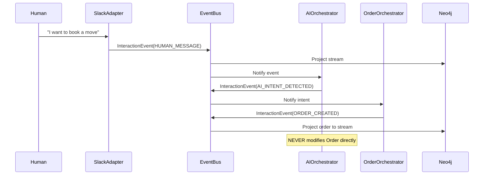
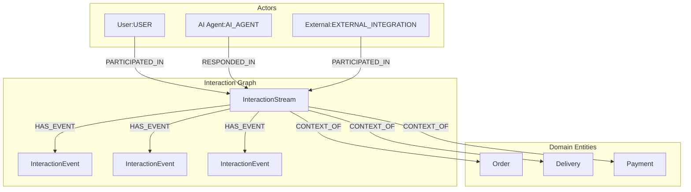

# ZanaFleet Interaction Engine Architecture Specification

## Executive Summary

This document defines the architectural specification for ZanaFleet's **Interaction Engine** - a unified, event-driven abstraction that serves as the primary input/output surface for all human, AI, and system interactions within the platform.

The Interaction Engine transforms ZanaFleet from a traditional page-centric application into a **stream-first** architecture where every action, message, and system event flows through a unified event journal.

---

## Table of Contents

1. [Strategic Context](#strategic-context)
2. [Current Architecture Analysis](#current-architecture-analysis)
3. [Core Domain Models](#core-domain-models)
4. [Architectural Principles](#architectural-principles)
5. [Component Architecture](#component-architecture)
   - 5.1 InteractionStream Aggregate
   - 5.2 InteractionEvent Model
   - 5.3 Participant Abstraction
   - 5.4 InteractionIngestionAdapters
   - 5.5 InteractionAIOrchestrator
6. [Integration Architecture](#integration-architecture)
   - 6.1 Neo4j Projection Model
   - 6.2 Search Indexing
   - 6.3 Policy & Moderation
   - 6.4 WebSocket Layer
7. [Migration Strategy](#migration-strategy)
8. [Implementation Roadmap](#implementation-roadmap)
9. [Anti-Patterns to Avoid](#anti-patterns-to-avoid)

---

## 1. Strategic Context

### Why This Matters Now

The LLM-era demands a fundamentally different architectural approach:

| Traditional App | LLM-Native App |
|-----------------|----------------|
| Users trigger actions | AI interprets intent and triggers actions |
| Fixed forms | Dynamic conversations |
| Page-centric | Stream-centric |
| Explicit commands | Contextual reasoning |
| Human → System | Human ↔ AI ↔ System |

### The Core Vision

```
┌─────────────────────────────────────────────────────────────────────┐
│                      INTERACTION ENGINE                              │
│                                                                      │
│   "Every user action, AI response, and system notification          │
│    is an event in a stream - not a message in a chat."              │
└─────────────────────────────────────────────────────────────────────┘
```

---

## 2. Current Architecture Analysis

### 2.1 Existing Patterns

Based on codebase analysis, ZanaFleet currently uses:

| Component | Technology | Purpose |
|-----------|------------|---------|
| Event Bus | Custom NATS/Redis | Domain events (BaseEvent interface) |
| CQRS | @nestjs/cqrs | Command/Query separation |
| Actors | ActorEntity + ActorType | Participant representation |
| Communication | NotificationEntity + Providers | Multi-channel notifications |
| Search | PostgreSQL FTS | Document indexing |
| Neo4j | Custom projections | Graph relationships |

### 2.2 Current Limitations

1. **Notification ≠ Interaction**: Current `CommunicationModule` sends notifications but doesn't capture interactions as events
2. **Actor Types Limited**: `ActorType` enum lacks `AI_AGENT` and `EXTERNAL_INTEGRATION`
3. **No Stream Concept**: Messages/notifications are isolated, not part of a continuous stream
4. **Search Siloed**: Each module indexes its own entities; no unified interaction search
5. **No Real-time Streams**: No WebSocket gateway for live interaction updates

---

## 3. Core Domain Models

### 3.1 InteractionStream Aggregate

The InteractionStream is the core aggregate root that represents a contextual thread of interactions.

```typescript
// apps/api/src/modules/interaction/entities/interaction-stream.entity.ts

import {
  Entity,
  PrimaryColumn,
  Column,
  CreateDateColumn,
  UpdateDateColumn,
  OneToMany,
  Index,
} from 'typeorm';
import { InteractionEventEntity } from './interaction-event.entity';

export enum InteractionStreamState {
  ACTIVE = 'ACTIVE',
  ARCHIVED = 'ARCHIVED',
  CLOSED = 'CLOSED',
}

export enum InteractionContextType {
  ORDER = 'ORDER',
  DELIVERY = 'DELIVERY',
  PAYMENT = 'PAYMENT',
  MOVES_QUOTE = 'MOVES_QUOTE',
  SUPPORT_TICKET = 'SUPPORT_TICKET',
  GENERAL = 'GENERAL',
}

@Entity('interaction_streams')
@Index(['contextType', 'contextId'])
@Index(['state'])
@Index(['createdAt'])
export class InteractionStreamEntity {
  @PrimaryColumn('uuid')
  id!: string;

  @Column('enum', { enum: InteractionContextType })
  contextType!: InteractionContextType;

  @Column('uuid')
  contextId!: string;

  @Column('enum', { enum: InteractionStreamState, default: InteractionStreamState.ACTIVE })
  state!: InteractionStreamState;

  @Column('jsonb', { nullable: true })
  metadata!: Record<string, unknown>;

  @Column('text', { array: true, default: () => "ARRAY[]::text[]" })
  participantIds!: string[];

  @CreateDateColumn({ type: 'timestamp with time zone' })
  createdAt!: Date;

  @UpdateDateColumn({ type: 'timestamp with time zone' })
  updatedAt!: Date;

  @OneToMany(() => InteractionEventEntity, (event) => event.stream)
  events!: InteractionEventEntity[];
}
```

### 3.2 InteractionEvent Model

Every interaction is an event - the fundamental building block of the system.

```typescript
// apps/api/src/modules/interaction/entities/interaction-event.entity.ts

import {
  Entity,
  PrimaryColumn,
  Column,
  CreateDateColumn,
  ManyToOne,
  JoinColumn,
  Index,
} from 'typeorm';
import { InteractionStreamEntity } from './interaction-stream.entity';

export enum InteractionEventType {
  // Human interactions
  HUMAN_MESSAGE = 'HUMAN_MESSAGE',
  HUMAN_ACTION = 'HUMAN_ACTION',
  
  // AI interactions
  AI_RESPONSE = 'AI_RESPONSE',
  AI_INTENT_DETECTED = 'AI_INTENT_DETECTED',
  AI_SUMMARIZATION = 'AI_SUMMARIZATION',
  
  // System interactions
  SYSTEM_NOTIFICATION = 'SYSTEM_NOTIFICATION',
  POLICY_VIOLATION = 'POLICY_VIOLATION',
  
  // External integrations
  SLACK_MESSAGE = 'SLACK_MESSAGE',
  TICKET_RESPONSE = 'TICKET_RESPONSE',
  EMAIL_RECEIVED = 'EMAIL_RECEIVED',
  WEBHOOK_EVENT = 'WEBHOOK_EVENT',
  
  // Domain events projected to stream
  ORDER_CREATED = 'ORDER_CREATED',
  ORDER_STATUS_CHANGED = 'ORDER_STATUS_CHANGED',
  PAYMENT_COMPLETED = 'PAYMENT_COMPLETED',
  DELIVERY_ASSIGNED = 'DELIVERY_ASSIGNED',
}

export enum InteractionActorType {
  USER = 'USER',
  ORGANIZATION = 'ORGANIZATION',
  DRIVER = 'DRIVER',
  RIDER = 'RIDER',
  SYSTEM = 'SYSTEM',
  AI_AGENT = 'AI_AGENT',
  EXTERNAL_INTEGRATION = 'EXTERNAL_INTEGRATION',
}

@Entity('interaction_events')
@Index(['streamId', 'createdAt'])
@Index(['actorType'])
@Index(['eventType'])
export class InteractionEventEntity {
  @PrimaryColumn('uuid')
  id!: string;

  @Column('uuid')
  streamId!: string;

  @Column('uuid')
  actorId!: string;

  @Column('enum', { enum: InteractionActorType })
  actorType!: InteractionActorType;

  @Column('enum', { enum: InteractionEventType })
  eventType!: InteractionEventType;

  @Column('jsonb')
  payload!: Record<string, unknown>;

  @Column('timestamp with time zone')
  createdAt!: Date;

  @ManyToOne(() => InteractionStreamEntity, (stream) => stream.events)
  @JoinColumn({ name: 'streamId' })
  stream!: InteractionStreamEntity;
}
```

### 3.3 Participant Abstraction

The Participant is an abstract concept that unifies all actors in the system.

```typescript
// apps/api/src/modules/interaction/types/participant.types.ts

/**
 * Participant represents any entity that can interact within the system.
 * This is a unified abstraction that encompasses:
 * - Human users
 * - Organizations
 * - Drivers/Riders
 * - AI Agents
 * - External Integrations (Slack, etc.)
 */
export type Participant = 
  | UserParticipant 
  | OrganizationParticipant 
  | DriverParticipant 
  | RiderParticipant 
  | SystemParticipant 
  | AIAgentParticipant 
  | ExternalIntegrationParticipant;

export interface BaseParticipant {
  id: string;
  type: InteractionActorType;
  displayName: string;
  metadata?: Record<string, unknown>;
}

export interface UserParticipant extends BaseParticipant {
  type: InteractionActorType.USER;
  userId: string;
  email: string;
}

export interface OrganizationParticipant extends BaseParticipant {
  type: InteractionActorType.ORGANIZATION;
  organizationId: string;
  businessName: string;
}

export interface DriverParticipant extends BaseParticipant {
  type: InteractionActorType.DRIVER;
  driverId: string;
  vehicleId?: string;
}

export interface RiderParticipant extends BaseParticipant {
  type: InteractionActorType.RIDER;
  riderId: string;
}

export interface SystemParticipant extends BaseParticipant {
  type: InteractionActorType.SYSTEM;
  serviceName: string;
}

export interface AIAgentParticipant extends BaseParticipant {
  type: InteractionActorType.AI_AGENT;
  agentId: string;
  model?: string;
  capabilities: string[];
}

export interface ExternalIntegrationParticipant extends BaseParticipant {
  type: InteractionActorType.EXTERNAL_INTEGRATION;
  integrationType: 'SLACK' | 'TICKETING' | 'EMAIL' | 'API' | 'WEBHOOK';
  externalId?: string;
}
```

---

## 4. Architectural Principles

### 4.1 Event-First Design

```
┌─────────────────────────────────────────────────────────────────────┐
│                    EVENT-FIRST ARCHITECTURE                          │
├─────────────────────────────────────────────────────────────────────┤
│                                                                      │
│   External Input ──► Normalize ──► InteractionEvent ──► Event Bus    │
│                           │                                         │
│                           ▼                                         │
│                    ┌─────────────┐                                  │
│                    │  Adapters   │ (No business logic)              │
│                    └─────────────┘                                  │
│                                                                      │
│   Event Bus ──► ┌─────────────┐ ──► Neo4j Projection               │
│                │  Handlers    │ ──► Search Index                    │
│                └─────────────┘ ──► WebSocket Push                  │
│                      │                                              │
│                      ▼                                              │
│                ┌─────────────┐                                      │
│                │ Orchestrators│ ──► Create new Events              │
│                └─────────────┘     (Never mutate!)                  │
│                                                                      │
└─────────────────────────────────────────────────────────────────────┘
```

### 4.2 Strict Layer Separation

| Layer | Responsibility | Rules |
|-------|----------------|-------|
| **Adapters** | Input normalization | No business logic |
| **Event Bus** | Event routing | Pure transport |
| **Projections** | State updates | Read-optimized |
| **Orchestrators** | Business coordination | Append-only |
| **Domain Services** | Core business logic | No interaction awareness |

### 4.3 AI as Append-Only Participant



---

## 5. Component Architecture

### 5.1 InteractionStream Aggregate

#### Stream Factory

```typescript
// apps/api/src/modules/interaction/factories/interaction-stream.factory.ts

import { Injectable } from '@nestjs/common';
import { v4 as uuidv4 } from 'uuid';
import { InteractionStreamEntity, InteractionContextType } from '../entities/interaction-stream.entity';

@Injectable()
export class InteractionStreamFactory {
  /**
   * Creates a new InteractionStream for a given context.
   * 
   * @param contextType - The type of context (ORDER, DELIVERY, etc.)
   * @param contextId - The ID of the domain entity
   * @param participantIds - Initial participants in the stream
   * @param metadata - Optional metadata
   */
  create(
    contextType: InteractionContextType,
    contextId: string,
    participantIds: string[],
    metadata?: Record<string, unknown>,
  ): InteractionStreamEntity {
    const stream = new InteractionStreamEntity();
    stream.id = uuidv4();
    stream.contextType = contextType;
    stream.contextId = contextId;
    stream.participantIds = participantIds;
    stream.metadata = metadata ?? {};
    stream.state = InteractionStreamState.ACTIVE;
    return stream;
  }

  /**
   * Finds or creates a stream for a given context.
   * Uses idempotent logic to prevent duplicate streams.
   */
  async findOrCreate(
    contextType: InteractionContextType,
    contextId: string,
    participantIds: string[],
  ): Promise<InteractionStreamEntity> {
    // Implementation delegates to repository with MERGE logic
  }
}
```

#### Repository Pattern

```typescript
// apps/api/src/modules/interaction/repositories/interaction-stream.repository.ts

import { Injectable } from '@nestjs/common';
import { InjectRepository } from '@nestjs/typeorm';
import { Repository } from 'typeorm';
import { InteractionStreamEntity, InteractionContextType } from '../entities/interaction-stream.entity';

@Injectable()
export class InteractionStreamRepository {
  constructor(
    @InjectRepository(InteractionStreamEntity)
    private readonly repository: Repository<InteractionStreamEntity>,
  ) {}

  async findById(id: string): Promise<InteractionStreamEntity | null> {
    return this.repository.findOne({ 
      where: { id },
      relations: ['events'],
    });
  }

  async findByContext(
    contextType: InteractionContextType,
    contextId: string,
  ): Promise<InteractionStreamEntity | null> {
    return this.repository.findOne({
      where: { contextType, contextId },
      relations: ['events'],
    });
  }

  async save(stream: InteractionStreamEntity): Promise<InteractionStreamEntity> {
    return this.repository.save(stream);
  }

  async appendEvent(
    streamId: string,
    event: InteractionEventEntity,
  ): Promise<InteractionStreamEntity> {
    // Uses database transaction to ensure atomicity
    return this.repository.manager.transaction(async (manager) => {
      const stream = await manager.findOne(InteractionStreamEntity, {
        where: { id: streamId },
      });
      
      if (!stream) {
        throw new Error(`Stream not found: ${streamId}`);
      }
      
      event.streamId = streamId;
      await manager.save(event);
      
      // Update participant list if new participant
      if (!stream.participantIds.includes(event.actorId)) {
        stream.participantIds = [...stream.participantIds, event.actorId];
        await manager.save(stream);
      }
      
      return stream;
    });
  }
}
```

### 5.2 InteractionEvent Model

#### Event Creation

```typescript
// apps/api/src/modules/interaction/commands/create-interaction-event.command.ts

import { ICommand } from '@nestjs/cqrs';
import { InteractionEventType, InteractionActorType } from '../entities/interaction-event.entity';

export class CreateInteractionEventCommand implements ICommand {
  constructor(
    public readonly streamId: string,
    public readonly actorId: string,
    public readonly actorType: InteractionActorType,
    public readonly eventType: InteractionEventType,
    public readonly payload: Record<string, unknown>,
  ) {}
}
```

#### Command Handler

```typescript
// apps/api/src/modules/interaction/handlers/create-interaction-event.handler.ts

import { CommandHandler, ICommandHandler } from '@nestjs/cqrs';
import { Injectable, Logger } from '@nestjs/common';
import { v4 as uuidv4 } from 'uuid';
import { EventBusService } from '@api/core/event-bus';
import { InteractionStreamRepository } from '../repositories/interaction-stream.repository';
import { InteractionEventEntity } from '../entities/interaction-event.entity';
import { CreateInteractionEventCommand } from '../commands/create-interaction-event.command';
import { InteractionEventCreatedEvent } from '../events/interaction-event-created.event';

@CommandHandler(CreateInteractionEventCommand)
@Injectable()
export class CreateInteractionEventHandler implements ICommandHandler<CreateInteractionEventCommand> {
  private readonly logger = new Logger(CreateInteractionEventHandler.name);

  constructor(
    private readonly streamRepository: InteractionStreamRepository,
    private readonly eventBus: EventBusService,
  ) {}

  async execute(command: CreateInteractionEventCommand): Promise<InteractionEventEntity> {
    this.logger.debug(`Creating interaction event: ${command.eventType}`);

    // Create the event entity
    const event = new InteractionEventEntity();
    event.id = uuidv4();
    event.streamId = command.streamId;
    event.actorId = command.actorId;
    event.actorType = command.actorType;
    event.eventType = command.eventType;
    event.payload = command.payload;
    event.createdAt = new Date();

    // Append to stream (transactional)
    await this.streamRepository.appendEvent(command.streamId, event);

    // Publish domain event for projections and handlers
    await this.eventBus.publish(
      new InteractionEventCreatedEvent(
        event.id,
        event.streamId,
        event.actorId,
        event.actorType,
        event.eventType,
        event.payload,
        event.createdAt,
      ),
    );

    this.logger.debug(`Interaction event created: ${event.id}`);
    return event;
  }
}
```

### 5.3 Participant Abstraction

#### Actor Type Extension

The existing `ActorType` enum must be extended:

```typescript
// apps/api/src/modules/actor/dto/actor.enums.ts (MODIFIED)

export enum ActorType {
  // Existing types
  Rider = 'Rider',
  Driver = 'Driver',
  Admin = 'Admin',
  Support = 'Support',
  HUMAN = 'HUMAN',
  SaccoAdmin = 'SaccoAdmin',
  Business = 'Business',
  BusinessOwner = 'BusinessOwner',
  Internal = 'Internal',
  AIService = 'AIService',
  
  // NEW: Interaction Engine types
  AI_AGENT = 'AI_AGENT',
  EXTERNAL_INTEGRATION = 'EXTERNAL_INTEGRATION',
}
```

#### Participant Resolution Service

```typescript
// apps/api/src/modules/interaction/services/participant-resolution.service.ts

import { Injectable } from '@nestjs/common';
import { ActorService } from '../../actor/services/actor.service';
import { OrganizationService } from '../../organization/services/organization.service';
import { Participant, InteractionActorType } from '../types/participant.types';

@Injectable()
export class ParticipantResolutionService {
  constructor(
    private readonly actorService: ActorService,
    private readonly organizationService: OrganizationService,
  ) {}

  async resolveParticipant(
    actorId: string,
    actorType: InteractionActorType,
  ): Promise<Participant> {
    switch (actorType) {
      case InteractionActorType.USER:
        return this.resolveUserParticipant(actorId);
      case InteractionActorType.ORGANIZATION:
        return this.resolveOrganizationParticipant(actorId);
      case InteractionActorType.DRIVER:
        return this.resolveDriverParticipant(actorId);
      case InteractionActorType.RIDER:
        return this.resolveRiderParticipant(actorId);
      case InteractionActorType.SYSTEM:
        return this.resolveSystemParticipant(actorId);
      case InteractionActorType.AI_AGENT:
        return this.resolveAIAgentParticipant(actorId);
      case InteractionActorType.EXTERNAL_INTEGRATION:
        return this.resolveExternalIntegrationParticipant(actorId);
      default:
        throw new Error(`Unknown actor type: ${actorType}`);
    }
  }

  private async resolveUserParticipant(actorId: string): Promise<Participant> {
    const actor = await this.actorService.findById(actorId);
    if (!actor) {
      throw new Error(`Actor not found: ${actorId}`);
    }
    
    return {
      id: actor.id,
      type: InteractionActorType.USER,
      displayName: actor.username,
      userId: actor.id,
      email: actor.email,
      metadata: { roles: actor.roles },
    };
  }

  // ... other resolution methods
}
```

### 5.4 InteractionIngestionAdapters

Each adapter normalizes external input into InteractionEvents. **No business logic inside adapters.**

```typescript
// apps/api/src/modules/interaction/adapters/base/adapter.interface.ts

import { InteractionEventType, InteractionActorType } from '../../entities/interaction-event.entity';

export interface AdapterInput {
  rawInput: unknown;
  source: string;
  timestamp: Date;
}

export interface NormalizedEvent {
  streamId?: string;
  contextType?: string;
  contextId?: string;
  actorId: string;
  actorType: InteractionActorType;
  eventType: InteractionEventType;
  payload: Record<string, unknown>;
}

export interface IInteractionAdapter {
  /**
   * Unique identifier for this adapter
   */
  readonly adapterId: string;

  /**
   * Supported input types
   */
  readonly supportedInputTypes: string[];

  /**
   * Normalize external input to InteractionEvent format
   */
  normalize(input: AdapterInput): NormalizedEvent;

  /**
   * Validate input before normalization
   */
  validate(input: AdapterInput): boolean;
}
```

#### Slack Adapter Example

```typescript
// apps/api/src/modules/interaction/adapters/slack/slack.adapter.ts

import { Injectable, Logger } from '@nestjs/common';
import { 
  IInteractionAdapter, 
  AdapterInput, 
  NormalizedEvent 
} from '../base/adapter.interface';
import { 
  InteractionEventType, 
  InteractionActorType 
} from '../../entities/interaction-event.entity';

interface SlackMessage {
  type: string;
  channel: string;
  user: string;
  text: string;
  ts: string;
}

@Injectable()
export class SlackAdapter implements IInteractionAdapter {
  private readonly logger = new Logger(SlackAdapter.name);
  readonly adapterId = 'slack';
  readonly supportedInputTypes = ['message', 'app_mention', 'reaction_added'];

  normalize(input: AdapterInput): NormalizedEvent {
    const slackMessage = input.rawInput as SlackMessage;
    
    this.logger.debug(`Normalizing Slack message: ${slackMessage.text}`);

    // Extract context from Slack channel (e.g., "order-123-support")
    const { contextType, contextId } = this.extractContext(slackMessage.channel);

    return {
      streamId: this.deriveStreamId(contextType, contextId),
      contextType,
      contextId,
      actorId: slackMessage.user,
      actorType: InteractionActorType.EXTERNAL_INTEGRATION,
      eventType: InteractionEventType.SLACK_MESSAGE,
      payload: {
        slackChannel: slackMessage.channel,
        slackUser: slackMessage.user,
        slackTimestamp: slackMessage.ts,
        text: slackMessage.text,
        integrationType: 'SLACK',
      },
    };
  }

  validate(input: AdapterInput): boolean {
    const message = input.rawInput as SlackMessage;
    return !!(message && message.type && message.text);
  }

  private extractContext(channel: string): { contextType: string; contextId: string } {
    // Parse channel name to extract context
    const parts = channel.split('-');
    if (parts.length >= 2) {
      return {
        contextType: parts[0].toUpperCase(),
        contextId: parts[1],
      };
    }
    return { contextType: 'GENERAL', contextId: 'default' };
  }

  private deriveStreamId(contextType: string, contextId: string): string {
    // Implementation: hash or lookup existing stream
    return `${contextType}-${contextId}`;
  }
}
```

#### WebChat Adapter Example

```typescript
// apps/api/src/modules/interaction/adapters/webchat/webchat.adapter.ts

import { Injectable } from '@nestjs/common';
import { 
  IInteractionAdapter, 
  AdapterInput, 
  NormalizedEvent 
} from '../base/adapter.interface';
import { 
  InteractionEventType, 
  InteractionActorType 
} from '../../entities/interaction-event.entity';

interface WebChatMessage {
  userId: string;
  sessionId: string;
  message: string;
  metadata?: Record<string, unknown>;
}

@Injectable()
export class WebChatAdapter implements IInteractionAdapter {
  readonly adapterId = 'webchat';
  readonly supportedInputTypes = ['text', 'action', 'attachment'];

  normalize(input: AdapterInput): NormalizedEvent {
    const chatMessage = input.rawInput as WebChatMessage;

    return {
      streamId: chatMessage.sessionId,
      contextType: 'GENERAL', // Default, can be overridden
      contextId: chatMessage.sessionId,
      actorId: chatMessage.userId,
      actorType: InteractionActorType.USER,
      eventType: InteractionEventType.HUMAN_MESSAGE,
      payload: {
        message: chatMessage.message,
        sessionId: chatMessage.sessionId,
        metadata: chatMessage.metadata,
      },
    };
  }

  validate(input: AdapterInput): boolean {
    const message = input.rawInput as WebChatMessage;
    return !!(message && message.userId && message.message);
  }
}
```

### 5.5 InteractionAIOrchestrator

The AI Orchestrator listens to interaction events and decides how to respond - without mutating entities.

```typescript
// apps/api/src/modules/interaction/ai/interaction-ai-orchestrator.ts

import { Injectable, Logger } from '@nestjs/common';
import { OnEvent } from '@nestjs/event-emitter';
import { EventBusService } from '@api/core/event-bus';
import { InteractionEventCreatedEvent } from '../../events/interaction-event-created.event';
import { InteractionEventType } from '../../entities/interaction-event.entity';

export enum AIResponseAction {
  RESPOND = 'RESPOND',
  SUMMARIZE = 'SUMMARIZE',
  ESCALATE = 'ESCALATE',
  TRIGGER_WORKFLOW = 'TRIGGER_WORKFLOW',
  ASK_CLARIFICATION = 'ASK_CLARIFICATION',
  BLOCK = 'BLOCK',
  IGNORE = 'IGNORE',
}

export interface AIDecision {
  action: AIResponseAction;
  confidence: number;
  reasoning: string;
  responsePayload?: Record<string, unknown>;
}

@Injectable()
export class InteractionAIOrchestrator {
  private readonly logger = new Logger(InteractionAIOrchestrator.name);

  constructor(private readonly eventBus: EventBusService) {}

  /**
   * Listens to all InteractionEventCreated events
   */
  @OnEvent('interaction.event.created')
  async handleInteractionEvent(event: InteractionEventCreatedEvent): Promise<void> {
    // Only process human messages
    if (event.eventType !== InteractionEventType.HUMAN_MESSAGE) {
      return;
    }

    this.logger.debug(`Processing human message in stream: ${event.streamId}`);

    // Make AI decision
    const decision = await this.makeDecision(event);

    // Execute action (append new event, never mutate)
    await this.executeDecision(decision, event);
  }

  private async makeDecision(event: InteractionEventCreatedEvent): Promise<AIDecision> {
    // TODO: Integrate with LLM provider
    // For now, simple rule-based logic
    
    const message = event.payload['message'] as string;
    const lowerMessage = message.toLowerCase();

    // Intent detection patterns
    if (lowerMessage.includes('book') || lowerMessage.includes('move')) {
      return {
        action: AIResponseAction.TRIGGER_WORKFLOW,
        confidence: 0.85,
        reasoning: 'Intent to book a move detected',
        responsePayload: {
          intent: 'BOOK_MOVE',
          entities: this.extractEntities(message),
        },
      };
    }

    if (lowerMessage.includes('help')) {
      return {
        action: AIResponseAction.ASK_CLARIFICATION,
        confidence: 0.7,
        reasoning: 'User requesting help',
      };
    }

    // Default: respond normally
    return {
      action: AIResponseAction.RESPOND,
      confidence: 0.6,
      reasoning: 'General message, respond normally',
      responsePayload: {
        message: 'Thank you for your message. How can I help you today?',
      },
    };
  }

  private async executeDecision(
    decision: AIDecision,
    originalEvent: InteractionEventCreatedEvent,
  ): Promise<void> {
    switch (decision.action) {
      case AIResponseAction.RESPOND:
        await this.appendAIResponse(originalEvent, decision);
        break;
      case AIResponseAction.TRIGGER_WORKFLOW:
        await this.appendIntentDetected(originalEvent, decision);
        break;
      case AIResponseAction.ASK_CLARIFICATION:
        await this.appendAIResponse(originalEvent, decision);
        break;
      case AIResponseAction.IGNORE:
        // Do nothing
        break;
      default:
        this.logger.warn(`Unknown AI action: ${decision.action}`);
    }
  }

  private async appendAIResponse(
    originalEvent: InteractionEventCreatedEvent,
    decision: AIDecision,
  ): Promise<void> {
    // Append AI response as new event (append-only!)
    const event = new InteractionEventCreatedEvent(
      // Generate new event ID
      `${originalEvent.streamId}-ai-${Date.now()}`,
      originalEvent.streamId,
      'ai-orchestrator', // AI agent ID
      InteractionActorType.AI_AGENT,
      InteractionEventType.AI_RESPONSE,
      {
        message: decision.responsePayload?.message,
        reasoning: decision.reasoning,
        confidence: decision.confidence,
      },
      new Date(),
    );

    await this.eventBus.publish(event);
  }

  private async appendIntentDetected(
    originalEvent: InteractionEventCreatedEvent,
    decision: AIDecision,
  ): Promise<void> {
    // Append intent detection event (triggers other orchestrators)
    const event = new InteractionEventCreatedEvent(
      `${originalEvent.streamId}-intent-${Date.now()}`,
      originalEvent.streamId,
      'ai-orchestrator',
      InteractionActorType.AI_AGENT,
      InteractionEventType.AI_INTENT_DETECTED,
      decision.responsePayload,
      new Date(),
    );

    await this.eventBus.publish(event);
  }

  private extractEntities(message: string): Record<string, unknown> {
    // Simple entity extraction (replace with NER in production)
    return {
      hasLocation: message.toLowerCase().includes('location'),
      hasDate: message.toLowerCase().includes('date'),
    };
  }
}
```

---

## 6. Integration Architecture

### 6.1 Neo4j Projection Model

```typescript
// apps/api/src/modules/interaction/projections/interaction-neo4j.projection.ts

import { Injectable, Logger } from '@nestjs/common';
import { EventsHandler, IEventHandler } from '@nestjs/cqrs';
import { Neo4jService } from '@api/core/neo4j';
import { InteractionEventCreatedEvent } from '../../events/interaction-event-created.event';

@EventsHandler(InteractionEventCreatedEvent)
@Injectable()
export class InteractionNeo4jProjection implements IEventHandler<InteractionEventCreatedEvent> {
  private readonly logger = new Logger(InteractionNeo4jProjection.name);

  constructor(private readonly neo4j: Neo4jService) {}

  async handle(event: InteractionEventCreatedEvent): Promise<void> {
    this.logger.debug(`Projecting interaction event to Neo4j: ${event.eventId}`);

    const session = this.neo4j.getWriteSession();

    try {
      // 1. Ensure InteractionStream node exists
      await session.run(
        `
        MERGE (s:InteractionStream {id: $streamId})
        SET s.contextType = $contextType,
            s.contextId = $contextId,
            s.updatedAt = datetime($createdAt)
        `,
        {
          streamId: event.streamId,
          contextType: event.payload['contextType'],
          contextId: event.payload['contextId'],
          createdAt: event.createdAt.toISOString(),
        }
      );

      // 2. Create Actor node if not exists
      await session.run(
        `
        MERGE (a:Actor {id: $actorId})
        SET a.type = $actorType
        `,
        {
          actorId: event.actorId,
          actorType: event.actorType,
        }
      );

      // 3. Create PARTICIPATED_IN relationship
      await session.run(
        `
        MATCH (a:Actor {id: $actorId})
        MATCH (s:InteractionStream {id: $streamId})
        MERGE (a)-[r:PARTICIPATED_IN]->(s)
        SET r.lastActiveAt = datetime($createdAt)
        `,
        {
          actorId: event.actorId,
          streamId: event.streamId,
          createdAt: event.createdAt.toISOString(),
        }
      );

      // 4. Create event node and relationship
      await session.run(
        `
        MATCH (s:InteractionStream {id: $streamId})
        CREATE (e:InteractionEvent {
          id: $eventId,
          eventType: $eventType,
          actorId: $actorId,
          createdAt: datetime($createdAt)
        })
        SET e.payload = $payload
        CREATE (s)-[:HAS_EVENT]->(e)
        `,
        {
          eventId: event.eventId,
          streamId: event.streamId,
          eventType: event.eventType,
          actorId: event.actorId,
          createdAt: event.createdAt.toISOString(),
          payload: JSON.stringify(event.payload),
        }
      );

      // 5. Context-specific relationships
      await this.createContextRelationships(session, event);

      this.logger.debug(`Successfully projected event: ${event.eventId}`);
    } catch (error) {
      const err = error as Error;
      this.logger.error(`Failed to project to Neo4j: ${err.message}`, err.stack);
      throw error;
    } finally {
      await session.close();
    }
  }

  private async createContextRelationships(
    session: any,
    event: InteractionEventCreatedEvent,
  ): Promise<void> {
    const contextType = event.payload['contextType'] as string;
    const contextId = event.payload['contextId'] as string;

    if (!contextType || !contextId) return;

    const contextNodeType = contextType.toUpperCase();

    await session.run(
      `
      MATCH (s:InteractionStream {id: $streamId})
      MERGE (c:${contextNodeType} {id: $contextId})
      MERGE (s)-[:CONTEXT_OF]->(c)
      `,
      {
        streamId: event.streamId,
        contextId: contextId,
      }
    );
  }
}
```

#### Neo4j Graph Structure



### 6.2 Search Indexing

```typescript
// apps/api/src/modules/interaction/services/interaction-search-projection.service.ts

import { Injectable, Logger } from '@nestjs/common';
import { EventsHandler, IEventHandler } from '@nestjs/cqrs';
import { ISearchProvider, SEARCH_PROVIDER } from '../../search/providers/search-provider.interface';
import { InteractionEventCreatedEvent } from '../events/interaction-event-created.event';

@EventsHandler(InteractionEventCreatedEvent)
@Injectable()
export class InteractionSearchProjection implements IEventHandler<InteractionEventCreatedEvent> {
  private readonly logger = new Logger(InteractionSearchProjection.name);

  constructor(
    @Inject(SEARCH_PROVIDER) private readonly searchProvider: ISearchProvider,
  ) {}

  async handle(event: InteractionEventCreatedEvent): Promise<void> {
    // Index the interaction event for search
    const searchableContent = this.extractSearchableContent(event);

    if (!searchableContent) return;

    this.logger.debug(`Indexing interaction event: ${event.eventId}`);

    await this.searchProvider.index({
      entityId: event.eventId,
      entityType: 'InteractionEvent',
      workspaceId: event.payload['workspaceId'] as string || 'default',
      title: searchableContent.title,
      description: searchableContent.description,
      metadata: {
        streamId: event.streamId,
        actorId: event.actorId,
        actorType: event.actorType,
        eventType: event.eventType,
        contextType: event.payload['contextType'],
        contextId: event.payload['contextId'],
        // AI-specific fields
        aiAnnotations: event.payload['aiAnnotations'],
        intentDetected: event.payload['intent'],
        sentiment: event.payload['sentiment'],
      },
      createdAt: event.createdAt,
    });
  }

  private extractSearchableContent(event: InteractionEventCreatedEvent): {
    title: string;
    description: string;
  } | null {
    const payload = event.payload;

    // Extract text content based on event type
    switch (event.eventType) {
      case 'HUMAN_MESSAGE':
        return {
          title: `Message from ${event.actorId}`,
          description: payload['message'] as string || '',
        };
      case 'AI_RESPONSE':
        return {
          title: 'AI Response',
          description: payload['message'] as string || '',
        };
      case 'AI_INTENT_DETECTED':
        return {
          title: `Intent: ${payload['intent']}`,
          description: `Confidence: ${payload['confidence']}`,
        };
      case 'SYSTEM_NOTIFICATION':
        return {
          title: 'System Notification',
          description: payload['message'] as string || '',
        };
      case 'SLACK_MESSAGE':
        return {
          title: `Slack: ${payload['slackChannel']}`,
          description: payload['text'] as string || '',
        };
      default:
        return null;
    }
  }
}
```

### 6.3 Policy & Moderation Integration

```typescript
// apps/api/src/modules/interaction/policy/interaction-policy-gateway.ts

import { Injectable, Logger } from '@nestjs/common';
import { OnEvent } from '@nestjs/event-emitter';
import { PolicyEnforcementAdapter } from '../../policy/services/policy-enforcement.adapter';
import { EventBusService } from '@api/core/event-bus';
import { InteractionEventCreatedEvent } from '../events/interaction-event-created.event';
import { InteractionEventType } from '../entities/interaction-event.entity';

@Injectable()
export class InteractionPolicyGateway {
  private readonly logger = new Logger(InteractionPolicyGateway.name);

  constructor(
    private readonly policyAdapter: PolicyEnforcementAdapter,
    private readonly eventBus: EventBusService,
  ) {}

  /**
   * Evaluate every human message against policy rules
   */
  @OnEvent('interaction.event.created')
  async evaluatePolicy(event: InteractionEventCreatedEvent): Promise<void> {
    // Only evaluate human messages
    if (event.eventType !== InteractionEventType.HUMAN_MESSAGE) {
      return;
    }

    this.logger.debug(`Evaluating policy for interaction event: ${event.eventId}`);

    // Evaluate against policy
    const decision = await this.policyAdapter.evaluate({
      resourceType: 'InteractionEvent',
      action: 'CREATE',
      actorId: event.actorId,
      context: {
        streamId: event.streamId,
        message: event.payload['message'],
        metadata: event.payload,
      },
    });

    if (!decision.permitted) {
      this.logger.warn(`Policy violation blocked: ${decision.reason}`);

      // Emit policy violation event (appended to stream, not blocking!)
      await this.eventBus.publish(
        new InteractionEventCreatedEvent(
          `${event.streamId}-violation-${Date.now()}`,
          event.streamId,
          'policy-engine',
          'SYSTEM',
          InteractionEventType.POLICY_VIOLATION,
          {
            originalEventId: event.eventId,
            reason: decision.reason,
            ruleId: decision.ruleId,
          },
          new Date(),
        ),
      );
    }
  }
}
```

### 6.4 WebSocket Layer

The WebSocket layer is **completely decoupled from domain logic**.

```typescript
// apps/api/src/modules/interaction-gateway/interaction-gateway.module.ts

import { Module } from '@nestjs/common';
import { EventBusModule } from '@api/core/event-bus';
import { InteractionGatewayService } from './interaction-gateway.service';
import { InteractionGatewayController } from './interaction-gateway.controller';

@Module({
  imports: [EventBusModule.forFeature()],
  providers: [InteractionGatewayService],
  controllers: [InteractionGatewayController],
  exports: [InteractionGatewayService],
})
export class InteractionGatewayModule {}
```

```typescript
// apps/api/src/modules/interaction-gateway/interaction-gateway.service.ts

import { Injectable, Logger } from '@nestjs/common';
import { WebSocketGateway, WebSocketServer, SubscribeMessage, OnGatewayConnection } from '@nestjs/websockets';
import { Server, Socket } from 'socket.io';

@WebSocketGateway({
  cors: {
    origin: process.env.CORS_ORIGIN || '*',
  },
})
@Injectable()
export class InteractionGatewayService implements OnGatewayConnection {
  @WebSocketServer()
  server: Server;

  private readonly logger = new Logger(InteractionGatewayService.name);
  private readonly userSockets: Map<string, Set<string>> = new Map();

  handleConnection(client: Socket): void {
    this.logger.debug(`Client connected: ${client.id}`);
  }

  /**
   * Subscribe a user to a specific interaction stream
   */
  @SubscribeMessage('stream:subscribe')
  handleSubscribe(client: Socket, payload: { streamId: string; userId: string }): void {
    const { streamId, userId } = payload;
    
    // Join socket room for this stream
    client.join(`stream:${streamId}`);
    
    // Track user sockets
    if (!this.userSockets.has(userId)) {
      this.userSockets.set(userId, new Set());
    }
    this.userSockets.get(userId)!.add(client.id);

    this.logger.debug(`User ${userId} subscribed to stream ${streamId}`);
  }

  /**
   * Push new event to all subscribers of a stream
   * Called by event handlers (not part of domain!)
   */
  async pushEvent(streamId: string, event: Record<string, unknown>): Promise<void> {
    this.server.to(`stream:${streamId}`).emit('stream:event', {
      streamId,
      event,
      timestamp: new Date().toISOString(),
    });
  }

  /**
   * Push AI typing indicator
   */
  async pushTypingIndicator(streamId: string, actorId: string): Promise<void> {
    this.server.to(`stream:${streamId}`).emit('stream:typing', {
      streamId,
      actorId,
    });
  }
}
```

---

## 7. Migration Strategy

### 7.1 Phased Migration

```
┌─────────────────────────────────────────────────────────────────────┐
│                      MIGRATION PHASES                                │
├─────────────────────────────────────────────────────────────────────┤
│                                                                      │
│  Phase 1: Foundation (Weeks 1-2)                                    │
│  ├── Create Interaction module structure                            │
│  ├── Implement InteractionStream + InteractionEvent entities        │
│  ├── Set up Neo4j projections                                       │
│  └── Register in AppModule (parallel to existing)                   │
│                                                                      │
│  Phase 2: Adapters & Events (Weeks 3-4)                             │
│  ├── Create WebChatAdapter                                          │
│  ├── Create SlackAdapter                                            │
│  ├── Implement InteractionEventCreatedEvent                         │
│  └── Add Search projection                                          │
│                                                                      │
│  Phase 3: AI Orchestration (Weeks 5-6)                              │
│  ├── Implement InteractionAIOrchestrator                           │
│  ├── Add intent detection                                           │
│  └── Integrate with existing orchestrators                          │
│                                                                      │
│  Phase 4: WebSocket (Weeks 7-8)                                     │
│  ├── Implement InteractionGatewayModule                            │
│  ├── Add real-time event pushing                                    │
│  └── Frontend integration                                           │
│                                                                      │
│  Phase 5: Deprecation (Weeks 9-10)                                  │
│  ├── Migrate existing notifications to events                        │
│  ├── Redirect legacy endpoints                                      │
│  └── Remove old CommunicationModule usage                           │
│                                                                      │
└─────────────────────────────────────────────────────────────────────┘
```

### 7.2 Coexistence Pattern

During migration, both systems operate in parallel:

```typescript
// apps/api/src/app.module.ts (MODIFIED)

@Module({
  imports: [
    // ... existing modules
    CommunicationModule, // Keep existing for backward compatibility
    InteractionModule,   // NEW: Parallel operation
    InteractionGatewayModule, // NEW: WebSocket
  ],
})
export class AppModule {}
```

### 7.3 Event Bridge (Optional)

For gradual migration, existing modules can emit both old and new events:

```typescript
// apps/api/src/modules/communication/bridges/notification-to-interaction.bridge.ts

import { Injectable } from '@nestjs/common';
import { OnEvent } from '@nestjs/event-emitter';
import { NotificationSentEvent } from '../events/notification-sent.event';
import { CreateInteractionEventCommand } from '../../interaction/commands/create-interaction-event.command';
import { CommandBus } from '@nestjs/cqrs';

@Injectable()
export class NotificationToInteractionBridge {
  constructor(private readonly commandBus: CommandBus) {}

  @OnEvent('notification.sent')
  async bridge(event: NotificationSentEvent): Promise<void> {
    // Convert notification to interaction event
    await this.commandBus.execute(
      new CreateInteractionEventCommand(
        event.recipientId, // streamId (derived)
        'system',
        'SYSTEM',
        'SYSTEM_NOTIFICATION',
        {
          notificationId: event.notificationId,
          channel: event.channel,
          message: event.message,
        },
      ),
    );
  }
}
```

---

## 8. Implementation Roadmap

### 8.1 File Structure

```
apps/api/src/modules/
├── interaction/
│   ├── __fixtures__/
│   │   └── interaction.fixtures.ts
│   ├── adapters/
│   │   ├── base/
│   │   │   └── adapter.interface.ts
│   │   ├── slack/
│   │   │   ├── slack.adapter.ts
│   │   │   └── slack.adapter.spec.ts
│   │   ├── webchat/
│   │   │   ├── webchat.adapter.ts
│   │   │   └── webchat.adapter.spec.ts
│   │   ├── ticketing/
│   │   │   ├── ticketing.adapter.ts
│   │   │   └── ticketing.adapter.spec.ts
│   │   ├── email/
│   │   │   ├── email.adapter.ts
│   │   │   └── email.adapter.spec.ts
│   │   └── api/
│   │       ├── api.adapter.ts
│   │       └── api.adapter.spec.ts
│   ├── ai/
│   │   ├── interaction-ai-orchestrator.ts
│   │   └── interaction-ai-orchestrator.spec.ts
│   ├── commands/
│   │   ├── create-interaction-stream.command.ts
│   │   └── create-interaction-event.command.ts
│   ├── dto/
│   │   ├── create-stream.dto.ts
│   │   └── create-event.dto.ts
│   ├── entities/
│   │   ├── interaction-stream.entity.ts
│   │   └── interaction-event.entity.ts
│   ├── events/
│   │   ├── interaction-stream-created.event.ts
│   │   └── interaction-event-created.event.ts
│   ├── handlers/
│   │   ├── create-interaction-stream.handler.ts
│   │   └── create-interaction-event.handler.ts
│   ├── projections/
│   │   ├── interaction-neo4j.projection.ts
│   │   └── interaction-neo4j.projection.spec.ts
│   ├── policy/
│   │   └── interaction-policy-gateway.ts
│   ├── repositories/
│   │   ├── interaction-stream.repository.ts
│   │   └── interaction-event.repository.ts
│   ├── services/
│   │   └── participant-resolution.service.ts
│   ├── types/
│   │   └── participant.types.ts
│   ├── interaction.module.ts
│   └── interaction.controller.ts
│
└── interaction-gateway/
    ├── interaction-gateway.module.ts
    ├── interaction-gateway.service.ts
    ├── interaction-gateway.controller.ts
    └── interaction-gateway.gateway.ts
```

### 8.2 Key Interfaces Summary

| Interface | Purpose | Location |
|-----------|---------|----------|
| `IInteractionAdapter` | External input normalization | `adapters/base/adapter.interface.ts` |
| `InteractionStreamEntity` | Stream aggregate root | `entities/interaction-stream.entity.ts` |
| `InteractionEventEntity` | Event entity | `entities/interaction-event.entity.ts` |
| `InteractionAIOrchestrator` | AI decision logic | `ai/interaction-ai-orchestrator.ts` |
| `InteractionNeo4jProjection` | Graph projection | `projections/interaction-neo4j.projection.ts` |
| `InteractionSearchProjection` | Search indexing | `services/interaction-search-projection.service.ts` |
| `InteractionPolicyGateway` | Policy evaluation | `policy/interaction-policy-gateway.ts` |
| `InteractionGatewayService` | WebSocket handling | `interaction-gateway.service.ts` |

---

## 9. Anti-Patterns to Avoid

### ❌ BAD: Slack Directly Calling OrderService

```typescript
// BAD: Tight coupling
@SlackController()
export class SlackController {
  @Post('slash-command')
  async handleCommand(@Body() command: SlackCommand) {
    if (command.text.includes('book')) {
      const order = await this.orderService.create({ ... }); // WRONG!
    }
  }
}
```

### ✅ GOOD: Slack Adapter → Event → Orchestrator

```typescript
// GOOD: Decoupled via event
@SlackController()
export class SlackController {
  @Post('slash-command')
  async handleCommand(@Body() command: SlackCommand) {
    const adapter = this.slackAdapter;
    const normalized = adapter.normalize({ rawInput: command, ... });
    await this.commandBus.execute(new CreateInteractionEventCommand(...));
  }
}
```

### ❌ BAD: AI Modifying Order Directly

```typescript
// BAD: AI mutating domain
@AIOrchestrator()
export class AIOrchestrator {
  async respond(message: string) {
    if (this.detectIntent(message) === 'BOOK_MOVE') {
      await this.orderService.create({ ... }); // WRONG!
    }
  }
}
```

### ✅ GOOD: AI Appending Intent Event

```typescript
// GOOD: AI appends events only
@AIOrchestrator()
export class AIOrchestrator {
  async respond(message: string) {
    if (this.detectIntent(message) === 'BOOK_MOVE') {
      await this.commandBus.execute(
        new CreateInteractionEventCommand(
          streamId, 'ai-agent', 'AI_AGENT', 'AI_INTENT_DETECTED',
          { intent: 'BOOK_MOVE', entities: ... }
        )
      );
      // OrderOrchestrator listens and creates order
    }
  }
}
```

### ❌ BAD: ChatController Knowing About Payment

```typescript
// BAD: Cross-module knowledge
@Controller('chat')
export class ChatController {
  async sendMessage(message: string) {
    await this.chatService.send(message);
    if (message.includes('pay')) {
      await this.paymentService.process(...); // WRONG!
    }
  }
}
```

### ✅ GOOD: Events Trigger Appropriate Handlers

```typescript
// GOOD: Handler-based coordination
@Controller('chat')
export class ChatController {
  async sendMessage(message: string) {
    await this.commandBus.execute(
      new CreateInteractionEventCommand(streamId, user, 'HUMAN_MESSAGE', { message })
    );
    // PaymentHandler listens to AI_INTENT_DETECTED
  }
}
```

---

## Appendix A: Event Type Reference

| EventType | ActorType | Payload Keys | Description |
|-----------|-----------|--------------|-------------|
| `HUMAN_MESSAGE` | USER | `message`, `attachments` | User chat message |
| `AI_RESPONSE` | AI_AGENT | `message`, `reasoning` | AI response |
| `AI_INTENT_DETECTED` | AI_AGENT | `intent`, `entities`, `confidence` | Intent from AI |
| `SYSTEM_NOTIFICATION` | SYSTEM | `message`, `notificationType` | System alert |
| `POLICY_VIOLATION` | SYSTEM | `reason`, `originalEventId` | Policy block |
| `SLACK_MESSAGE` | EXTERNAL_INTEGRATION | `slackChannel`, `text`, `slackUser` | Slack message |
| `TICKET_RESPONSE` | EXTERNAL_INTEGRATION | `ticketId`, `response` | Support ticket |
| `EMAIL_RECEIVED` | EXTERNAL_INTEGRATION | `emailFrom`, `subject`, `body` | Email input |
| `ORDER_CREATED` | SYSTEM | `orderId`, `summary` | Domain event |
| `DELIVERY_ASSIGNED` | SYSTEM | `deliveryId`, `riderId` | Domain event |

---

## Appendix B: Migration Checklist

- [ ] Create InteractionModule structure
- [ ] Add InteractionStreamEntity to TypeORM
- [ ] Add InteractionEventEntity to TypeORM
- [ ] Create migration for new tables
- [ ] Implement InteractionStreamRepository
- [ ] Implement InteractionEventRepository
- [ ] Create CreateInteractionEventCommand/Handler
- [ ] Create InteractionEventCreatedEvent
- [ ] Implement InteractionNeo4jProjection
- [ ] Create IInteractionAdapter interface
- [ ] Implement SlackAdapter
- [ ] Implement WebChatAdapter
- [ ] Create InteractionAIOrchestrator
- [ ] Integrate with SearchModule
- [ ] Integrate with PolicyModule
- [ ] Create InteractionGatewayModule
- [ ] Update AppModule imports
- [ ] Write unit tests
- [ ] Write integration tests
- [ ] Update documentation

---

## Appendix C: Configuration

```yaml
# config/interaction.yaml
interaction:
  ai:
    enabled: true
    model: "gpt-4"
    temperature: 0.7
    maxTokens: 1000
  
  adapters:
    slack:
      enabled: true
      signingSecret: "${SLACK_SIGNING_SECRET}"
      botToken: "${SLACK_BOT_TOKEN}"
    
    webchat:
      enabled: true
      maxMessageLength: 5000
    
    ticketing:
      enabled: true
      provider: "zendesk" # or "freshdesk"
  
  policy:
    enabled: true
    evaluationMode: "strict" # or "permissive"
  
  websocket:
    enabled: true
    pingInterval: 30000
    pingTimeout: 10000
```

---

*Document Version: 1.0*
*Last Updated: 2026-02-14*
*Architecture Owner: ZanaFleet Platform Team*
