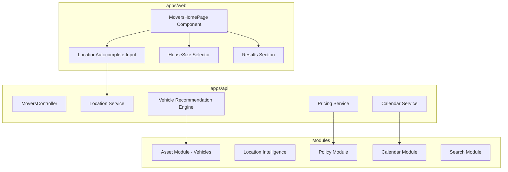

# Movers Homepage Experience - Implementation Plan

## Executive Summary

This plan outlines the implementation of the Movers homepage experience for the ZanaFleet platform. The feature will allow users to enter moving locations, select house sizes, and receive vehicle recommendations with price/time estimates.

**Key Integration Points:**
- **Asset Module**: Vehicle availability and matching based on house size
- **Location Intelligence**: Geocoding, distance calculations, autocomplete
- **Policy Engine**: Pricing rules, holiday restrictions, surge pricing
- **Calendar Module**: Availability scheduling
- **Payment Module**: Estimate pre-authorization (future)

## Architecture Overview



## Part 1: Backend API Design

### 1.1 New Module: Movers

**Location**: `apps/api/src/modules/movers/`

#### 1.1.1 DTOs and Contracts

```typescript
// apps/api/src/modules/movers/dto/moving-quote-request.dto.ts
export enum HouseSize {
  STUDIO = 'studio',
  ONE_BEDROOM = '1br',
  TWO_BEDROOM = '2br',
  THREE_BEDROOM = '3br',
  FOUR_PLUS = '4br+',
}

export interface LocationSuggestion {
  placeId: string;
  formattedAddress: string;
  latitude: number;
  longitude: number;
  locality?: string;
  region?: string;
  country?: string;
}

export interface MovingQuoteRequest {
  movingFrom: LocationSuggestion;
  movingTo: LocationSuggestion;
  currentHouseSize: HouseSize;
  destinationHouseSize: HouseSize;
  preferredDate?: Date;
  accessRestrictions?: string[];
}

export interface VehicleRecommendation {
  vehicleType: string;
  vehicleName: string;
  capacity: string;
  recommendedFor: HouseSize[];
  estimatedCapacity: number; // cubic meters
  imageUrl?: string;
}

export interface MovingQuote {
  quoteId: string;
  vehicles: VehicleRecommendation[];
  estimatedPrice: {
    min: number;
    max: number;
    currency: string;
  };
  estimatedDuration: {
    minMinutes: number;
    maxMinutes: number;
  };
  distanceKm: number;
  availableSlots: AvailableSlot[];
  pricingFactors: PricingFactor[];
  validUntil: Date;
}

export interface AvailableSlot {
  date: Date;
  startTime: string;
  endTime: string;
  available: boolean;
}

export interface PricingFactor {
  name: string;
  impact: 'positive' | 'negative' | 'neutral';
  description: string;
}
```

#### 1.1.2 Location Autocomplete Provider Interface

```typescript
// apps/api/src/modules/movers/providers/location-autocomplete.interface.ts
export const LOCATION_AUTOCOMPLETE_PROVIDER = Symbol('LOCATION_AUTOCOMPLETE_PROVIDER');

export interface LocationAutocompleteProvider {
  readonly providerId: string;
  
  /**
   * Search for location suggestions based on user input
   */
  searchSuggestions(
    query: string,
    options?: {
      latitude?: number;
      longitude?: number;
      radius?: number;
      limit?: number;
    }
  ): Promise<LocationSuggestion[]>;
  
  /**
   * Get detailed location information for a selected place
   */
  getPlaceDetails(placeId: string): Promise<LocationSuggestion | null>;
  
  /**
   * Validate that a location is serviceable
   */
  validateServiceArea(latitude: number, longitude: number): Promise<boolean>;
}
```

#### 1.1.3 Vehicle Recommendation Service

```typescript
// apps/api/src/modules/movers/services/vehicle-recommendation.service.ts
@Injectable()
export class VehicleRecommendationService {
  constructor(
    private readonly assetService: AssetService,
    private readonly locationService: LocationIntelligenceService,
  ) {}

  /**
   * Recommend vehicles based on house size and distance
   */
  async recommendVehicles(
    currentSize: HouseSize,
    destinationSize: HouseSize,
    distanceKm: number
  ): Promise<VehicleRecommendation[]> {
    // Map house size to required capacity
    const requiredCapacity = this.getRequiredCapacity(currentSize, destinationSize);
    
    // Get available vehicles with matching capacity
    const vehicles = await this.assetService.findAvailableVehiclesByCapacity(requiredCapacity);
    
    // Sort by suitability for the move
    return this.rankVehicles(vehicles, requiredCapacity, distanceKm);
  }

  private getRequiredCapacity(current: HouseSize, destination: HouseSize): number {
    const capacities: Record<HouseSize, number> = {
      [HouseSize.STUDIO]: 8,
      [HouseSize.ONE_BEDROOM]: 15,
      [HouseSize.TWO_BEDROOM]: 25,
      [HouseSize.THREE_BEDROOM]: 40,
      [HouseSize.FOUR_PLUS]: 60,
    };
    
    const maxSize = Math.max(
      capacities[current],
      capacities[destination]
    );
    
    // Add 20% buffer for safety
    return maxSize * 1.2;
  }

  private rankVehicles(
    vehicles: AssetEntity[],
    requiredCapacity: number,
    distanceKm: number
  ): VehicleRecommendation[] {
    // Weight factors:
    // - Capacity match (higher is better)
    // - Long distance: larger vehicles more efficient
    // - Short distance: smaller vehicles more maneuverable
    
    return vehicles
      .map(vehicle => ({
        vehicleType: vehicle.type,
        vehicleName: vehicle.name,
        capacity: vehicle.capacity?.['volume'] as string,
        recommendedFor: this.getRecommendedSizes(vehicle),
        estimatedCapacity: vehicle.capacity?.['volume'] as number || 0,
        imageUrl: vehicle.imageIds?.[0]?.mediaId,
      }))
      .sort((a, b) => {
        const capacityDiffA = Math.abs(a.estimatedCapacity - requiredCapacity);
        const capacityDiffB = Math.abs(b.estimatedCapacity - requiredCapacity);
        return capacityDiffA - capacityDiffB;
      });
  }
}
```

#### 1.1.4 Pricing Service

```typescript
// apps/api/src/modules/movers/services/movers-pricing.service.ts
@Injectable()
export class MoversPricingService {
  constructor(
    private readonly policyEngine: PolicyEvaluationEngineService,
    private readonly locationService: LocationIntelligenceService,
  ) {}

  async calculateQuote(
    request: MovingQuoteRequest
  ): Promise<MovingQuote> {
    const distance = await this.locationService.calculateDistance(
      request.movingFrom,
      request.movingTo
    );
    
    // Build evaluation context for policy engine
    const context: EvaluationContext = {
      trigger: 'movers_quote_calculation',
      workspaceId: 'system', // Default workspace for quotes
      timestamp: request.preferredDate || new Date(),
      metadata: {
        distance,
        houseSize: request.currentHouseSize,
        destinationSize: request.destinationHouseSize,
        region: {
          country: request.movingFrom.country,
          administrativeArea: request.movingFrom.region,
          locality: request.movingFrom.locality,
        },
      },
    };
    
    // Evaluate pricing policies
    const pricingResult = await this.policyEngine.evaluate(context, {
      enrichCalendarContext: true,
    });
    
    // Calculate base price
    const basePrice = this.calculateBasePrice(distance, request.currentHouseSize);
    
    // Apply policy modifiers
    const adjustedPrice = this.applyPolicyModifiers(
      basePrice,
      pricingResult.finalDecision.modifications
    );
    
    // Check availability
    const availableSlots = await this.getAvailableSlots(request.preferredDate);
    
    return {
      quoteId: uuidv4(),
      vehicles: [], // Populated by recommendation service
      estimatedPrice: {
        min: adjustedPrice.min,
        max: adjustedPrice.max,
        currency: 'KES',
      },
      estimatedDuration: this.estimateDuration(distance),
      distanceKm: distance,
      availableSlots,
      pricingFactors: this.extractPricingFactors(pricingResult),
      validUntil: this.getQuoteExpiration(),
    };
  }

  private calculateBasePrice(distanceKm: number, houseSize: HouseSize): number {
    const baseRate = 1500; // Base fee
    const perKmRate = 50;   // Per kilometer rate
    const sizeMultipliers: Record<HouseSize, number> = {
      [HouseSize.STUDIO]: 1.0,
      [HouseSize.ONE_BEDROOM]: 1.2,
      [HouseSize.TWO_BEDROOM]: 1.5,
      [HouseSize.THREE_BEDROOM]: 2.0,
      [HouseSize.FOUR_PLUS]: 2.5,
    };
    
    return baseRate + (distanceKm * perKmRate) * sizeMultipliers[houseSize];
  }

  private async getAvailableSlots(preferredDate?: Date): Promise<AvailableSlot[]> {
    // Integration with Calendar module
    const startDate = preferredDate || new Date();
    return []; // Placeholder - to be implemented with CalendarService
  }

  private getQuoteExpiration(): Date {
    const expiration = new Date();
    expiration.setDate(expiration.getDate() + 7);
    return expiration;
  }
}
```

#### 1.1.5 Movers Controller

```typescript
// apps/api/src/modules/movers/controllers/movers.controller.ts
@Controller('movers')
export class MoversController {
  constructor(
    private readonly locationProvider: LocationAutocompleteProvider,
    private readonly vehicleRecommendationService: VehicleRecommendationService,
    private readonly pricingService: MoversPricingService,
  ) {}

  @Get('locations/suggestions')
  async getLocationSuggestions(
    @Query('q') query: string,
    @Query('lat') latitude?: number,
    @Query('lng') longitude?: number,
  ): Promise<LocationSuggestion[]> {
    if (!query || query.length < 3) {
      return [];
    }
    
    return this.locationProvider.searchSuggestions(query, {
      latitude,
      longitude,
      limit: 10,
    });
  }

  @Post('quote')
  async calculateQuote(
    @Body() request: MovingQuoteRequest,
  ): Promise<MovingQuote> {
    // Get vehicle recommendations
    const vehicles = await this.vehicleRecommendationService.recommendVehicles(
      request.currentHouseSize,
      request.destinationHouseSize,
      0, // Distance will be calculated in pricing service
    );
    
    // Calculate pricing
    const quote = await this.pricingService.calculateQuote(request);
    
    return {
      ...quote,
      vehicles,
    };
  }

  @Post('quote/pre-authorize')
  async preAuthorizeQuote(
    @Body() body: { quoteId: string; estimatedAmount: number },
  ): Promise<{ preAuthId: string; status: string }> {
    // Integration with Payment module for estimate pre-authorization
    // This is a placeholder for future implementation
    return {
      preAuthId: uuidv4(),
      status: 'pending',
    };
  }
}
```

#### 1.1.6 Movers Module

```typescript
// apps/api/src/modules/movers/movers.module.ts
@Module({
  imports: [
    CqrsModule,
    LocationIntelligenceModule,
    AssetModule,
    PolicyModule,
    CalendarModule,
  ],
  controllers: [MoversController],
  providers: [
    MoversPricingService,
    VehicleRecommendationService,
    {
      provide: LOCATION_AUTOCOMPLETE_PROVIDER,
      useClass: LocationAutocompleteProviderImpl, // Default implementation
    },
  ],
  exports: [MoversPricingService, VehicleRecommendationService],
})
export class MoversModule {}
```

### 1.2 Module Integration

Register the MoversModule in the main app module:

```typescript
// apps/api/src/app.module.ts
@Module({
  imports: [
    // ... existing imports
    MoversModule,
  ],
})
export class AppModule {}
```

## Part 2: Frontend Implementation

### 2.1 Movers Homepage Component

**Location**: `apps/web/src/pages/MoversHomePage/index.tsx`

```typescript
// apps/web/src/pages/MoversHomePage/index.tsx
import React, { useState, useCallback } from 'react';
import {
  Box,
  Container,
  Typography,
  TextField,
  Button,
  Grid,
  Paper,
  Card,
  CardContent,
  CardMedia,
  Chip,
  Alert,
  CircularProgress,
  Autocomplete,
  ToggleButton,
  ToggleButtonGroup,
} from '@mui/material';
import { useQuery } from '@tanstack/react-query';
import { moversApi, LocationSuggestion, MovingQuote, HouseSize } from '../../services/moversApi';
import { searchAddress, Address } from '../../services/geoApi';

const houseSizeOptions = [
  { value: HouseSize.STUDIO, label: 'Studio', icon: '🏢' },
  { value: HouseSize.ONE_BEDROOM, label: '1 Bedroom', icon: '🏠' },
  { value: HouseSize.TWO_BEDROOM, label: '2 Bedrooms', icon: '🏡' },
  { value: HouseSize.THREE_BEDROOM, label: '3 Bedrooms', icon: '🏘️' },
  { value: HouseSize.FOUR_PLUS, label: '4+ Bedrooms', icon: '🏚️' },
];

export const MoversHomePage: React.FC = () => {
  const [movingFrom, setMovingFrom] = useState<LocationSuggestion | null>(null);
  const [movingTo, setMovingTo] = useState<LocationSuggestion | null>(null);
  const [currentSize, setCurrentSize] = useState<HouseSize | null>(null);
  const [destinationSize, setDestinationSize] = useState<HouseSize | null>(null);
  const [fromQuery, setFromQuery] = useState('');
  const [toQuery, setToQuery] = useState('');
  const [error, setError] = useState<string | null>(null);

  const { data: quote, isLoading, refetch } = useQuery({
    queryKey: ['moversQuote', movingFrom?.placeId, movingTo?.placeId, currentSize, destinationSize],
    queryFn: async () => {
      if (!movingFrom || !movingTo || !currentSize || !destinationSize) {
        return null;
      }
      
      return moversApi.calculateQuote({
        movingFrom,
        movingTo,
        currentHouseSize: currentSize,
        destinationHouseSize: destinationSize,
      });
    },
    enabled: Boolean(movingFrom && movingTo && currentSize && destinationSize),
  });

  const handleFromSearch = useCallback(async (query: string): Promise<Address[]> => {
    if (query.length < 3) return [];
    return searchAddress(query);
  }, []);

  const handleToSearch = useCallback(async (query: string): Promise<Address[]> => {
    if (query.length < 3) return [];
    return searchAddress(query);
  }, []);

  const handleSubmit = () => {
    if (!movingFrom || !movingTo || !currentSize || !destinationSize) {
      setError('Please fill in all fields');
      return;
    }
    setError(null);
    refetch();
  };

  return (
    <Box sx={{ minHeight: '100vh', bgcolor: '#f8f9fa' }}>
      {/* Hero Section with Form */}
      <Box
        sx={{
          background: 'linear-gradient(135deg, #1976d2 0%, #1565c0 100%)',
          color: 'white',
          py: { xs: 6, md: 10 },
          px: 2,
        }}
      >
        <Container maxWidth="lg">
          <Typography variant="h3" component="h1" gutterBottom sx={{ fontWeight: 700 }}>
            Find Reliable Movers
          </Typography>
          <Typography variant="h6" sx={{ mb: 4, opacity: 0.9 }}>
            Get instant quotes and book your move in minutes
          </Typography>

          {/* Location Inputs */}
          <Grid container spacing={2} sx={{ mb: 3 }}>
            <Grid item xs={12} md={5}>
              <Paper sx={{ p: 2 }}>
                <Typography variant="subtitle2" color="text.secondary" gutterBottom>
                  Moving From
                </Typography>
                <Autocomplete
                  freeSolo
                  options={[]}
                  getOptionLabel={(option) =>
                    typeof option === 'string' ? option : option.formattedAddress
                  }
                  onInputChange={(_, value) => setFromQuery(value)}
                  onChange={(_, value) => {
                    if (value && typeof value !== 'string') {
                      setMovingFrom({
                        placeId: value.formattedAddress,
                        formattedAddress: value.formattedAddress,
                        latitude: -1.2921, // Will be replaced with real geocoding
                        longitude: 36.8219,
                        locality: value.city,
                        region: value.region,
                        country: value.country,
                      });
                    }
                  }}
                  renderInput={(params) => (
                    <TextField
                      {...params}
                      placeholder="Enter origin address"
                      variant="outlined"
                      fullWidth
                      size="small"
                    />
                  )}
                />
              </Paper>
            </Grid>

            <Grid item xs={12} md={2} sx={{ display: 'flex', alignItems: 'center', justifyContent: 'center' }}>
              <Box
                sx={{
                  width: 48,
                  height: 48,
                  borderRadius: '50%',
                  bgcolor: 'white',
                  display: 'flex',
                  alignItems: 'center',
                  justifyContent: 'center',
                  color: 'primary.main',
                }}
              >
                ⇄
              </Box>
            </Grid>

            <Grid item xs={12} md={5}>
              <Paper sx={{ p: 2 }}>
                <Typography variant="subtitle2" color="text.secondary" gutterBottom>
                  Moving To
                </Typography>
                <Autocomplete
                  freeSolo
                  options={[]}
                  getOptionLabel={(option) =>
                    typeof option === 'string' ? option : option.formattedAddress
                  }
                  onInputChange={(_, value) => setToQuery(value)}
                  onChange={(_, value) => {
                    if (value && typeof value !== 'string') {
                      setMovingTo({
                        placeId: value.formattedAddress,
                        formattedAddress: value.formattedAddress,
                        latitude: -1.2921,
                        longitude: 36.8219,
                        locality: value.city,
                        region: value.region,
                        country: value.country,
                      });
                    }
                  }}
                  renderInput={(params) => (
                    <TextField
                      {...params}
                      placeholder="Enter destination address"
                      variant="outlined"
                      fullWidth
                      size="small"
                    />
                  )}
                />
              </Paper>
            </Grid>
          </Grid>

          {/* House Size Selectors */}
          <Paper sx={{ p: 3, mb: 3 }}>
            <Grid container spacing={3}>
              <Grid item xs={12} md={6}>
                <Typography variant="subtitle2" color="text.secondary" gutterBottom>
                  Current Home Size
                </Typography>
                <ToggleButtonGroup
                  value={currentSize}
                  exclusive
                  onChange={(_, value) => value && setCurrentSize(value)}
                  fullWidth
                  size="small"
                >
                  {houseSizeOptions.map((option) => (
                    <ToggleButton key={option.value} value={option.value}>
                      {option.icon} {option.label}
                    </ToggleButton>
                  ))}
                </ToggleButtonGroup>
              </Grid>

              <Grid item xs={12} md={6}>
                <Typography variant="subtitle2" color="text.secondary" gutterBottom>
                  Destination Home Size
                </Typography>
                <ToggleButtonGroup
                  value={destinationSize}
                  exclusive
                  onChange={(_, value) => value && setDestinationSize(value)}
                  fullWidth
                  size="small"
                >
                  {houseSizeOptions.map((option) => (
                    <ToggleButton key={option.value} value={option.value}>
                      {option.icon} {option.label}
                    </ToggleButton>
                  ))}
                </ToggleButtonGroup>
              </Grid>
            </Grid>
          </Paper>

          {/* CTA Button */}
          <Button
            variant="contained"
            size="large"
            onClick={handleSubmit}
            disabled={!movingFrom || !movingTo || !currentSize || !destinationSize || isLoading}
            sx={{
              bgcolor: 'white',
              color: 'primary.main',
              px: 6,
              py: 1.5,
              fontSize: '1.1rem',
              fontWeight: 600,
              '&:hover': {
                bgcolor: 'grey.100',
              },
            }}
          >
            {isLoading ? <CircularProgress size={24} color="inherit" /> : 'Find Movers'}
          </Button>

          {error && (
            <Alert severity="error" sx={{ mt: 2 }}>
              {error}
            </Alert>
          )}
        </Container>
      </Box>

      {/* Results Section */}
      {quote && (
        <Container maxWidth="lg" sx={{ py: 6 }}>
          <Typography variant="h4" gutterBottom sx={{ fontWeight: 600 }}>
            Available Options
          </Typography>

          {/* Quote Summary */}
          <Paper sx={{ p: 3, mb: 4, bgcolor: '#e3f2fd' }}>
            <Grid container spacing={2} alignItems="center">
              <Grid item xs={12} md={4}>
                <Typography variant="body2" color="text.secondary">
                  Estimated Distance
                </Typography>
                <Typography variant="h5" fontWeight={600}>
                  {quote.distanceKm.toFixed(1)} km
                </Typography>
              </Grid>
              <Grid item xs={12} md={4}>
                <Typography variant="body2" color="text.secondary">
                  Estimated Time
                </Typography>
                <Typography variant="h5" fontWeight={600}>
                  {quote.estimatedDuration.minMinutes}-{quote.estimatedDuration.maxMinutes} mins
                </Typography>
              </Grid>
              <Grid item xs={12} md={4}>
                <Typography variant="body2" color="text.secondary">
                  Estimated Price
                </Typography>
                <Typography variant="h5" fontWeight={600} color="primary.main">
                  KES {quote.estimatedPrice.min.toLocaleString()} - {quote.estimatedPrice.max.toLocaleString()}
                </Typography>
              </Grid>
            </Grid>
          </Paper>

          {/* Vehicle Recommendations */}
          <Grid container spacing={3}>
            {quote.vehicles.map((vehicle, index) => (
              <Grid item xs={12} md={6} lg={4} key={index}>
                <Card sx={{ height: '100%' }}>
                  <CardMedia
                    component="div"
                    sx={{
                      height: 140,
                      bgcolor: 'grey.200',
                      display: 'flex',
                      alignItems: 'center',
                      justifyContent: 'center',
                      fontSize: '3rem',
                    }}
                  >
                    🚛
                  </CardCardContent>
                    <Typography variant="h6" gutterBottom>
                      {vehicle.vehicleName}
                    </Typography>
                    <Typography variant="body2" color="text.secondary" gutterBottom>
                      {vehicle.capacity}
                    </Typography>
                    <Box sx={{ mt: 2 }}>
                      {vehicle.recommendedFor.map((size) => (
                        <Chip
                          key={size}
                          label={size}
                          size="small"
                          sx={{ mr: 0.5, mb: 0.5 }}
                        />
                      ))}
                    </Box>
                    <Button
                      variant="outlined"
                      fullWidth
                      sx={{ mt: 2 }}
                    >
                      Select This Vehicle
                    </Button>
                  </Card>
                </Card>
              </Grid>
            ))}
          </Grid>

          {/* Available Time Slots */}
          {quote.availableSlots.length > 0 && (
            <Box sx={{ mt: 6 }}>
              <Typography variant="h5" gutterBottom sx={{ fontWeight: 600 }}>
                Available Time Slots
              </Typography>
              <Grid container spacing={2}>
                {quote.availableSlots.slice(0, 6).map((slot, index) => (
                  <Grid item xs={6} sm={4} md={2} key={index}>
                    <Paper
                      sx={{
                        p: 2,
                        textAlign: 'center',
                        cursor: 'pointer',
                        '&:hover': { bgcolor: 'action.hover' },
                      }}
                    >
                      <Typography variant="subtitle2">
                        {new Date(slot.date).toLocaleDateString('en-US', {
                          weekday: 'short',
                          month: 'short',
                          day: 'numeric',
                        })}
                      </Typography>
                      <Typography variant="body2" color="text.secondary">
                        {slot.startTime} - {slot.endTime}
                      </Typography>
                    </Paper>
                  </Grid>
                ))}
              </Grid>
            </Box>
          )}

          {/* Pricing Factors */}
          {quote.pricingFactors.length > 0 && (
            <Box sx={{ mt: 6 }}>
              <Typography variant="h5" gutterBottom sx={{ fontWeight: 600 }}>
                What's Included
              </Typography>
              <Grid container spacing={2}>
                {quote.pricingFactors.map((factor, index) => (
                  <Grid item xs={12} sm={6} md={4} key={index}>
                    <Box sx={{ display: 'flex', alignItems: 'center', gap: 1 }}>
                      <Chip
                        label={factor.impact}
                        color={factor.impact === 'positive' ? 'success' : factor.impact === 'negative' ? 'error' : 'default'}
                        size="small"
                      />
                      <Typography variant="body2">
                        {factor.name}: {factor.description}
                      </Typography>
                    </Box>
                  </Grid>
                ))}
              </Grid>
            </Box>
          )}
        </Container>
      )}
    </Box>
  );
};
```

### 2.2 API Service

```typescript
// apps/web/src/services/moversApi.ts
import { ApiError } from './signupApi';

const API_BASE_URL = process.env.REACT_APP_API_URL || '/api';

async function handleResponse<T>(response: Response): Promise<T> {
  if (!response.ok) {
    let body: unknown;
    try {
      body = await response.json();
    } catch {}
    throw new ApiError(response.status, response.statusText, body);
  }
  return response.json() as Promise<T>;
}

export interface HouseSize {
  STUDIO: 'studio';
  ONE_BEDROOM: '1br';
  TWO_BEDROOM: '2br';
  THREE_BEDROOM: '3br';
  FOUR_PLUS: '4br+';
}

export interface LocationSuggestion {
  placeId: string;
  formattedAddress: string;
  latitude: number;
  longitude: number;
  locality?: string;
  region?: string;
  country?: string;
}

export interface MovingQuoteRequest {
  movingFrom: LocationSuggestion;
  movingTo: LocationSuggestion;
  currentHouseSize: HouseSize[keyof HouseSize];
  destinationHouseSize: HouseSize[keyof HouseSize];
  preferredDate?: Date;
  accessRestrictions?: string[];
}

export interface VehicleRecommendation {
  vehicleType: string;
  vehicleName: string;
  capacity: string;
  recommendedFor: string[];
  estimatedCapacity: number;
  imageUrl?: string;
}

export interface MovingQuote {
  quoteId: string;
  vehicles: VehicleRecommendation[];
  estimatedPrice: {
    min: number;
    max: number;
    currency: string;
  };
  estimatedDuration: {
    minMinutes: number;
    maxMinutes: number;
  };
  distanceKm: number;
  availableSlots: {
    date: Date;
    startTime: string;
    endTime: string;
    available: boolean;
  }[];
  pricingFactors: {
    name: string;
    impact: 'positive' | 'negative' | 'neutral';
    description: string;
  }[];
  validUntil: Date;
}

export async function calculateQuote(request: MovingQuoteRequest): Promise<MovingQuote> {
  const response = await fetch(`${API_BASE_URL}/movers/quote`, {
    method: 'POST',
    headers: { 'Content-Type': 'application/json' },
    body: JSON.stringify(request),
  });
  return handleResponse<MovingQuote>(response);
}

export async function getLocationSuggestions(
  query: string,
  latitude?: number,
  longitude?: number
): Promise<LocationSuggestion[]> {
  const params = new URLSearchParams({ q: query });
  if (latitude) params.append('lat', latitude.toString());
  if (longitude) params.append('lng', longitude.toString());

  const response = await fetch(`${API_BASE_URL}/movers/locations/suggestions?${params}`, {
    method: 'GET',
    headers: { 'Content-Type': 'application/json' },
  });
  return handleResponse<LocationSuggestion[]>(response);
}
```

### 2.3 Route Registration

```typescript
// Add to apps/web/src/App.tsx or routing configuration
import { MoversHomePage } from './pages/MoversHomePage';

// In routes array:
{
  path: '/movers',
  component: MoversHomePage,
},
```

## Implementation Steps

### Phase 1: Backend Core
1. Create Movers module structure
2. Implement DTOs and interfaces
3. Create LocationAutocompleteProvider interface
4. Implement VehicleRecommendationService
5. Implement MoversPricingService
6. Create MoversController
7. Register module in AppModule

### Phase 2: Module Integration
1. Integrate with Asset module for vehicle data
2. Integrate with Location Intelligence for distance calculation
3. Integrate with Policy module for pricing rules
4. Integrate with Calendar module for availability
5. Integrate with Search module for location autocomplete

### Phase 3: Frontend Implementation
1. Create MoversHomePage component
2. Implement location autocomplete inputs
3. Implement house size selectors
4. Implement results section with vehicle cards
5. Create moversApi service
6. Register route

### Phase 4: Polish and Testing
1. Add loading states and error handling
2. Implement responsive design
3. Add unit tests
4. Add integration tests
5. Verify CI/CD pipeline

## File Structure Summary

```
apps/api/src/modules/movers/
├── movers.module.ts
├── movers.module定义
├── dto/
│   ├── index.ts
│   ├── moving-quote-request.dto.ts
│   ├── moving-quote-response.dto.ts
│   └── house-size.enum.ts
├── controllers/
│   └── movers.controller.ts
├── services/
│   ├── vehicle-recommendation.service.ts
│   ├── movers-pricing.service.ts
│   └── movers-availability.service.ts
├── providers/
│   ├── location-autocomplete.interface.ts
│   └── location-autocomplete-default.provider.ts
├── events/
│   └── movers-quote-requested.event.ts
└── projections/
    └── movers-quote-neo4j.projection.ts

apps/web/src/pages/MoversHomePage/
├── index.tsx
├── components/
│   ├── LocationInput.tsx
│   ├── HouseSizeSelector.tsx
│   ├── VehicleCard.tsx
│   ├── TimeSlotPicker.tsx
│   └── QuoteSummary.tsx
└── services/
    └── moversApi.ts
```

## Risk Mitigation

| Risk | Mitigation |
|------|------------|
| Location provider dependency | Abstract via `LocationAutocompleteProvider` interface |
| Pricing complexity | Leverage existing Policy engine |
| Vehicle availability | Async check with fallback options |
| Calendar integration | Use CalendarModule for availability |

## Success Criteria

- [ ] Users can enter origin/destination with autocomplete
- [ ] House size selection works for both locations
- [ ] Quote calculation returns vehicle recommendations
- [ ] Price and time estimates are displayed
- [ ] Available time slots are shown
- [ ] Integration with existing modules verified
- [ ] Unit tests pass (70%+ coverage)
- [ ] Integration tests pass
