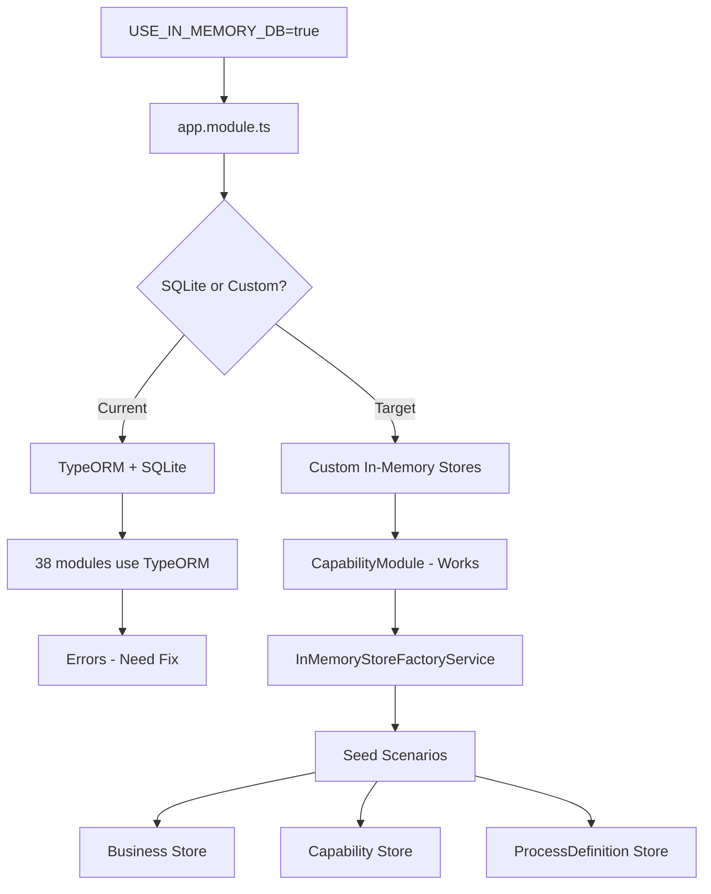

# Sandbox Mode TypeORM Fix Plan

## Problem Analysis

When running `USE_IN_MEMORY_DB=true npm run start:dev`, the sandbox mode has the following architecture issues:

### Current Behavior
1. **app.module.ts** configures TypeORM to use SQLite in-memory (`better-sqlite3`, `:memory:`) when `USE_IN_MEMORY_DB=true`
2. **Seed scenarios** populate **custom in-memory stores** (via `InMemoryStoreFactoryService`), NOT the TypeORM/SQLite database
3. **Only CapabilityModule** has been properly updated to use the custom in-memory stores in sandbox mode

### Root Cause
- The `CapabilityModule` shows the correct pattern: conditionally using either TypeORM repositories or in-memory repositories
- 38 other modules still unconditionally use `TypeORMModule.forFeature()` 
- The disconnect: seed data goes to custom in-memory stores, but most modules try to read from SQLite

## Solution Options

### Option A: Make SQLite Work (Recommended for Quick Fix)
Keep using TypeORM with SQLite in-memory but ensure:
- All entities are compatible with SQLite
- Fix any SQLite-specific issues (like missing column types)
- Auto-load entities properly

### Option B: Expand In-Memory Store Pattern
Apply the CapabilityModule pattern to all 39 modules:
1. Create in-memory repositories for each module
2. Update module to conditionally use TypeORM or in-memory based on `USE_IN_MEMORY_DB`
3. Seed data flows to the correct store

### Option C: Hybrid Approach
- Keep SQLite for modules that already work
- Add in-memory repositories only for critical modules that fail

## Recommended Plan: Option A - Make SQLite Work (Easiest & Most Robust)

### Why Option A is Better for Testing:
1. **Less code changes** - Just fix entity compatibility issues, not create 39 new repositories
2. **TypeORM handles complexity** - Migrations, schema, queries all work out of the box
3. **Easier testing** - Use SQLite like any other database, just switch connection string
4. **Existing infrastructure** - Already configured in app.module.ts
5. **Robust** - Well-tested SQLite driver, mature technology

### Why Option B (In-Memory Stores) is Harder:
- Need to create 39+ in-memory repository implementations
- Each needs full CRUD + query methods
- Seed data must be duplicated
- Harder to test and maintain

---

## Implementation: Option A - Fix SQLite Compatibility
- Fix messaging.service.ts type issues
- Fix payment module exports
- Fix missing @zanafleet/utils imports
- Fix calendar-policy-bridge type mappings

### Phase 2: Update Critical Modules
Apply CapabilityModule pattern to these modules (in order):
1. **ActorModule** - Core to many other modules
2. **OrganizationModule** - Required for workspace/actor
3. **WorkspaceModule** - Foundation for business context
4. **PersonaModule** - Depends on CapabilityModule
5. **BusinessModule** - Already has in-memory repo (needs integration)
6. **WalletModule** - Payment handling
7. **RiderModule** - Core entity

### Phase 3: Implement In-Memory Repository Pattern

For each module, follow this pattern:

```typescript
// 1. Check sandbox mode at module load time
const isSandBoxMode = process.env.USE_IN_MEMORY_DB === 'true';

// 2. Conditionally load TypeORM entities
function getTypeOrmImports() {
  if (isSandBoxMode) {
    return []; // Skip TypeORM in sandbox
  }
  return [TypeOrmModule.forFeature([Entity])];
}

// 3. Provide in-memory repository in sandbox mode
function getRepositoryProvider() {
  if (isSandBoxMode) {
    return {
      provide: REPOSITORY_TOKEN,
      useClass: RepositoryInMemory,
    };
  }
  return {
    provide: REPOSITORY_TOKEN,
    useClass: TypeOrmRepository,
  };
}
```

### Phase 4: Seed Data Integration

Update seed scenarios to:
1. Still use custom in-memory stores for data that works
2. Optionally also seed SQLite if using hybrid approach
3. Ensure both storage mechanisms can be queried

## Implementation Checklist

- [ ] Fix TypeScript compilation errors
- [ ] Create base in-memory repository interface
- [ ] Update ActorModule for sandbox mode
- [ ] Update OrganizationModule for sandbox mode
- [ ] Update WorkspaceModule for sandbox mode
- [ ] Update BusinessModule (integrate existing in-memory repo)
- [ ] Update WalletModule for sandbox mode
- [ ] Update RiderModule for sandbox mode
- [ ] Update remaining modules as needed
- [ ] Verify sandbox seeding works
- [ ] Test with `USE_IN_MEMORY_DB=true npm run start:dev`

## Architecture Diagram



## Files to Modify

1. `apps/api/src/modules/*/ - each module.ts`
2. Create in-memory repositories: `apps/api/src/modules/*/repositories/*.in-memory.ts`
3. Update seed scenarios: `apps/api/src/database/seeds/scenarios/*.ts`
4. Potentially update entities for SQLite compatibility