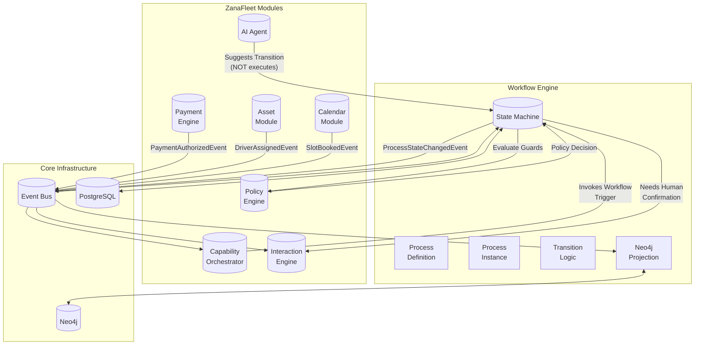
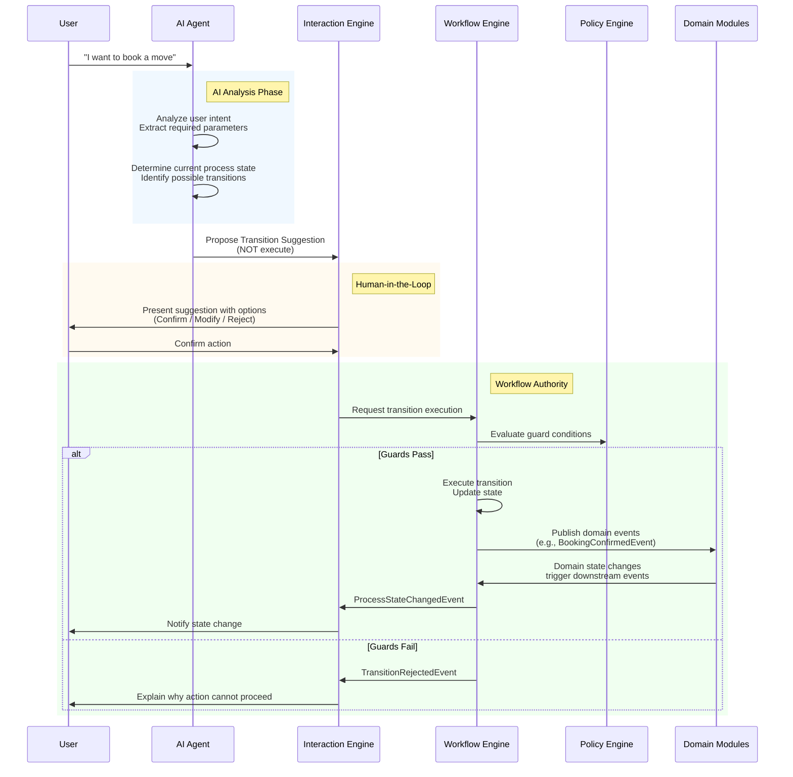

# ZanaFleet Workflow & State Engine - Architecture Design

## Executive Summary

This document defines the architecture for a new **Workflow & State Engine** module in ZanaFleet. The engine provides a declarative, event-driven framework for managing complex multi-step processes (e.g., MoveBookingProcess) with explicit state transitions, policy enforcement, and AI interaction patterns.

**Key Design Principles:**
- **Event-Driven**: All state changes are driven by domain events via the NATS event bus
- **AI as Advisor**: AI can propose transitions but never executes them directly - workflow remains the authority
- **Explicit Transitions**: Every state change is auditable with guard conditions
- **Policy Integration**: Transitions can be gated by PolicyEngine evaluations

---

## 1. ProcessDefinition Model

The ProcessDefinition is the blueprint/template for processes. It defines the valid states, transitions, and metadata for a category of process.

### TypeScript Interface

```typescript
// apps/api/src/modules/workflow/entities/process-definition.entity.ts

import {
  Entity,
  PrimaryColumn,
  Column,
  CreateDateColumn,
  UpdateDateColumn,
  OneToMany,
} from 'typeorm';
import { ProcessTransitionEntity } from './process-transition.entity';

/**
 * Process State Enum
 * 
 * Defines all possible states for process instances.
 * States are process-agnostic - specific processes use subsets.
 */
export enum ProcessState {
  // Initial states
  DRAFT = 'draft',
  ESTIMATE_REQUESTED = 'estimate_requested',
  OPTIONS_PRESENTED = 'options_presented',
  
  // Confirmation states
  BOOKING_CONFIRMED = 'booking_confirmed',
  PAYMENT_AUTHORIZED = 'payment_authorized',
  
  // Assignment states
  DRIVER_ASSIGNED = 'driver_assigned',
  VEHICLE_ASSIGNED = 'vehicle_assigned',
  
  // Active states
  IN_PROGRESS = 'in_progress',
  ARRIVED = 'arrived',
  LOADING = 'loading',
  UNLOADING = 'unloading',
  
  // Terminal states
  COMPLETED = 'completed',
  CANCELLED = 'cancelled',
  FAILED = 'failed',
}

/**
 * Process Definition Entity
 * 
 * Represents a process template/blueprint that can be instantiated.
 * Example: MoveBookingProcess, RefundProcess, OnboardingProcess
 */
@Entity('process_definitions')
export class ProcessDefinitionEntity {
  @PrimaryColumn('uuid')
  definitionId!: string;

  @Column()
  name!: string;

  @Column()
  description!: string;

  @Column({ default: '1.0.0' })
  version!: string;

  @Column({ default: true })
  isActive!: boolean;

  @Column('simple-array', { nullable: true })
  allowedStates!: string[];

  @Column('jsonb', { nullable: true })
  metadata!: Record<string, unknown>;

  @Column({ nullable: true })
  initialState!: string;

  @Column('simple-array', { nullable: true })
  terminalStates!: string[];

  @OneToMany(() => ProcessTransitionEntity, (transition) => transition.definition)
  transitions!: ProcessTransitionEntity[];

  @CreateDateColumn()
  createdAt!: Date;

  @UpdateDateColumn()
  updatedAt!: Date;
}
```

---

## 2. ProcessInstance Model

The ProcessInstance is the runtime execution of a ProcessDefinition. It tracks the current state, context data, and related entities.

### TypeScript Interface

```typescript
// apps/api/src/modules/workflow/entities/process-instance.entity.ts

import {
  Entity,
  PrimaryColumn,
  Column,
  CreateDateColumn,
  UpdateDateColumn,
  Index,
  ManyToOne,
  JoinColumn,
} from 'typeorm';
import { ProcessDefinitionEntity } from './process-definition.entity';
import { ProcessState } from './process-definition.entity';

/**
 * Process Instance Status Enum
 * 
 * Runtime status of a process instance.
 */
export enum ProcessInstanceStatus {
  ACTIVE = 'active',
  SUSPENDED = 'suspended',
  COMPLETED = 'completed',
  CANCELLED = 'cancelled',
  FAILED = 'failed',
}

/**
 * Process Context Entry
 * 
 * Individual context key-value pair.
 */
export interface ProcessContextEntry {
  key: string;
  value: unknown;
  updatedAt: Date;
  updatedBy: string | null;
}

/**
 * Related Entity Reference
 * 
 * Links to other domain entities (orders, users, vehicles, etc.)
 */
export interface ProcessRelatedEntity {
  entityType: string;
  entityId: string;
  role: string;
  linkedAt: Date;
}

/**
 * Process Instance Entity
 * 
 * Runtime instance of a process definition.
 * Tracks current state, context, and related entities.
 */
@Entity('process_instances')
@Index(['definitionId', 'status'])
@Index(['currentState', 'status'])
@Index(['createdAt'])
export class ProcessInstanceEntity {
  @PrimaryColumn('uuid')
  instanceId!: string;

  @Column('uuid')
  definitionId!: string;

  @ManyToOne(() => ProcessDefinitionEntity)
  @JoinColumn({ name: 'definitionId' })
  definition!: ProcessDefinitionEntity;

  @Column()
  name!: string;

  @Column({
    type: 'enum',
    enum: ProcessState,
    default: ProcessState.DRAFT,
  })
  currentState!: ProcessState;

  @Column({
    type: 'enum',
    enum: ProcessInstanceStatus,
    default: ProcessInstanceStatus.ACTIVE,
  })
  status!: ProcessInstanceStatus;

  @Column('jsonb', { default: {} })
  context!: Record<string, unknown>;

  @Column('jsonb', { default: [] })
  relatedEntities!: ProcessRelatedEntity[];

  @Column({ nullable: true })
  triggeredBy!: string;

  @Column({ nullable: true })
  correlationId!: string;

  @Column({ nullable: true })
  parentInstanceId!: string;

  @Column({ nullable: true })
  expiresAt!: Date;

  @Column({ default: 0 })
  transitionCount!: number;

  @Column('jsonb', { default: [] })
  history!: ProcessHistoryEntry[];

  @CreateDateColumn()
  createdAt!: Date;

  @UpdateDateColumn()
  updatedAt!: Date;

  @Column({ nullable: true })
  completedAt!: Date;
}

/**
 * Process History Entry
 * 
 * Audit trail of state transitions.
 */
export interface ProcessHistoryEntry {
  transitionId: string;
  fromState: string;
  toState: string;
  eventType: string;
  eventId: string;
  triggeredBy: string;
  contextSnapshot: Record<string, unknown>;
  timestamp: Date;
  guardResults?: GuardEvaluationResult[];
}

/**
 * Guard Evaluation Result
 * 
 * Result of policy/condition evaluation for a transition.
 */
export interface GuardEvaluationResult {
  guardName: string;
  passed: boolean;
  reason: string;
  policyId?: string;
}
```

---

## 3. Transition Model

The Transition model defines explicit rules for moving between states, including guard conditions and actions.

### TypeScript Interface

```typescript
// apps/api/src/modules/workflow/entities/process-transition.entity.ts

import {
  Entity,
  PrimaryColumn,
  Column,
  ManyToOne,
  JoinColumn,
} from 'typeorm';
import { ProcessDefinitionEntity } from './process-definition.entity';

/**
 * Transition Trigger Type
 * 
 * Defines what type of event can trigger this transition.
 */
export enum TransitionTriggerType {
  EVENT = 'event',
  MANUAL = 'manual',
  TIMEOUT = 'timeout',
  AI_SUGGESTION = 'ai_suggestion',
}

/**
 * Guard Condition Type
 * 
 * Defines how guard conditions are evaluated.
 */
export enum GuardType {
  POLICY = 'policy',
  EXPRESSION = 'expression',
  CALLBACK = 'callback',
}

/**
 * Guard Condition Configuration
 * 
 * Defines a guard condition for the transition.
 */
export interface GuardConditionConfig {
  guardType: GuardType;
  guardName: string;
  expression?: string;
  policyScope?: string;
  policyAction?: string;
  callbackService?: string;
  failMessage: string;
}

/**
 * Transition Action Configuration
 * 
 * Defines an action to execute during transition.
 */
export interface TransitionActionConfig {
  actionType: 'event' | 'service' | 'notification';
  actionName: string;
  serviceName?: string;
  payload?: Record<string, unknown>;
  async: boolean;
  onFailure: 'continue' | 'rollback' | 'abort';
}

/**
 * Process Transition Entity
 * 
 * Defines an explicit transition between two states.
 * Includes guard conditions and actions.
 */
@Entity('process_transitions')
export class ProcessTransitionEntity {
  @PrimaryColumn('uuid')
  transitionId!: string;

  @Column('uuid')
  definitionId!: string;

  @ManyToOne(() => ProcessDefinitionEntity)
  @JoinColumn({ name: 'definitionId' })
  definition!: ProcessDefinitionEntity;

  @Column()
  name!: string;

  @Column()
  description!: string;

  @Column()
  sourceState!: string;

  @Column()
  targetState!: string;

  @Column({
    type: 'enum',
    enum: TransitionTriggerType,
    default: TransitionTriggerType.EVENT,
  })
  triggerType!: TransitionTriggerType;

  @Column({ nullable: true })
  triggerEventType!: string;

 b', { default @Column('json: [] })
  guardConditions!: GuardConditionConfig[];

  @Column('jsonb', { default: [] })
  actions!: TransitionActionConfig[];

  @Column({ default: true })
  isActive!: boolean;

  @Column({ default: 0 })
  priority!: number;

  @Column({ nullable: true })
  timeoutMs!: number;

  @Column({ nullable: true })
  timeoutEventType!: string;
}
```

---

## 4. Event-Driven State Transition Mechanism

The workflow engine listens to domain events and triggers state transitions based on the process definition.

### Event Flow Diagram

```mermaid
sequenceDiagram
    participant Domain as Domain Module
    participant EventBus as Event Bus (NATS)
    participant Workflow as Workflow Engine
    participant Policy as Policy Engine
    participant Neo4j as Neo4j Projections

    Domain->>EventBus: Publish Domain Event<br/>(e.g., PaymentAuthorizedEvent)
    EventBus->>Workflow: Route Event to Workflow Listener
    
    alt Find Matching Process Instance
        Workflow->>Workflow: Find active instances<br/>listening for this event
        Workflow->>Workflow: Validate current state<br/>allows transition
        
        alt Has Guard Conditions
            Workflow->>Policy: Evaluate Policy<br/>with transition context
            Policy-->>Workflow: Policy Decision<br/>(ALLOW/BLOCK)
        end
        
        alt Guard Passed
            Workflow->>Workflow: Execute Pre-Transition Actions
            Workflow->>Workflow: Update State<br/>(ProcessStateChangedEvent)
            Workflow->>Workflow: Execute Post-Transition Actions
            Workflow->>EventBus: Publish ProcessStateChangedEvent
            EventBus->>Neo4j: Update Process Graph
        else Guard Failed
            Workflow->>EventBus: Publish TransitionRejectedEvent
        end
    else No Matching Instance
        Workflow: Log: No process instance<br/>found for event
    end
```

### Core Service Implementation

```typescript
// apps/api/src/modules/workflow/services/workflow-state-machine.service.ts

import { Injectable, Logger } from '@nestjs/common';
import { EventBusService } from '@api/core/event-bus/event-bus.service';
import { PolicyEnforcementAdapter } from '@api/modules/policy/policy.module';
import { ProcessInstanceEntity, ProcessState, ProcessHistoryEntry } from '../entities/process-instance.entity';
import { ProcessTransitionEntity, GuardConditionConfig } from '../entities/process-transition.entity';
import { ProcessStateChangedEventV1 } from '../events/process-state-changed.event';
import { TransitionRejectedEventV1 } from '../events/transition-rejected.event';

/**
 * Transition Result
 * 
 * Result of attempting a state transition.
 */
export interface TransitionResult {
  success: boolean;
  instance?: ProcessInstanceEntity;
  newState?: string;
  guardResults?: GuardEvaluationResult[];
  error?: string;
}

/**
 * WorkflowStateMachineService
 * 
 * Core service that handles event-driven state transitions.
 * Implements the Command → Event → Handler → Projection flow.
 */
@Injectable()
export class WorkflowStateMachineService {
  private readonly logger = new Logger(WorkflowStateMachineService.name);

  constructor(
    private readonly eventBus: EventBusService,
    private readonly policyAdapter: PolicyEnforcementAdapter,
    // Additional repositories would be injected
  ) {}

  /**
   * Handle incoming domain event and attempt transition
   * 
   * @param eventType - The type of event received
   * @param eventData - The event payload
   * @param correlationId - Optional correlation ID
   */
  async handleEvent(
    eventType: string,
    eventData: Record<string, unknown>,
    correlationId?: string,
  ): Promise<TransitionResult[]> {
    this.logger.log(`Handling event: ${eventType}`);

    // 1. Find process instances that are waiting for this event
    const instances = await this.findInstancesByEventAndState(eventType);

    const results: TransitionResult[] = [];

    for (const instance of instances) {
      // 2. Find the matching transition
      const transition = await this.findMatchingTransition(
        instance.definitionId,
        instance.currentState,
        eventType,
      );

      if (!transition) {
        this.logger.warn(`No transition found for ${instance.instanceId} from state ${instance.currentState} on event ${eventType}`);
        continue;
      }

      // 3. Evaluate guard conditions
      const guardResults = await this.evaluateGuardConditions(
        transition.guardConditions,
        instance,
        eventData,
      );

      // 4. Check if all guards pass
      const allGuardsPassed = guardResults.every((g) => g.passed);

      if (!allGuardsPassed) {
        // Publish rejection event
        await this.publishTransitionRejected(instance, transition, guardResults);
        results.push({
          success: false,
          instance,
          guardResults,
          error: 'Guard conditions not met',
        });
        continue;
      }

      // 5. Execute transition
      const result = await this.executeTransition(instance, transition, eventData, guardResults);
      results.push(result);
    }

    return results;
  }

  /**
   * Execute a state transition
   */
  private async executeTransition(
    instance: ProcessInstanceEntity,
    transition: ProcessTransitionEntity,
    eventData: Record<string, unknown>,
    guardResults: GuardEvaluationResult[],
  ): Promise<TransitionResult> {
    const previousState = instance.currentState;
    const previousContext = { ...instance.context };

    // Update instance state
    instance.currentState = transition.targetState as ProcessState;
    instance.transitionCount += 1;
    instance.context = { ...instance.context, ...eventData };

    // Add history entry
    const historyEntry: ProcessHistoryEntry = {
      transitionId: transition.transitionId,
      fromState: previousState,
      toState: transition.targetState,
      eventType: transition.triggerEventType || 'unknown',
      eventId: (eventData.eventId as string) || '',
      triggeredBy: instance.triggeredBy || 'system',
      contextSnapshot: previousContext,
      timestamp: new Date(),
      guardResults,
    };

    instance.history = [...instance.history, historyEntry];

    // Save instance (repository call would go here)
    // await this.instanceRepository.save(instance);

    // Execute post-transition actions
    await this.executeTransitionActions(transition.actions, instance);

    // Publish state changed event
    const stateChangedEvent = new ProcessStateChangedEventV1({
      eventId: crypto.randomUUID(),
      instanceId: instance.instanceId,
      definitionId: instance.definitionId,
      previousState,
      newState: transition.targetState,
      context: instance.context,
      transitionId: transition.transitionId,
      guardResults,
      triggeredBy: instance.triggeredBy,
      occurredAt: new Date(),
    });

    await this.eventBus.publish('workflow.events.state-changed-v1', stateChangedEvent);

    return {
      success: true,
      instance,
      newState: transition.targetState,
      guardResults,
    };
  }

  /**
   * Evaluate guard conditions for a transition
   */
  private async evaluateGuardConditions(
    guardConditions: GuardConditionConfig[],
    instance: ProcessInstanceEntity,
    eventData: Record<string, unknown>,
  ): Promise<GuardEvaluationResult[]> {
    const results: GuardEvaluationResult[] = [];

    for (const guard of guardConditions) {
      if (guard.guardType === GuardType.POLICY) {
        // Evaluate using PolicyEngine
        const decision = await this.policyAdapter.evaluate({
          scope: guard.policyScope!,
          action: guard.policyAction!,
          subject: instance.instanceId,
          subjectType: 'ProcessInstance',
          context: {
            instanceContext: instance.context,
            eventData,
            currentState: instance.currentState,
          },
        });

        results.push({
          guardName: guard.guardName,
          passed: decision.effect === 'ALLOW',
          reason: decision.reason,
          policyId: decision.policyId,
        });
      } else if (guard.guardType === GuardType.EXPRESSION) {
        // Evaluate expression (would use expression evaluator)
        const passed = this.evaluateExpression(guard.expression!, {
          context: instance.context,
          eventData,
          currentState: instance.currentState,
        });

        results.push({
          guardName: guard.guardName,
          passed,
          reason: passed ? 'Expression evaluated true' : 'Expression evaluated false',
        });
      }
    }

    return results;
  }

  private evaluateExpression(
    expression: string,
    context: Record<string, unknown>,
  ): boolean {
    // Simple expression evaluation (would use a proper expression parser)
    try {
      // Example: context.amount > 100
      const fn = new Function('context', `return ${expression}`);
      return fn(context) as boolean;
    } catch {
      return false;
    }
  }

  private async findInstancesByEventAndState(
    eventType: string,
  ): Promise<ProcessInstanceEntity[]> {
    // Query repository for instances waiting for this event
    // This would involve joining with transitions to find matching states
    return [];
  }

  private async findMatchingTransition(
    definitionId: string,
    currentState: string,
    eventType: string,
  ): Promise<ProcessTransitionEntity | null> {
    // Query repository for matching transition
    return null;
  }

  private async executeTransitionActions(
    actions: TransitionActionConfig[],
    instance: ProcessInstanceEntity,
  ): Promise<void> {
    for (const action of actions) {
      if (action.async) {
        // Execute asynchronously
        this.executeAction(action, instance).catch((err) =>
          this.logger.error(`Action ${action.actionName} failed: ${err.message}`),
        );
      } else {
        await this.executeAction(action, instance);
      }
    }
  }

  private async executeAction(
    action: TransitionActionConfig,
    instance: ProcessInstanceEntity,
  ): Promise<void> {
    if (action.actionType === 'event') {
      // Publish event
      await this.eventBus.publish(
        action.actionName,
        { ...action.payload, instanceId: instance.instanceId },
      );
    }
  }

  private async publishTransitionRejected(
    instance: ProcessInstanceEntity,
    transition: ProcessTransitionEntity,
    guardResults: GuardEvaluationResult[],
  ): Promise<void> {
    const event = new TransitionRejectedEventV1({
      eventId: crypto.randomUUID(),
      instanceId: instance.instanceId,
      definitionId: instance.definitionId,
      currentState: instance.currentState,
      attemptedTransition: transition.name,
      guardResults,
      reason: guardResults.find((g) => !g.passed)?.failMessage || 'Guard conditions not met',
      occurredAt: new Date(),
    });

    await this.eventBus.publish('workflow.events.transition-rejected-v1', event);
  }
}
```

---

## 5. Integration Points

### Integration Architecture Diagram



### 5.1 CapabilityOrchestrator Integration

```typescript
// Integration point: How capabilities invoke workflow triggers

/**
 * Workflow Capability Integration
 * 
 * Capabilities can trigger workflow state transitions.
 * Example: "ConfirmBooking" capability → triggers BOOKING_CONFIRMED transition
 */
export interface WorkflowTriggerConfig {
  capabilityName: string;
  workflowDefinition: string;
  targetState: string;
  requireConfirmation: boolean;
  contextBuilder: (capabilityInputs: Record<string, unknown>) => Record<string, unknown>;
}

// Usage in CapabilityOrchestrator:
// 1. When capability is confirmed, check if it has workflow trigger
// 2. If yes, invoke WorkflowStateMachineService.handleManualTransition()
// 3. This maintains human-in-the-loop: AI proposes → Human confirms → Workflow executes
```

### 5.2 InteractionEngine Integration

```typescript
// Integration point: How state changes produce system notifications

/**
 * ProcessStateChangedEventV1
 * 
 * Published whenever a process state changes.
 * Downstream consumers (InteractionEngine) use this for notifications.
 */
export class ProcessStateChangedEventV1 implements BaseEvent {
  readonly eventId: string;
  readonly eventType: 'ProcessStateChangedEvent-V1' = 'ProcessStateChangedEvent-V1';
  readonly eventVersion: '1.0.0' = '1.0.0';
  readonly occurredAt: Date;
  readonly aggregateId: string;
  readonly aggregateType: 'ProcessInstance' = 'ProcessInstance';

  readonly instanceId: string;
  readonly definitionId: string;
  readonly previousState: string;
  readonly newState: string;
  readonly context: Record<string, unknown>;
  readonly transitionId: string;
  readonly guardResults?: GuardEvaluationResult[];
  readonly triggeredBy: string;

  readonly correlationId?: string;
}
```

### 5.3 PolicyEngine Integration

```typescript
// Guard condition types for policy evaluation

const transitionGuard: GuardConditionConfig = {
  guardType: GuardType.POLICY,
  guardName: 'payment_required',
  policyScope: 'move_booking',
  policyAction: 'authorize_payment',
  failMessage: 'Payment authorization is required before confirming booking',
};
```

### 5.4 Neo4j Integration

```typescript
// apps/api/src/modules/workflow/projections/process-neo4j.projection.ts

import { EventsHandler, IEventHandler } from '@nestjs/cqrs';
import { ProjectionBuilder } from '@api/core/projections/projection-builder.base';
import { ProcessStateChangedEventV1 } from '../events/process-state-changed.event';

/**
 * ProcessNeo4jProjection
 * 
 * Maintains process graph in Neo4j for real-time visibility.
 * 
 * Node: (:ProcessInstance)
 * - id, definitionId, name, currentState, status, createdAt, updatedAt
 * 
 * Relationships:
 * - (:Actor)-[:INITIATED]->(:ProcessInstance)
 * - (:ProcessInstance)-[:HAS_CONTEXT]->(:ProcessContext)
 * - (:ProcessInstance)-[:LINKED_TO]->(:Order|:Vehicle|:Driver)
 */
@EventsHandler(ProcessStateChangedEventV1)
export class ProcessNeo4jProjection extends ProjectionBuilder<ProcessStateChangedEventV1> {
  protected readonly projectionName = 'ProcessNeo4jProjection';

  async handle(event: ProcessStateChangedEventV1): Promise<void> {
    await this.upsertNode(
      'ProcessInstance',
      'id',
      event.instanceId,
      {
        definitionId: event.definitionId,
        currentState: event.newState,
        previousState: event.previousState,
        updatedAt: event.occurredAt.toISOString(),
      },
    );

    // Update relationships
    await this.upsertRelationship(
      'ProcessInstance',
      'id',
      event.instanceId,
      'HAS_STATE',
      'ProcessState',
      'name',
      event.newState,
      { since: event.occurredAt.toISOString() },
    );
  }
}
```

---

## 6. AI Interaction Pattern

The AI interaction pattern ensures AI remains an advisor while the workflow engine maintains authority over state transitions.

### AI Interaction Flow



### TypeScript Interfaces for AI Interaction

```typescript
// apps/api/src/modules/workflow/dto/ai-suggestion.dto.ts

/**
 * AI Transition Suggestion
 * 
 * Represents AI's suggestion for a workflow transition.
 * AI can suggest but NOT execute.
 */
export interface AITransitionSuggestion {
  suggestionId: string;
  instanceId: string;
  definitionId: string;
  
  // AI's analysis
  currentState: string;
  suggestedTransition: string;
  suggestedTargetState: string;
  confidence: number;
  reasoning: string;
  
  // Context for the transition
  proposedContext: Record<string, unknown>;
  missingInputs: string[];
  
  // Status
  status: AITransitionStatus;
  
  // Metadata
  createdAt: Date;
  expiresAt: Date;
}

/**
 * AI Transition Suggestion Status
 */
export enum AITransitionStatus {
  PENDING = 'pending',
  CONFIRMED = 'confirmed',
  REJECTED = 'rejected',
  MODIFIED = 'modified',
  EXPIRED = 'expired',
  EXECUTED = 'executed',
}

/**
 * Transition Suggestion Request
 * 
 * Request from AI to suggest a transition.
 */
export interface TransitionSuggestionRequest {
  instanceId: string;
  desiredState: string;
  proposedContext: Record<string, unknown>;
  reasoning: string;
  confidence: number;
}

/**
 * Transition Confirmation Request
 * 
 * Request to execute a confirmed transition.
 * This is the ONLY way transitions can execute.
 */
export interface TransitionConfirmationRequest {
  suggestionId: string;
  confirmedBy: string;
  modifiedContext?: Record<string, unknown>;
}
```

### Workflow Engine AI Service

```typescript
// apps/api/src/modules/workflow/services/workflow-ai-advisor.service.ts

import { Injectable, Logger } from '@nestjs/common';

/**
 * WorkflowAIAdvisorService
 * 
 * Provides AI-friendly interfaces for understanding and suggesting
 * workflow transitions WITHOUT executing them.
 * 
 * Key principle: AI can query, suggest, and propose - but only
 * human/system confirmation triggers actual execution.
 */
@Injectable()
export class WorkflowAIAdvisorService {
  private readonly logger = new Logger(WorkflowAIAdvisorService.name);

  /**
   * Get available transitions for an instance
   * 
   * AI calls this to understand what transitions are possible
   * from the current state.
   */
  async getAvailableTransitions(instanceId: string): Promise<Transition[]> {
    // Query process definition for valid transitions from current state
    // Return them to AI for analysis
    return [];
  }

  /**
   * Propose a transition (NOT execute)
   * 
   * AI calls this to suggest a transition.
   * Creates a suggestion record that requires confirmation.
   */
  async proposeTransition(request: TransitionSuggestionRequest): Promise<AITransitionSuggestion> {
    // 1. Validate the suggestion is possible
    // 2. Create suggestion record with PENDING status
    // 3. Return suggestion to AI for presentation to user
    
    return {
      suggestionId: crypto.randomUUID(),
      instanceId: request.instanceId,
      definitionId: '',
      currentState: '',
      suggestedTransition: '',
      suggestedTargetState: request.desiredState,
      confidence: request.confidence,
      reasoning: request.reasoning,
      proposedContext: request.proposedContext,
      missingInputs: [],
      status: AITransitionStatus.PENDING,
      createdAt: new Date(),
      expiresAt: new Date(Date.now() + 5 * 60 * 1000), // 5 minutes
    };
  }

  /**
   * Request transition execution (requires external confirmation)
   * 
   * AI can request execution but MUST go through confirmation flow.
   * The workflow engine will emit events for human confirmation.
   */
  async requestTransitionExecution(suggestionId: string): Promise<TransitionExecutionRequest> {
    // 1. Validate suggestion exists and is pending
    // 2. Emit confirmation required event
    // 3. Return execution request (which awaits confirmation)
    
    return {
      requestId: crypto.randomUUID(),
      suggestionId,
      status: 'awaiting_confirmation',
      requiresHumanConfirmation: true,
    };
  }
}
```

---

## 7. MoveBookingProcess Example

Here's how the MoveBookingProcess would be defined using the workflow engine:

```typescript
// Example: MoveBookingProcess Definition

const moveBookingProcess: Partial<ProcessDefinitionEntity> = {
  definitionId: 'move-booking-v1',
  name: 'MoveBookingProcess',
  description: 'Process for booking a move with driver and vehicle',
  version: '1.0.0',
  initialState: ProcessState.ESTIMATE_REQUESTED,
  terminalStates: [ProcessState.COMPLETED, ProcessState.CANCELLED, ProcessState.FAILED],
  allowedStates: [
    ProcessState.ESTIMATE_REQUESTED,
    ProcessState.OPTIONS_PRESENTED,
    ProcessState.BOOKING_CONFIRMED,
    ProcessState.PAYMENT_AUTHORIZED,
    ProcessState.DRIVER_ASSIGNED,
    ProcessState.VEHICLE_ASSIGNED,
    ProcessState.IN_PROGRESS,
    ProcessState.COMPLETED,
    ProcessState.CANCELLED,
    ProcessState.FAILED,
  ],
};

// Example Transitions
const transitions = [
  {
    name: 'RequestEstimate',
    sourceState: ProcessState.DRAFT,
    targetState: ProcessState.ESTIMATE_REQUESTED,
    triggerType: TransitionTriggerType.MANUAL,
    guardConditions: [],
  },
  {
    name: 'PresentOptions',
    sourceState: ProcessState.ESTIMATE_REQUESTED,
    targetState: ProcessState.OPTIONS_PRESENTED,
    triggerType: TransitionTriggerType.EVENT,
    triggerEventType: 'EstimateGeneratedEvent-V1',
    guardConditions: [],
  },
  {
    name: 'ConfirmBooking',
    sourceState: ProcessState.OPTIONS_PRESENTED,
    targetState: ProcessState.BOOKING_CONFIRMED,
    triggerType: TransitionTriggerType.EVENT,
    triggerEventType: 'BookingConfirmedEvent-V1',
    guardConditions: [
      {
        guardType: GuardType.POLICY,
        guardName: 'booking_allowed',
        policyScope: 'move_booking',
        policyAction: 'confirm',
        failMessage: 'Booking is not allowed at this time',
      },
    ],
  },
  {
    name: 'AuthorizePayment',
    sourceState: ProcessState.BOOKING_CONFIRMED,
    targetState: ProcessState.PAYMENT_AUTHORIZED,
    triggerType: TransitionTriggerType.EVENT,
    triggerEventType: 'PaymentAuthorizedEvent-V1',
    guardConditions: [
      {
        guardType: GuardType.POLICY,
        guardName: 'payment_valid',
        policyScope: 'payment',
        policyAction: 'authorize',
        failMessage: 'Payment authorization failed',
      },
    ],
  },
  {
    name: 'AssignDriver',
    sourceState: ProcessState.PAYMENT_AUTHORIZED,
    targetState: ProcessState.DRIVER_ASSIGNED,
    triggerType: TransitionTriggerType.EVENT,
    triggerEventType: 'DriverAssignedEvent-V1',
    guardConditions: [],
  },
  {
    name: 'StartMove',
    sourceState: ProcessState.DRIVER_ASSIGNED,
    targetState: ProcessState.IN_PROGRESS,
    triggerType: TransitionTriggerType.MANUAL,
    guardConditions: [],
  },
  {
    name: 'CompleteMove',
    sourceState: ProcessState.IN_PROGRESS,
    targetState: ProcessState.COMPLETED,
    triggerType: TransitionTriggerType.EVENT,
    triggerEventType: 'MoveCompletedEvent-V1',
    guardConditions: [],
  },
  {
    name: 'CancelBooking',
    sourceState: ProcessState.OPTIONS_PRESENTED,
    targetState: ProcessState.CANCELLED,
    triggerType: TransitionTriggerType.EVENT,
    triggerEventType: 'BookingCancelledEvent-V1',
    guardConditions: [],
  },
];
```

---

## 8. Summary

This design provides:

| Component | Description |
|-----------|-------------|
| **ProcessDefinition** | Blueprint model with states, metadata, and version |
| **ProcessInstance** | Runtime tracking with context, history, and related entities |
| **Transition** | Explicit rules with guard conditions and actions |
| **StateMachine** | Event-driven transition execution with policy integration |
| **Neo4j Projection** | Real-time graph visibility of process state |
| **AI Advisor** | Query and suggest interface (not execution) |
| **Human-in-Loop** | Confirmation flow via CapabilityOrchestrator integration |

The workflow engine maintains **authority** over all state transitions while allowing AI to provide intelligent suggestions. This ensures auditable, policy-compliant process execution aligned with ZanaFleet's existing architecture patterns.
